# 信息搜集

## 主机发现

```
nmap -sn 192.168.182.0/24
nmap -sS 192.168.182.145
```

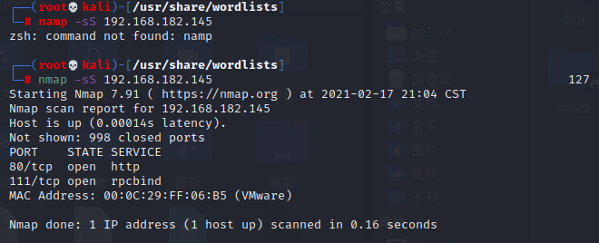

# getshell

我们尝试访问80端口
发现网页全是静态的 ，只有一个提交留言的窗口

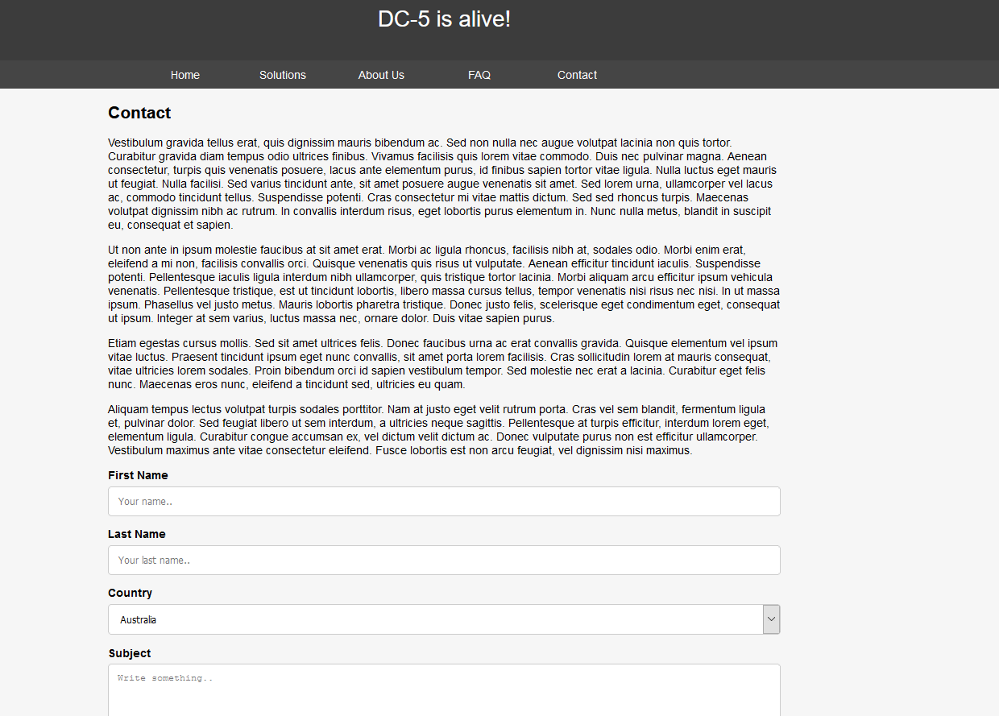

在提交后的页面下,我们发现我们传的变量全部都在url里面

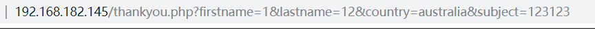

而且我们每次刷新下面也在不断改变


我们访问foorer.php

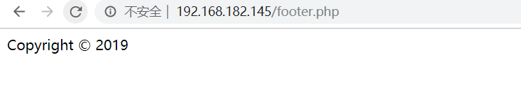

也是在不断改变,这里很有可能是直接include包含了footer.php文件,

然后使用burp爆破变量名

[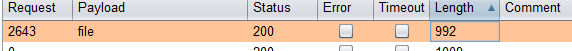](http://cyzcc.vip/2020/03/07/vulnhub-DC5/8.png)
说明file很有可能是传参的变量，尝试/etc/passwd成功执行

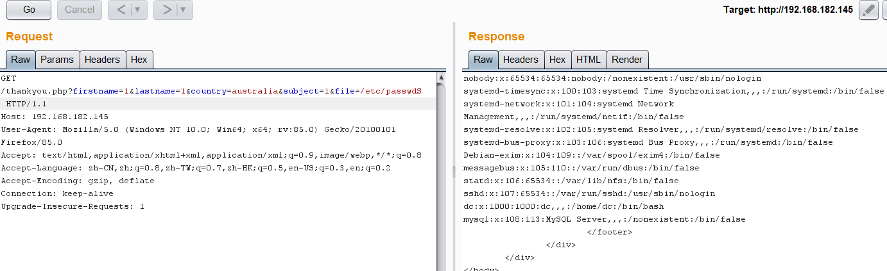

上传一句话进行日志包含

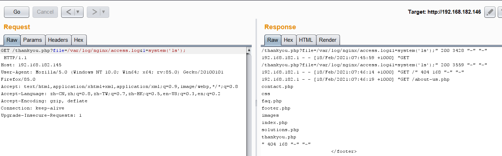

蚁剑终端连接

cat thankyou.php

```php
#文件包含代码
<footer>
                <?php
                    $file = $_GET['file'];
                        if(isset($file))
                        {
                            include("$file");
                        }
                        else
                        {
                            include("footer.php");
                        }
                ?>
</footer>
                  
```

# 提权

## screen软件提权

su -l 查看是否有命令在执行期间有root权限并且没有密码保护，但是没有

然后查看一些具有suid权限的命令

```bash
find / -perm -u=s -type f 2>/dev/null
```

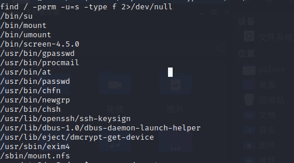

发现一个软件screen-4.5.0具有root权限,搜索一下是否有相关漏洞

### 脚本搜索

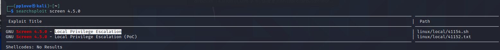

### 编译脚本

发现提权脚本,然后按着脚本编译好libhax.so和rootshell,用wget上传至靶机 tmp目录

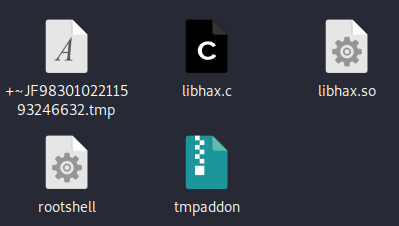

### 上传脚本

然后开启一个8000端口服务让我们的靶机下载libhax.so和rootshell文件

```
python -m SimpleHTTPServer 8000    
```

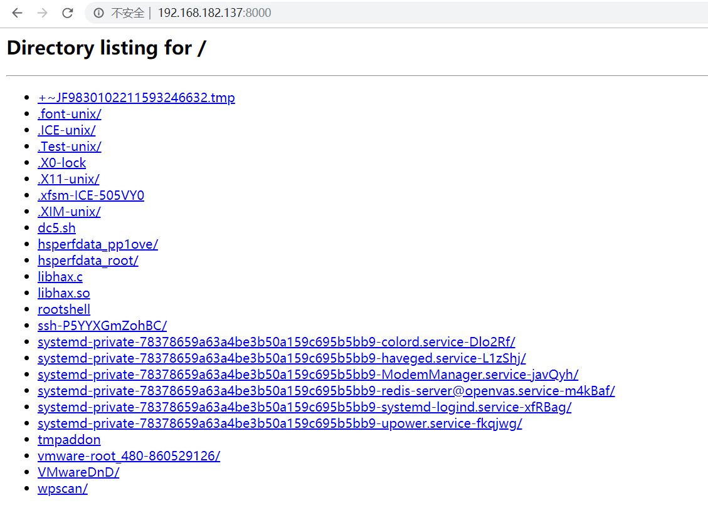

### 提权

将rootshell和libhax.so下载下来,然后用脚本里的方法提权

成功获得root权限

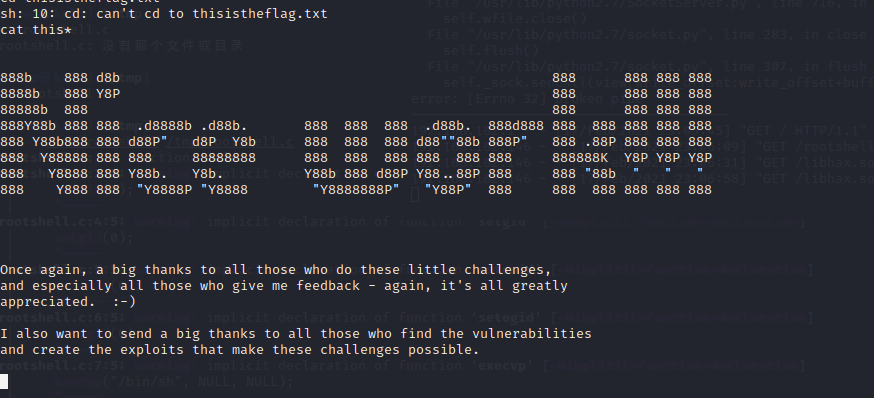