# 信息搜集

## 主机发现

```
nmap -sn 192.168.182.0/24

nmap -sS 192.168.182.151
```

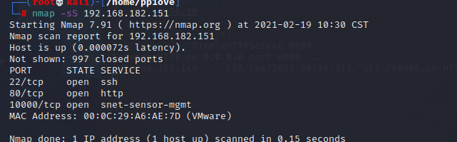

访问一下80端口

扫一下

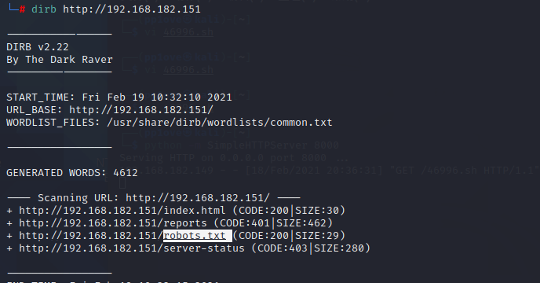

发现robots文件

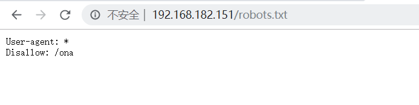

禁止爬虫访问/ona目录

# 漏洞发现

我们手动访问一下，发现:

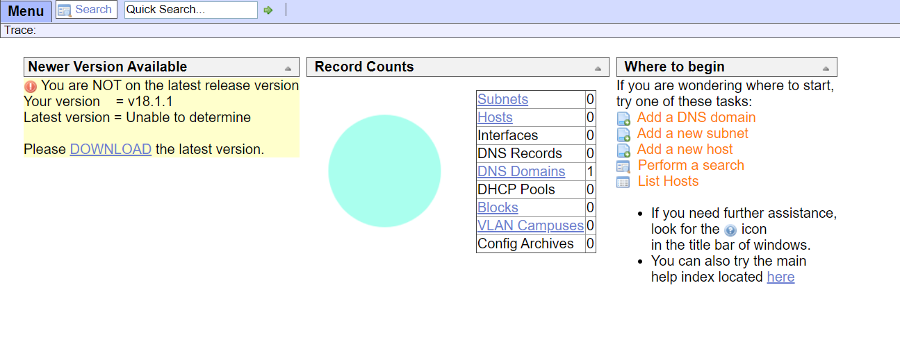

发现了系统和版本,是一个OpenNetAdmin v18.1.1系统

去搜索一下是否有相关漏洞

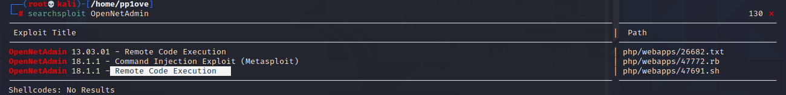

发现一个远程代码执行漏洞

# Getshell

在执行时报错了,百度一下发现需要转换格式

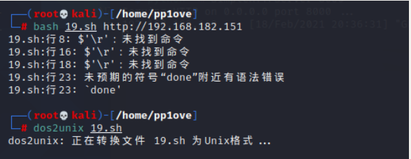

执行`bash ./19.sh http://192.168.182.151/ona/`

成功拿到shell,（我这里没有加最后的/结果一直没有成功）

经过一番测试，发现这里无法执行的命令是没有回显的，并且不能执行cd命令，但是可以使用ls和cat命令

# 提权

## 提权douglas

执行find命令查看一下我们可以读取的文件

```
find / -type f -user www-data
```

发现

```
/var/www/html/reports/.htaccess
/var/log/ona.log
```

读取`var/www/html/reports/.htaccess`可以找到`AuthUserFile`的路径`/var/www/.htpasswd`

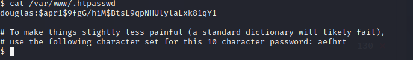

htpasswd建立和更新存储用户名、密码的文本文件,读取这个文件如下，可以得到用户名`douglas`和HASH的密码`$apr1$9fgG/hiM$BtsL9qpNHUlylaLxk81qY1`，给的提示是只包含`aefhrt`的十个字符

### crunch生成字典

然后使用crunch生成对应的字典，命令格式`crunch <min-len> <max-len> [charset string] [options]`，这里生成只包含aefhrt的10个字符，就可以使用如下命令`crunch 10 10 aefhrt -o pass.txt`

### John破解密码

将密码放入1.txt文件

`john --wordlist=pass.txt 1.txt`

成功跑出来密码

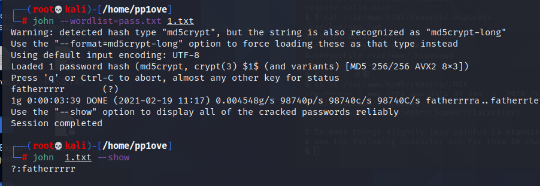

## 提权jen

ssh登录成功获取douglas用户的权限,查看一下无密码使用的命令,发现一个jen权限的cp命令

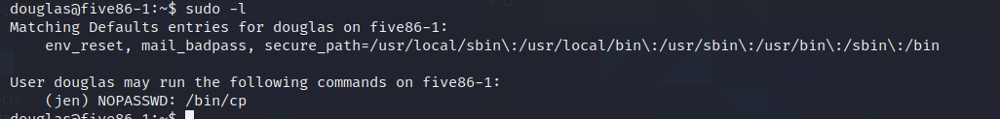

这里应该是想让我们利用这个cp命令

```bash
ssh-keygen -b 2048
# 生成 2048 比特字节的密钥

cp /home/douglas/.ssh/id_rsa.pub /tmp/id_rsa.pub
```

这个时候我们来到 /tmp（临时目录）下给 authorized_keys 这个文件一个可执行权限，然后使用 sudo以 jen 用户权限去执行 cp 命令，把我们刚刚生成的 authorized_keys移动到 /home/jen/.ssh/ 目录下，这样我们才能登陆它

```bash
chmod 777 id_rsa.pub
sudo -u jen cp /tmp/id_rsa.pub/home/jen/.ssh/authorized_keys
ssh jen@192.168.182.151
```

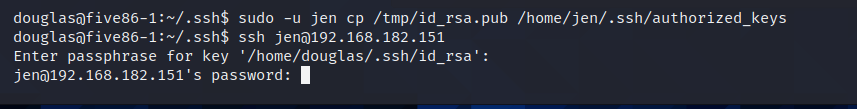

成功登录

## 提权moss

使用**echo $(find / -type f -user jen) > 1.txt**

发现/var/mail/jen 有一封邮件

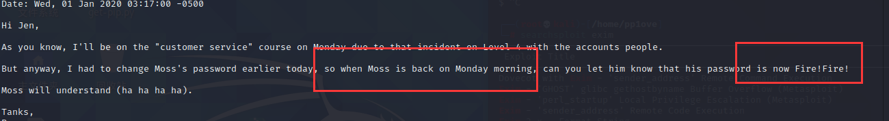

发现moss用户密码为Fire!Fire!

## 提权root

登录后查看一下SUID权限可执行文件

```
find / -perm -u=s -type f 2>/dev/null
```

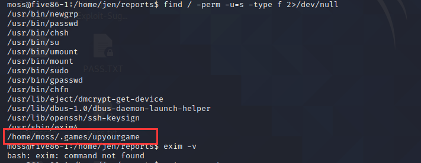

发现了一个upyourgame具有suid权限
然后cd到那个目录下面去执行upyourgame文件

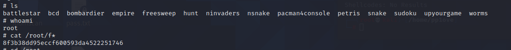

