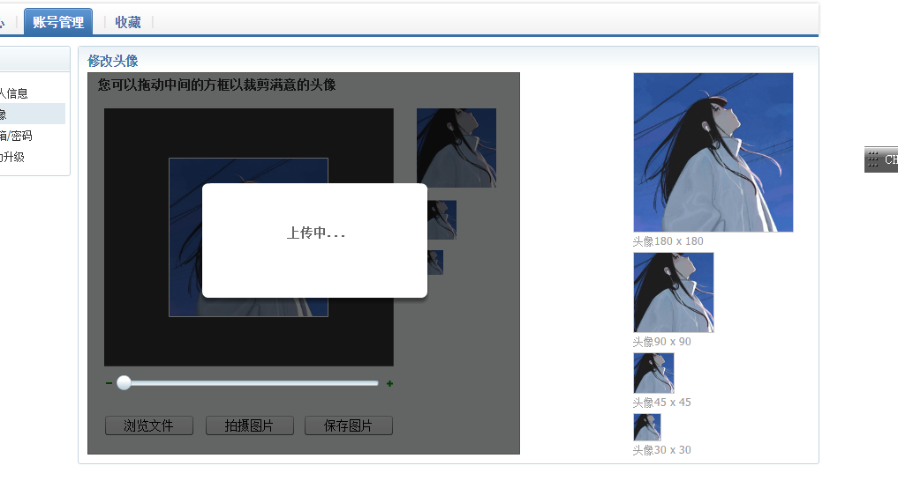
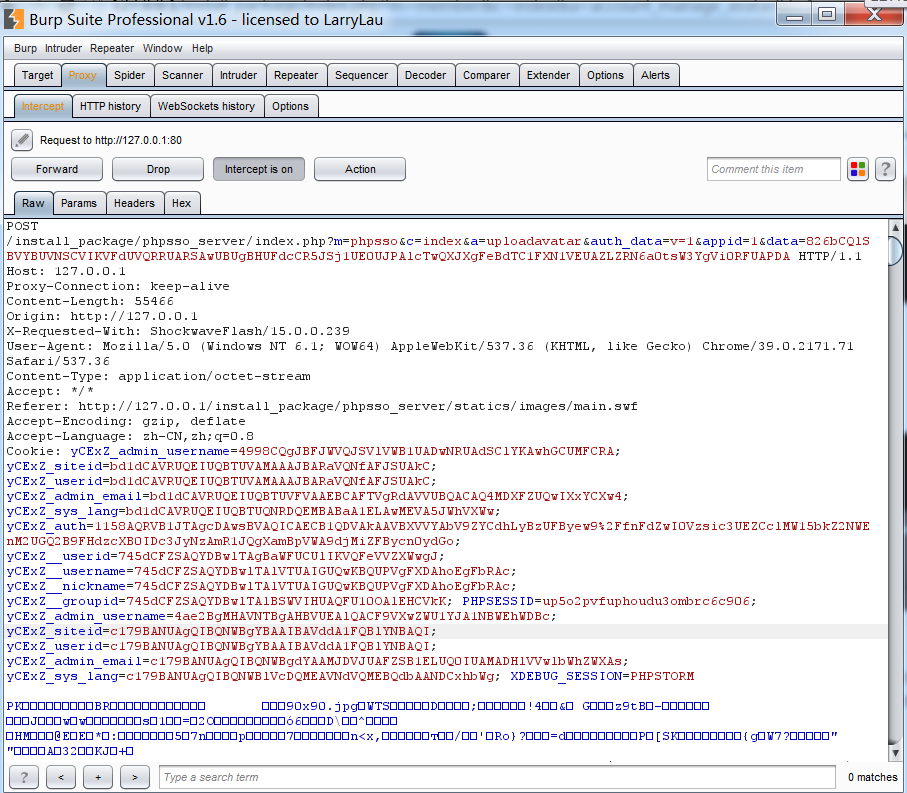
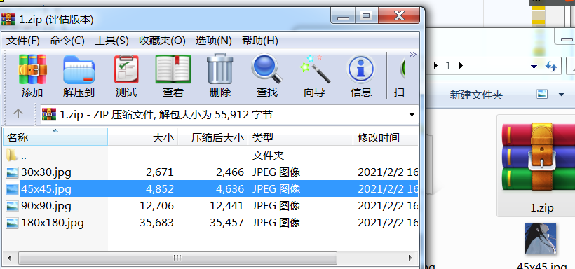
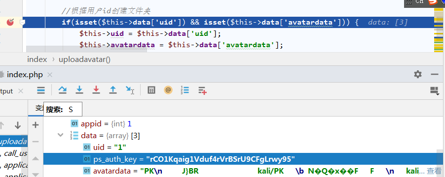
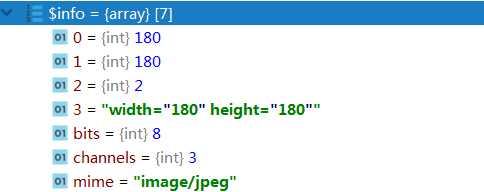
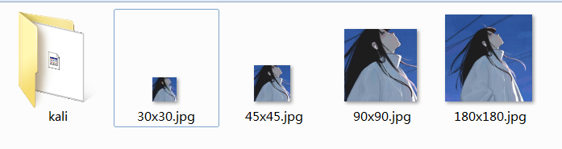

## 前端操作







这里在前端,会将我们的头像分成四个大小，打包成一个压缩包,然后交给后台处理

## 后端代码



```php
/**
	 *  上传头像处理
	 *  传入头像压缩包，解压到指定文件夹后删除非图片文件
	 */
	public function uploadavatar() {
		
		//根据用户id创建文件夹
		if(isset($this->data['uid']) && isset($this->data['avatardata'])) {     //avatardata为文件内容
			$this->uid = $this->data['uid'];
			$this->avatardata = $this->data['avatardata'];
		} else {
			exit('0');
		}
		
		$dir1 = ceil($this->uid / 10000);					
		$dir2 = ceil($this->uid % 10000 / 1000);
		
		//创建图片存储文件夹
		$avatarfile = pc_base::load_config('system', 'upload_path').'avatar/';
		$dir = $avatarfile.$dir1.'/'.$dir2.'/'.$this->uid.'/';
		if(!file_exists($dir)) {
			mkdir($dir, 0777, true);
		}
		
		//存储flashpost图片
		$filename = $dir.$this->uid.'.zip';
		file_put_contents($filename, $this->avatardata);              //$filename=1.zip
		
		//解压缩文件
		pc_base::load_app_class('pclzip', 'phpsso', 0);
		$archive = new PclZip($filename);
		if ($archive->extract(PCLZIP_OPT_PATH, $dir) == 0) {
			die("Error : ".$archive->errorInfo(true));
		}
		
		//判断文件安全，删除压缩包和非jpg图片
		$avatararr = array('180x180.jpg', '30x30.jpg', '45x45.jpg', '90x90.jpg');
		if($handle = opendir($dir)) {                                   //打开文件保存目录
		    while(false !== ($file = readdir($handle))) {              //列出该目录下的文件,$file为文件名数组
				if($file !== '.' && $file !== '..') {
					if(!in_array($file, $avatararr)) {                 //如果文件名不合法,则删除文件
						@unlink($dir.$file);                           //@unlink 无法删除文件夹
					} else {
						$info = @getimagesize($dir.$file);            //返回图片信息
						if(!$info || $info[2] !=2) {
							@unlink($dir.$file);
						}
					}
				}
		    }
		    closedir($handle);    
		}
		$this->db->update(array('avatar'=>1), array('uid'=>$this->uid));
		exit('1');
	}

```



因为这个方法没有进行递归查询,readdir()只能列出该目录下的文件,但是删除文件它用的是@unlink(),@unlink 无法删除文件夹，所以说若我们通过抓包,将压缩包内容修改为一个kali文件夹,里面存放1.php木马,这串代码无法删除kali文件,也没有递归检测我们的1.php文件,导致我们就可以使我们的恶意文件成功上传



