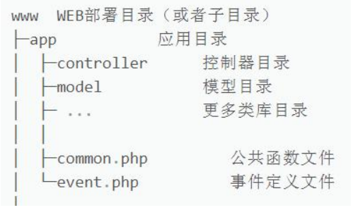
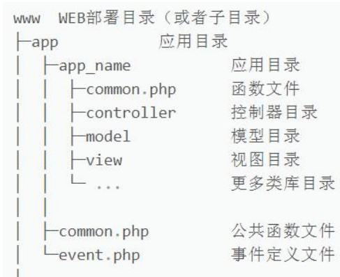
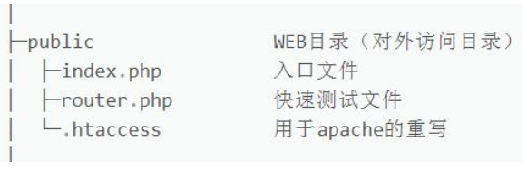
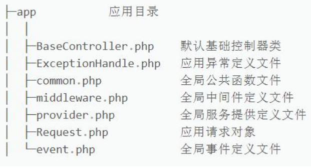
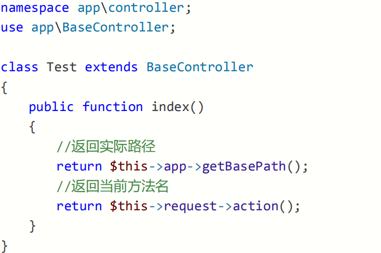
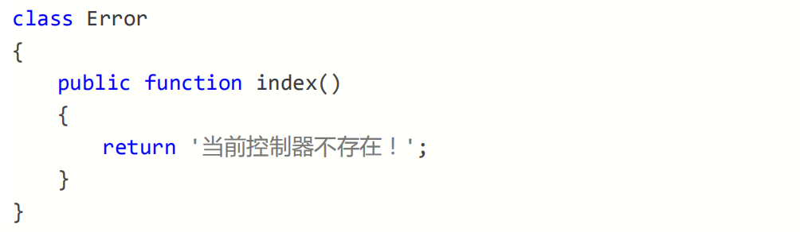
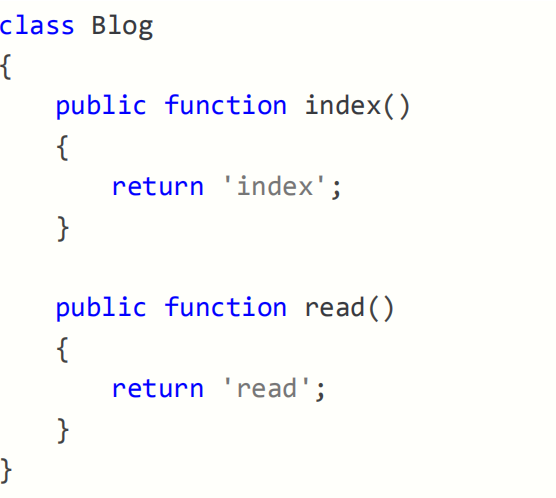
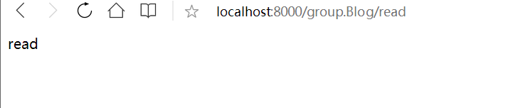

# 0x01thinkphp6.0的安装

参考

```
https://www.kancloud.cn/manual/thinkphp6_0/1037479
https://www.cnblogs.com/it-abu/p/13493424.html
```

# 0x02开发规范

## **一．开发规范** 

#### **一．开发规范** 

1. ##### ThinkPHP6.0 遵循的是 PSR-2 的命名规范和 PSR-4 的自动加载； 

2. ##### 目录和文件的规范如下： 

a. 目录名（小写+下划线）； 

b. 类库和函数文件统一以.php 为后缀； 

c. 类的文件名均以命名空间定义，并且命名空间的路径和类库文件所在路径 

一致； 

d. 类（包含接口和 Trait）文件采用驼峰式命名（首字母大写），其它采用 

小写+下划线命名； 

e. 类名（包括接口和 Trait）和文件名保持一致，统一采用驼峰式命名 

（首字母大写）； 

3. ##### 函数和类、属性命名规范如下： 

a. 类的命名采用驼峰法（首字母大写），如：User、UserType； 

b. 函数的命名使用小写字母和下划线（小写字母开头）的方式， 

如：get_client_ip； 

c. 方法的命名使用驼峰法（首字母小写），如：getUserName； 

d. 属性的命名使用驼峰法（首字母小写），如：tableName； 

e. 特例：以双下划线__打头的函数或方法作为魔术方法，如： 

__call 和 __autoload； 

4. ##### 常量与配置的规范如下： 

a. 常量以大写字母和下划线命名，如：APP_PATH； 

b. 配置参数以小写字母和下划线命名，如：url_convert； 

c. 环境变量定义使用大写字母和下划线命名，如：APP_DEBUG； 

5. 数据表和字段的规范如下： 

a. 数据表和字段采用小写加下划线方式命名； 

b. 并注意字段名不要以下划线开头，如： think_user 表和 user_name 

c. 字段不建议使用驼峰和中文作为数据表及字段命名； 

## **二．目录结构** 

1. ThinkPHP6.0 支持多应用模式部署，app 是应用目录； 

2. 默认情况下，是采用的单模式，如下图结构：

   

3. 多应用模式下，结构如下图： 

   

4. 上图中，app_name 可以有多个，即多应用模式； 

5. 在目录结构上，只确保对外可访问的仅 public 目录； 

   

6. 在 app 目录中，还提供了一些文件，这些文件将在后面逐步讲到； 

   

# 0x03**开启调试与配置文件**

1. 通过命令行安装的 TP6.0，会自动在根目录生成一个.example..env 文件； 
2. 这个.env 文件是环境配置文件，我们只要删除前面的.example.即可生效； 
3. 此时，刷新页面，右下角会出现 Trace 调试小图标，说明调试开启了； 
4. 查看.env 文件，打开调试的环境变量为 APP_DEBUG = true，false 关闭； 

# **0x04URL访问模式**

1. ThinkPHP 框架非常多的操作都是通过 URL 来实现的； 

2. 多应用：http://serverName/index.php/应用/控制器/操作/参数/值…； 

3. 单应用：http://serverName/index.php/控制器/操作/参数/值…；

4. 由于 TP6.0 默认是单应用模式，多应用需要作为扩展安装，避免混乱暂时搁置； 

5. http://serverName 是域名地址，比如 127.0.0.1:8000 或 localhost/tp6/ 

6. index.php 这个文件，是根目录下 public/下的 index.php(入口文件)； 

7. 控制器：app 目录下有一个 controller 控制器目录的 Test.php(控制器)； 

8. Test.php 控制器的类名也必须是 class Test，否则错误； 

9. 操作就是控制器类里面的方法，比如：index(默认免写)或 hello(必写)； 

10. 那么完整形式为： 

a. http://localhost/tp6/public/index.php/test/hello/value/world 

b. http://127.0.0.1:8000/index.php/test/hello/value/world 

```php
class Test 

{ 

	public function index() 

	{ 

		return 'test'; 

	}

	public function hello($value = '') 

	{ 

		return 'hello '.$value; 

	} 

} 
```

11. public/index.php 中的 index.php 可以省略，只要设置 URL 重写即可； 

12. httpd.conf 配置文件中加载了 mod_rewrite.so 模块； 

13. AllowOverride None 将 None 改为 All； 

14. 此时，路径变更为： 

http://localhost/tp6/public/test/hello/value/world

## **二．****URL** **兼容模式** 

1. 上个要点已经了解了 URL 所有访问规则，通过创建 Test 控制器更加了解； 

2. 如果上面那种形式的 URL 不支持的话，可以使用兼容模式的方式来访问： 

http://localhost/tp6test3/public/?s=test/hello/value/world

# **0x05控制器定义**

## **一．控制器定义** 

1. 控制器，即 controller，控制器文件存放在 controller 目录下； 

2. 如果想改变系统默认的控制器文件目录，可以在 config 下 route.php 配置： 

'controller_layer' => 'controller123', 

3. 类名和文件名大小写保持一致，并采用驼峰式（首字母大写）； 

namespace app\controller; 

class Test {...} 

4. 从上面两段代码得知 Test.php 的实际位置为：app\controller\Test.php 

5. 在 Test 类创建两个方法 index(默认)和 hello，访问 URL 如下： 

http://localhost/tp6/public/test/ 

http://localhost/tp6/public/test/hello 

6. 那么如果创建的是双字母组合，比如 class HelloWorld，访问 URL 如下： 

http://localhost/tp6test3/public/helloworld 

http://localhost/tp6test3/public/hello_world 

7. 如果你想避免引入同类名时的冲突，可以 route.php 设置控制器后缀： 

'controller_suffix' => true, 

8. 此时，Test.php 就必须改成 TestController.php，并类名也需要增加后缀； 

**二．渲染输出** 

1. ThinkPHP 直接采用方法内 return 返回的方式直接就输出了； 

2. 使用 json 输出，直接采用 json 函数； 

$data = array('a'=>**1**, 'b'=>**2**, 'c'=>**3**); 

return json($data); 

3. 不推荐使用 die、exit 等 PHP 方法中断代码执行，推荐助手函数 halt()； 

halt('中断测试')

# 0x06基础.空.多级控制器

## **一．基础控制器** 

1. 一般来说，创建控制器后，推荐继承基础控制器来获得更多的方法； 

2. 基础控制器仅仅提供了控制器验证功能，并注入了think\App和think\Request； 

3. 这两个对象后面会有章节详细讲解，下面我们继承并简单使用一下； 



## **二．空控制器** 

1. 在单应用模式下，我们可以给项目定义一个 Error 控制器类，来提醒错误；



## **三．多级控制器** 

1. 所谓多级控制器，就是在控制器 controller 目录下再建立目录并创建控制器； 

2. 我们在 controller 目录下建立 group 目录，并创建 Blog.php 控制器； 

3. 而此时，我们需要访问的地址为：http://localhost:8000/group.blog





# 0x07连接数据库与模型初探

## **一．连接数据库** 

1. ThinkPHP 采用内置抽象层将不同的数据库操作进行封装处理； 

2. 数据抽象层基于 PDO 模式，无须针对不同的数据库编写相应的代码； 

3. 使用数据库的第一步，就是连接你的数据库； 

4. 在根目录的 config 下的 database.php 可以设置数据库连接信息； 

5. 大部分系统已经给了默认值，你只需要修改和填写需要的值即可； 

6. 本地测试，会优先采用.env 的配置信息，我们和 database 配置对应上即可； 

> 'type' => Env::get('database.type', 'mysql'), 
>
> 'hostname' => Env::get('database.hostname', '127.0.0.1'), 
>
> 'database' => Env::get('database.database', 'grade'), 
>
> 'username' => Env::get('database.username', 'root'), 
>
> 'password' => Env::get('database.password', '123456'), 
>
> 'hostport' => Env::get('database.hostport', '3306'), 
>
> 'charset' => Env::get('database.charset', 'utf8'), 
>
> 'prefix' =>Env::get('database.prefix', 'tp_'), 


7. 可以通过删除改变.env 的配置，或删除.env 来验证 database 的执行优先级； 

8. 在 database.php 配置中，default 表示设置默认的数据库连接； 

9. connections 配置数据库连接信息，可以是多个数据库，便于切换； 

10. 默认的数据库连接名称为：'mysql'，再复制一组数据库链接信息：'demo'切换； 

11. 创建一个用于测试数据连接的控制器：DataTest.php； 

```php
namespace app\controller; 

use think\facade\Db; 

class DataTest 

{ 

	public function index() 

	{ 

		$user = Db::table('tp_user')->select(); 

		//$user = Db::connect('mysql')->table('tp_user')->select(); 

		return json($user); 

	}

	public function demo() 

	{ 

		$demo = Db::connect('demo')->table('tp_user')->select(); 

		return json($demo); 

	} 

} 
```

## **二．模型初探** 

1. 在 app 目录下创建一个 model 目录，并创建 User.php 的模型类； 

```php
namespace app\model; 

use think\Model; 

class User extends Model 

{ 

	protected $connection = 'demo'; 

} 
```


2. User 继承模型基类，即可实现数据调用，后面章节会详解讲解； 

3. 而受保护的字段$connection，则是切换到 demo 数据库； 

4. 控制器端的调用方式如下，具体原理，后面模型章节会详解； 

```php
public function getUser() 

{ 

	$user = User::select(); 

	return json($user); 

}
```

# 0x08数据库的数据查询

## **一．单数据查询** 

1. Db::table()中 table 必须指定完整数据表（包括前缀）； 

2. 如果希望只查询一条数据，可以使用 find()方法，需指定 where 条件； 

```php
Db::table('tp_user')->where('id', 27)->find() 
```

3. Db::getLastSql()方法，可以得到最近一条 SQL 查询的原生语句； 

```php
SELECT * FROM `tp_user` LIMIT 1 
```

4. 没有查询到任何值，则返回 null； 

5. 使用 findOrFail()方法同样可以查询一条数据，在没有数据时抛出一个异常； 

```php
Db::table('tp_user')->where('id', 1)->findOrFail() 
```

6. 使用 findOrEmpty()方法也可以查询一条数据，但在没有数据时返回一个空数组； 

```php
Db::table('tp_user')->where('id', 1)->findOrEmpty(); 
```

## **二．数据集查询** 

1. 想要获取多列数据，可以使用 select()方法； 

```php
Db::table('tp_user')->select(); 

SELECT * FROM `tp_user` 
```

2. 多列数据在查询不到任何数据时返回空数组，使用 selectOrFail()抛出异常； 

```php
Db::table('tp_user')->where('id', 1)->selectOrFail(); 
```

3. 在 select()方法后再使用 toArray()方法，可以将数据集对象转化为数组； 

```php
$user = Db::table('tp_user')->select()->toArray(); 

dump($user); 
```

4. 当在数据库配置文件中设置了前缀，那么我们可以使用 name()方法忽略前缀； 

```php
Db::name('user')->select(); 
```

## **三．其它查询** 

1. 通过 value()方法，可以查询指定字段的值（单个），没有数据返回 null； 

```php
Db::name('user')->where('id', **27**)->value('username');
```

2. 通过 colunm()方法，可以查询指定列的值（多个），没有数据返回空数组； 

```php
Db::name('user')->column('username'); 
```

3. 可以指定 id 作为列值的索引； 

```php
Db::name('user')->column('username', 'id'); 
```

4. 如果处理的数据量巨大，成百上千那种，一次性读取有可能会导致内存开销过大； 

5. 为了避免内存处理太多数据出错，可以使用 chunk()方法分批处理数据； 

6. 比如，每次只处理 100 条，处理完毕后，再读取 100 条继续处理； 

```php
Db::table('tp_user')->chunk(3, function($users) { 

	foreach ($users as $user) { 

	dump($user); 

}

echo 1; 

}; 
```

7. 可以利用游标查询功能，可以大幅度减少海量数据的内存开销，它利用了 PHP 生 

成器特性。每次查询只读一行，然后再读取时，自动定位到下一行继续读取； 

```php
$cursor = Db::table('tp_user')->cursor(); 

foreach($cursor as $user){ 

	dump($user); 

}
```

# 0x09数据库的链式查询

**一．查询规则** 

1. 前面课程中我们通过指向符号“->”多次连续调用方法称为：链式查询； 

2. 当 Db::name('user')时，返回查询对象(Query)，即可连缀数据库对应的方法； 

3. 每次执行一个数据库查询方法时，比如 where()，还将返回查询对象(Query)； 

4. 只要还是数据库对象，那么就可以一直使用指向符号进行链式查询； 

5. 再利用 find()、select()等方法返回数组(Array)或数据集对象(Colletion)； 

6. 而 find()和 select()是结果查询方法（放在最后），并不是链式查询方法； 

```
Db::name('user')->where('id', 27)->order('id', 'desc')->find() 
```

7. 除了查询方法可以使用链式连贯操作，CURD 操作也可以使用（后续课程研究）； 

8. 那么，有多少种类似 where()的链式操作方法呢？打开手册瞄一下。。。 

**二．更多查询** 

1. 如果多次使用数据库查询，那么每次静态创建都会生成一个实例，造成浪费； 

2. 我们可以把对象实例保存下来，再进行反复调用即可； 

```php
$userQuery = Db::name('user'); 
$dataFind = $userQuery->where('id', 27)->find(); 
$dataSelect = $userQuery->select(); 
```

3. 当同一个对象实例第二次查询后，会保留第一次查询的值； 

```php
$data1 = $userQuery->order('id', 'desc')->select(); 
$data2 = $userQuery->select(); 
return Db::getLastSql(); 
SELECT * FROM tp_user ORDER BY id DESC 
```

4. 使用 removeOption()方法，可以清理掉上一次查询保留的值； 

```php
$userQuery->removeOption('where')->select();
```

# 0x0a数据库的数据新增

## **一．单数据新增** 

1. 使用 insert()方法可以向数据表添加一条数据，更多的字段采用默认； 

> $data = [ 
>
> 'username' => '辉夜', 
>
> 'password' => '123', 
>
> 'gender' => '女', 
>
> 'email' => 'huiye@163.com', 
>
> 'price' => 90, 
>
> 'details' => '123' 
>
> ];

`Db::name('user')->insert($data);` 

2. 如果新增成功，insert()方法会返回一个 1 值； 

`return Db::name('user')->insert($data);` 

3. 如果你添加一个不存在的字段数据，会抛出一个异常 Exception； 

4. 如果想强行新增抛弃不存在的字段数据，则使用 strick(false)方法，忽略异常； 

`Db::name('user')->strict(false)->insert($data);` 

5. 如果我们采用的数据库是 mysql，可以支持 replace 写入； 

6. insert 和 replace 写入的区别，前者表示表中存在主键相同则报错，后者则修改； 

`Db::name('user')->replace()->insert($data);` 

`return Db::getLastSql();` 

7. 使用 insertGetId()方法，可以在新增成功后返回当前数据 ID； 

`return Db::name('user')->insertGetId($data);` 

## 二．**批量数据新增** 

1. 使用 insertAll()方法，可以批量新增数据，但要保持数组结构一致； 

> $data = [ 
>
> [ 
>
> 'username' => '辉夜', 
>
> 'password' => '123
>
> 'gender' => '女', 
>
> 'email' => 'huiye@163.com',
>
>  'price' => 90, 
>
> 'details' => '123' ],
>
> [ 
>
> 'username' => '辉夜', 
>
> 'password' => '123', 
>
> 'gender' => '女', 
>
> 'email' => 'huiye@163.com', 
>
> 'price' => 90, 
>
> 'details' => '123' 
>
> ] 
>
> ];

`Db::name('user')->insertAll($data);` 

2. 批量新增也支持 replace()方法，添加后改变成 replace into； 

`Db::name('user')->replace()->insertAll($data);` 

## 三．save()新增

1. save()方法是一个通用方法，可以自行判断是新增还是修改(更新)数据； 

2. save()方法判断是否为新增或修改的依据为，是否存在主键，不存在即新增； 

```php
Db::name('user')->save($data);
```

# 0x0b数据库的修改删除

## **一．数据修改** 

1. 使用 update()方法来修改数据，修改成功返回影响行数，没有修改返回 0； 

> $data = [ 
>
> 'username' => '李白' 
>
> ];
>
> return Db::**name**('user')->where('id', **38**)->update($data); 

2. 如果修改数据包含了主键信息，比如 id，那么可以省略掉 where 条件； 

> $data = [ 
>
> 'id' => 231, 
>
> 'username' => '李白' 
>
> ];
>
> return Db::name('user')->update($data); 

3. 如果想让一些字段修改时执行 SQL 函数操作，可以使用 exp()方法实现； 

Db::name('user')->where('id', **232**) ->exp('email', 'UPPER(email)') ->update(); 

4. 如果要自增/自减某个字段，可以使用 inc/dec 方法，并支持自定义步长； 

Db::name('user')->where('id', **232**) ->inc('price') ->dec('status', **2**) ->update(); 

5. 一个更加简单粗暴灵活的方式，使用::raw()方法实现 3，4 点的内容； 

> Db::name('user')->where('id', **232**) 
>
> ->update([ 
>
> 'email' => Db::raw('UPPER(email)'), 
>
> 'price' => Db::raw('price + 1'), 
>
> 'status' => Db::raw('status - 2')
>
> ]); 

6. 使用 save()方法进行修改数据，这里必须指定主键才能实现修改功能； 

Db::name('user')->where('id', **232**) ->save(['username'=>'李黑']);

# 0x0c数据库的查询表达式

## **一．比较查询** 

1. 查询表达式支持大部分常用的 SQL 语句，语法格式如下： 

where('字段名','查询表达式','查询条件'); 

2. 在查询数据进行筛选时，我们采用 where()方法，比如 id=80； 

Db::**name**('user')->where('id', **80**)->find(); 

Db::**name**('user')->where('id','=',**80**)->find(); 

3. 使用<>、>、<、>=、<=可以筛选出各种符合比较值的数据列表； 

Db::**name**('user')->where('id','<>',**80**)->select(); 

## **二．区间查询** 

1. 使用 like 表达式进行模糊查询； 

Db::**name**('user')->where('email','like','xiao%')->select(); 

2. like 表达式还可以支持数组传递进行模糊查询； 

Db::**name**('user')->where('email','like',['xiao%','wu%'], 'or')->select(); 

SELECT * FROM `tp_user` WHERE (`email` LIKE 'xiao%' OR `email` LIKE 'wu%') 

3. like 表达式具有两个快捷方式 whereLike()和 whereNoLike()； 

Db::**name**('user')->whereLike('email','xiao%')->select(); 

Db::**name**('user')->whereNotLike('email','xiao%')->select(); 

4. between 表达式具有两个快捷方式 whereBetween()和 whereNotBetween()； 

Db::**name**('user')->where('id','between','19,25')->select(); 

Db::**name**('user')->where('id','between',[**19**, **25**])->select(); 

Db::**name**('user')->whereBetween('id','19,25')->select(); 

Db::**name**('user')->whereNotBetween('id','19,25')->select(); 

5. in 表达式具有两个快捷方式 whereIn()和 whereNotIn()； 

Db::**name**('user')->where('id','in', '19,21,29')->select(); 

Db::**name**('user')->where('id','in', [**19**, **21**, **29**])->select();

Db::**name**('user')->whereIn('id','19,21,29')->select(); 

Db::**name**('user')->whereNotIn('id','19,21,29')->select(); 

6. null 表达式具有两个快捷方式 whereNull()和 whereNotNull()； 

Db::**name**('user')->where('uid','null')->select(); 

Db::**name**('user')->where('uid','not null')->select(); 

Db::**name**('user')->whereNull('uid')->select(); 

Db::**name**('user')->whereNotNull('uid')->select(); 

## **三．EXP 查询** 

1. 使用 exp 可以自定义字段后的 SQL 语句； 

Db::**name**('user')->where('id','exp','IN (19,21,25)')->select(); 

Db::**name**('user')->whereExp('id','IN (19,21,25)')->select()

# 0x0d数据库的时间查询

## **一．传统方式** 

1. 可以使用>、<、>=、<=来筛选匹配时间的数据； 

Db::**name**('user')->where('create_time', '>', '2018-1-1')->select(); 

1. 可以使用 between 关键字来设置时间的区间； 

Db::**name**('user')->where('create_time', 'between', ['2018-1-1', '2019-12-31'])->select(); 

Db::**name**('user')->where('create_time', 'not between', ['2018-1-1', '2019-12-31'])->select(); 

## **二．快捷方式** 

1. 时间查询的快捷方法为 whereTime()，直接使用>、<、>=、<=； 

Db::**name**('user')->whereTime('create_time', '>', '2018-1-1')->select(); 

2. 快捷方式也可以使用 between 和 not between； 

Db::**name**('user')->whereBetween('create_time', ['2018-1-1', '2019-12-31'])->select(); 

3. 还有一种快捷方式为：whereBetweenTime()和 whereNotBetweenTime()； 

Db::**name**('user')->whereBetweenTime('create_time', '2018-1-1', '2019-12-31')->select(); 

4. 默认的大于>，可以省略； 

Db::**name**('user')->whereTime('create_time', '2018-1-1')->select(); 

## **三．固定查询** 

1. 使用 whereYear 查询今年的数据、去年的数据和某一年的数据 

Db::name('user')->whereYear('create_time')->select(); 

Db::name('user')->whereYear('create_time', 'last year')->select(); 

Db::name('user')->whereYear('create_time', '2016')->select();

2. 使用 whereMonth 查询当月的数据、上月的数据和某一个月的数据； 

Db::name('user')->whereMonth('create_time')->select(); 

Db::name('user')->whereMonth('create_time', 'last month')->select(); 

Db::name('user')->whereMonth('create_time', '2016-6')->select(); 

3. 使用 whereDay 查询今天的数据、昨天的数据和某一个天的数据； 

Db::name('user')->whereDay('create_time')->select(); 

Db::name('user')->whereDay('create_time', 'last day')->select(); 

Db::name('user')->whereDay('create_time', '2016-6-27')->select(); 

## **四．其它查询** 

1. 查询指定时间的数据，比如两小时内的； 

Db::**name**('user')->whereTime('create_time', '-2 hours')->select(); 

2. 查询两个时间字段时间有效期的数据，比如会员开始到结束的期间； 

Db::**name**('user')->whereBetweenTimeField('start_time', 'end_time')->select();

# 0x10**模型的定义方式** 

## **一．定义模型** 

1. 定义一个和数据库表向匹配的模型； 

class User extends Model 

2. 模型会自动对应数据表，并且有一套自己的命名规则； 

3. 模型类需要去除表前缀(tp_)，采用驼峰式命名，并且首字母大写； 

tp_user(表名) => User 

tp_user_type(表名) => UserType 

4. 创建空模型后，我们可以在控制器调用，创建控制器 DataModel.php； 

5. 可以直接使用模型的名称 User::*调用查询方法，比如 select()等； 

6. 如果没有代码提示，请和上一节一样，把 5.1 的注释复制过来； 

```php
class DataModel 

{ 

public function index() 

{ 

return json(User::**select**()); 

} 

} 
```


7. 如果担心设置的模型类名和 PHP 关键字冲突，可以开启应用类后缀； 

8. 比如设置：Class UserModel 这种，需要更改文件名为 UserModel.php； 

9. 然后设置一下$name 属性为指定 user(表名)即可实现； 

```php
class UserModel extends Model 

{ 

protected $name = 'user'; 

} 
```


## **二．设置模型** 

1. 默认主键为 id，你可以设置其它主键，比如 uid； 

protected $pk = 'uid'; 

2. 从控制器端调用模型操作，如果和控制器类名重复，可以设置别名； 

use app\model\User as UserModel;

3. 在模型定义中，可以设置其它的数据表； 

protected $table = 'tp_one'; 

4. 模型和控制器一样，也有初始化，在这里必须设置 static 静态方法； 

```php
//模型初始化 

protected static function init() 

{ 

//第一次实例化的时候执行 init 

echo '初始化 User 模型'; 

}


```

