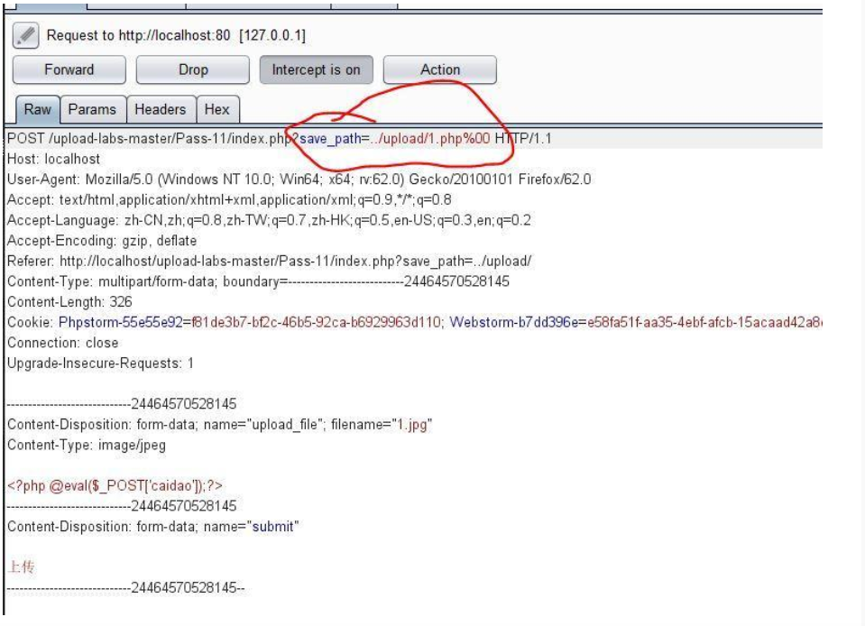

---

title: upload-labs
author: Pp1ove
avatar: \img\custom\head.jpg
authorLink: 
authorAbout: Pp1ove
authorDesc: 一个好奇的人
categories: 技术
comments: false
comments: false
date: 2021-02-02 17:29:40
tags: 文件上传
photos: \img\article\7.png
---

## Less-1:


ban掉或者修改js

## Less-2

```
if (($_FILES['upload_file']['type'] == 'image/jpeg') || ($_FILES['upload_file']['type'] == 'image/png') || ($_FILES['upload_file']['type'] == 'image/gif'))
```

对上传文件的  type进行了检测,而这个是可以抓包修改的

## Less-3

```php
if (isset($_POST['submit'])) {
    if (file_exists($UPLOAD_ADDR)) {
        $deny_ext = array('.asp','.aspx','.php','.jsp');
        $file_name = trim($_FILES['upload_file']['name']);              //首尾去空
        $file_name = deldot($file_name);								//删除文件名末尾的点
        $file_ext = strrchr($file_name, '.');                           //从后开始找到第一个“.”,返回从.开始到末尾
        $file_ext = strtolower($file_ext); 								//转换为小写
        $file_ext = str_ireplace('::$DATA', '', $file_ext);				//去除字符串::$DATA
        $file_ext = trim($file_ext); 									//收尾去空
																		
        if(!in_array($file_ext, $deny_ext)) {
            if (move_uploaded_file($_FILES['upload_file']['tmp_name'], $UPLOAD_ADDR. '/' . $_FILES['upload_file']['name'])) {
                 $img_path = $UPLOAD_ADDR .'/'. $_FILES['upload_file']['name'];
                 $is_upload = true;
            }
        } else {
            $msg = '不允许上传.asp,.aspx,.php,.jsp后缀文件！';
        }
    } else {
        $msg = $UPLOAD_ADDR . '文件夹不存在,请手工创建！';
    }
}
```

白名单不完整,上传php3

## Less-4

白名单补充了,但是没有过滤.htaccess

## Less-5

没有转换为小写,可以使用大小写绕过

## Less-6

```PHP
if (isset($_POST['submit'])) {
    if (file_exists($UPLOAD_ADDR)) {
        $deny_ext = array(".php",".php5",".php4",".php3",".php2",".html",".htm",".phtml",".pHp",".pHp5",".pHp4",".pHp3",".pHp2",".Html",".Htm",".pHtml",".jsp",".jspa",".jspx",".jsw",".jsv",".jspf",".jtml",".jSp",".jSpx",".jSpa",".jSw",".jSv",".jSpf",".jHtml",".asp",".aspx",".asa",".asax",".ascx",".ashx",".asmx",".cer",".aSp",".aSpx",".aSa",".aSax",".aScx",".aShx",".aSmx",".cEr",".sWf",".swf",".htaccess");
        $file_name = $_FILES['upload_file']['name'];
        $file_name = deldot($file_name);//删除文件名末尾的点
        $file_ext = strrchr($file_name, '.');
        $file_ext = strtolower($file_ext); //转换为小写
        $file_ext = str_ireplace('::$DATA', '', $file_ext);//去除字符串::$DATA
        
        if (!in_array($file_ext, $deny_ext)) {
            if (move_uploaded_file($_FILES['upload_file']['tmp_name'], $UPLOAD_ADDR . '/' . $_FILES['upload_file']['name'])) {
                $img_path = $UPLOAD_ADDR . '/' . $file_name;
                $is_upload = true;
            }
        } else {
            $msg = '此文件不允许上传';
        }
    } else {
        $msg = $UPLOAD_ADDR . '文件夹不存在,请手工创建！';
    }
}
?>
```

没有对后缀去空格,可以使用在后缀名后加空格

## Less-7

```PHP
if (isset($_POST['submit'])) {
    if (file_exists($UPLOAD_ADDR)) {
        $deny_ext = array(".php",".php5",".php4",".php3",".php2",".html",".htm",".phtml",".pHp",".pHp5",".pHp4",".pHp3",".pHp2",".Html",".Htm",".pHtml",".jsp",".jspa",".jspx",".jsw",".jsv",".jspf",".jtml",".jSp",".jSpx",".jSpa",".jSw",".jSv",".jSpf",".jHtml",".asp",".aspx",".asa",".asax",".ascx",".ashx",".asmx",".cer",".aSp",".aSpx",".aSa",".aSax",".aScx",".aShx",".aSmx",".cEr",".sWf",".swf",".htaccess");
        $file_name = trim($_FILES['upload_file']['name']);
        $file_ext = strrchr($file_name, '.');
        $file_ext = strtolower($file_ext); //转换为小写
        $file_ext = str_ireplace('::$DATA', '', $file_ext);//去除字符串::$DATA
        $file_ext = trim($file_ext); //首尾去空
        
        if (!in_array($file_ext, $deny_ext)) {
            if (move_uploaded_file($_FILES['upload_file']['tmp_name'], $UPLOAD_ADDR . '/' . $_FILES['upload_file']['name'])) {
                $img_path = $UPLOAD_ADDR . '/' . $file_name;
                $is_upload = true;
            }
        } else {
            $msg = '此文件不允许上传';
        }
    } else {
        $msg = $UPLOAD_ADDR . '文件夹不存在,请手工创建！';
    }
}
?>
```

还是黑名单，但是没有对后缀名进行去”.”处理，利用windows特性，会自动去掉后缀名中最后的”.”，可在后缀名中加”.”绕过

## Less-8

还是黑名单，但是没有对后缀名进行去”::$DATA”处理，利用windows特性，可在后缀名中加” ::$DATA”绕过：

## Less-9

```PHP
if (isset($_POST['submit'])) {
    if (file_exists($UPLOAD_ADDR)) {
        $deny_ext = array(".php",".php5",".php4",".php3",".php2",".html",".htm",".phtml",".pHp",".pHp5",".pHp4",".pHp3",".pHp2",".Html",".Htm",".pHtml",".jsp",".jspa",".jspx",".jsw",".jsv",".jspf",".jtml",".jSp",".jSpx",".jSpa",".jSw",".jSv",".jSpf",".jHtml",".asp",".aspx",".asa",".asax",".ascx",".ashx",".asmx",".cer",".aSp",".aSpx",".aSa",".aSax",".aScx",".aShx",".aSmx",".cEr",".sWf",".swf",".htaccess");
        $file_name = trim($_FILES['upload_file']['name']);
        $file_name = deldot($file_name);//删除文件名末尾的点
        $file_ext = strrchr($file_name, '.');
        $file_ext = strtolower($file_ext); //转换为小写
        $file_ext = str_ireplace('::$DATA', '', $file_ext);//去除字符串::$DATA
        $file_ext = trim($file_ext); //首尾去空
        
        if (!in_array($file_ext, $deny_ext)) {
            if (move_uploaded_file($_FILES['upload_file']['tmp_name'], $UPLOAD_ADDR . '/' . $_FILES['upload_file']['name'])) {
                $img_path = $UPLOAD_ADDR . '/' . $file_name;
                $is_upload = true;
            }
        } else {
            $msg = '此文件不允许上传';
        }
    } else {
        $msg = $UPLOAD_ADDR . '文件夹不存在,请手工创建！';
    }
}if (isset($_POST['submit'])) {
    if (file_exists($UPLOAD_ADDR)) {
        $deny_ext = array(".php",".php5",".php4",".php3",".php2",".html",".htm",".phtml",".pHp",".pHp5",".pHp4",".pHp3",".pHp2",".Html",".Htm",".pHtml",".jsp",".jspa",".jspx",".jsw",".jsv",".jspf",".jtml",".jSp",".jSpx",".jSpa",".jSw",".jSv",".jSpf",".jHtml",".asp",".aspx",".asa",".asax",".ascx",".ashx",".asmx",".cer",".aSp",".aSpx",".aSa",".aSax",".aScx",".aShx",".aSmx",".cEr",".sWf",".swf",".htaccess");
        $file_name = trim($_FILES['upload_file']['name']);
        $file_ext = strrchr($file_name, '.');
        $file_ext = strtolower($file_ext); //转换为小写
        $file_ext = str_ireplace('::$DATA', '', $file_ext);//去除字符串::$DATA
        $file_ext = trim($file_ext); //首尾去空
        
        if (!in_array($file_ext, $deny_ext)) {
            if (move_uploaded_file($_FILES['upload_file']['tmp_name'], $UPLOAD_ADDR . '/' . $_FILES['upload_file']['name'])) {
                $img_path = $UPLOAD_ADDR . '/' . $file_name;
                $is_upload = true;
            }
        } else {
            $msg = '此文件不允许上传';
        }
    } else {
        $msg = $UPLOAD_ADDR . '文件夹不存在,请手工创建！';
    }
}
?>	
```

使用6.php. .

window特性


命名完成后名称为6.php

## Less-10

```php
$is_upload = false;
$msg = null;
if (isset($_POST['submit'])) {
    if (file_exists($UPLOAD_ADDR)) {
        $deny_ext = array("php","php5","php4","php3","php2","html","htm","phtml","jsp","jspa","jspx","jsw","jsv","jspf","jtml","asp","aspx","asa","asax","ascx","ashx","asmx","cer","swf","htaccess");

        $file_name = trim($_FILES['upload_file']['name']);
        $file_name = str_ireplace($deny_ext,"", $file_name);
        if (move_uploaded_file($_FILES['upload_file']['tmp_name'], $UPLOAD_ADDR . '/' . $file_name)) {
            $img_path = $UPLOAD_ADDR . '/' .$file_name;
            $is_upload = true;
        }
    } else {
        $msg = $UPLOAD_ADDR . '文件夹不存在,请手工创建！';
    }
}
?>
```

将问题后缀吗替换为空,使用双写绕过

## Less-11

```PHP
if(isset($_POST['submit'])){
    $ext_arr = array('jpg','png','gif');
    $file_ext = substr($_FILES['upload_file']['name'],strrpos($_FILES['upload_file']['name'],".")+1);
    if(in_array($file_ext,$ext_arr)){
        $temp_file = $_FILES['upload_file']['tmp_name'];
        $img_path = $_GET['save_path']."/".rand(10, 99).date("YmdHis").".".$file_ext;

        if(move_uploaded_file($temp_file,$img_path)){
            $is_upload = true;
        }
        else{
            $msg = '上传失败！';
        }
    }
    else{
        $msg = "只允许上传.jpg|.png|.gif类型文件！";
    }
}
?>
    
```

白名单,可以控制path,使用%00截断（因为php底层代码为c）

```
截断条件：
 1、php版本小于5.3.4
 2、php.ini的magic_quotes_gpc为OFF状态
```




## Less-12

和十一关不同的是这次的save_path是通过post传进来的，还是利用00截断，但这次需要在二进制中进行修改，因为post不会像get对%00进行自动解码。

## Less-13

```PHP
function getReailFileType($filename){
    $file = fopen($filename, "rb");
    $bin = fread($file, 2); //只读2字节
    fclose($file);
    $strInfo = @unpack("C2chars", $bin);    
    $typeCode = intval($strInfo['chars1'].$strInfo['chars2']);    
    $fileType = '';    
    switch($typeCode){      
        case 255216:            
            $fileType = 'jpg';
            break;
        case 13780:            
            $fileType = 'png';
            break;        
        case 7173:            
            $fileType = 'gif';
            break;
        default:            
            $fileType = 'unknown';
        }    
        return $fileType;
}
$is_upload = false;
$msg = null;
if(isset($_POST['submit'])){
    $temp_file = $_FILES['upload_file']['tmp_name'];
    $file_type = getReailFileType($temp_file);

    if($file_type == 'unknown'){
        $msg = "文件未知，上传失败！";
    }else{
        $img_path = $UPLOAD_ADDR."/".rand(10, 99).date("YmdHis").".".$file_type;//将文件类型拼接成文件后缀
        if(move_uploaded_file($temp_file,$img_path)){
            $is_upload = true;
        }
        else{
            $msg = "上传失败";
        }
    }
}
?>
```

通过读文件的前2个字节判断文件类型，因此直接上传图片马即可

## Less-14

```php
function isImage($filename){
    $types = '.jpeg|.png|.gif';
    if(file_exists($filename)){
        $info = getimagesize($filename);
        $ext = image_type_to_extension($info[2]);
        if(stripos($types,$ext)){
            return $ext;
        }else{
            return false;
        }
    }else{
        return false;
    }
}

$is_upload = false;
$msg = null;
if(isset($_POST['submit'])){
    $temp_file = $_FILES['upload_file']['tmp_name'];
    $res = isImage($temp_file);
    if(!$res){
        $msg = "文件未知，上传失败！";
    }else{
        $img_path = $UPLOAD_ADDR."/".rand(10, 99).date("YmdHis").$res;
        if(move_uploaded_file($temp_file,$img_path)){
            $is_upload = true;
        }
        else{
            $msg = "上传失败";
        }
    }
}
?>
```


## Less-15

```PHP
function isImage($filename){
    //需要开启php_exif模块
    $image_type = exif_imagetype($filename);
    switch ($image_type) {
        case IMAGETYPE_GIF:
            return "gif";
            break;
        case IMAGETYPE_JPEG:
            return "jpg";
            break;
        case IMAGETYPE_PNG:
            return "png";
            break;    
        default:
            return false;
            break;
    }
}

$is_upload = false;
$msg = null;
if(isset($_POST['submit'])){
    $temp_file = $_FILES['upload_file']['tmp_name'];
    $res = isImage($temp_file);
    if(!$res){
        $msg = "文件未知，上传失败！";
    }else{
        $img_path = $UPLOAD_ADDR."/".rand(10, 99).date("YmdHis").".".$res;
        if(move_uploaded_file($temp_file,$img_path)){
            $is_upload = true;
        }
        else{
            $msg = "上传失败";
        }
    }
}
?>
```


感觉和13的原理类似

## Less-16

```PHP
if (isset($_POST['submit'])){
    // 获得上传文件的基本信息，文件名，类型，大小，临时文件路径
    $filename = $_FILES['upload_file']['name'];
    $filetype = $_FILES['upload_file']['type'];
    $tmpname = $_FILES['upload_file']['tmp_name'];

    $target_path=$UPLOAD_ADDR.basename($filename);

    // 获得上传文件的扩展名
    $fileext= substr(strrchr($filename,"."),1);

    //判断文件后缀与类型，合法才进行上传操作
    if(($fileext == "jpg") && ($filetype=="image/jpeg")){
        if(move_uploaded_file($tmpname,$target_path))
        {
            //使用上传的图片生成新的图片
            $im = imagecreatefromjpeg($target_path);

            if($im == false){
                $msg = "该文件不是jpg格式的图片！";
            }else{
                //给新图片指定文件名
                srand(time());
                $newfilename = strval(rand()).".jpg";
                $newimagepath = $UPLOAD_ADDR.$newfilename;
                imagejpeg($im,$newimagepath);
                //显示二次渲染后的图片（使用用户上传图片生成的新图片）
                $img_path = $UPLOAD_ADDR.$newfilename;
                unlink($target_path);
                $is_upload = true;
            }
        }
        else
        {
            $msg = "上传失败！";
        }

    }else if(($fileext == "png") && ($filetype=="image/png")){
        if(move_uploaded_file($tmpname,$target_path))
        {
            //使用上传的图片生成新的图片
            $im = imagecreatefrompng($target_path);

            if($im == false){
                $msg = "该文件不是png格式的图片！";
            }else{
                 //给新图片指定文件名
                srand(time());
                $newfilename = strval(rand()).".png";
                $newimagepath = $UPLOAD_ADDR.$newfilename;
                imagepng($im,$newimagepath);
                //显示二次渲染后的图片（使用用户上传图片生成的新图片）
                $img_path = $UPLOAD_ADDR.$newfilename;
                unlink($target_path);
                $is_upload = true;               
            }
        }
        else
        {
            $msg = "上传失败！";
        }

    }else if(($fileext == "gif") && ($filetype=="image/gif")){
        if(move_uploaded_file($tmpname,$target_path))
        {
            //使用上传的图片生成新的图片
            $im = imagecreatefromgif($target_path);
            if($im == false){
                $msg = "该文件不是gif格式的图片！";
            }else{
                //给新图片指定文件名
                srand(time());
                $newfilename = strval(rand()).".gif";
                $newimagepath = $UPLOAD_ADDR.$newfilename;
                imagegif($im,$newimagepath);
                //显示二次渲染后的图片（使用用户上传图片生成的新图片）
                $img_path = $UPLOAD_ADDR.$newfilename;
                unlink($target_path);
                $is_upload = true;
            }
        }
        else
        {
            $msg = "上传失败！";
        }
    }else{
        $msg = "只允许上传后缀为.jpg|.png|.gif的图片文件！";
    }
}
?>
```

本关综合判断了后缀名、content-type，以及利用imagecreatefromgif判断是否为gif图片，最后再做了一次二次渲染，绕过方法：

在图片开头或者图片中间加入php代码

## Less-17

```php

if(isset($_POST['submit'])){
    $ext_arr = array('jpg','png','gif');
    $file_name = $_FILES['upload_file']['name'];
    $temp_file = $_FILES['upload_file']['tmp_name'];
    $file_ext = substr($file_name,strrpos($file_name,".")+1);
    $upload_file = $UPLOAD_ADDR . '/' . $file_name;

    if(move_uploaded_file($temp_file, $upload_file)){
        if(in_array($file_ext,$ext_arr)){
             $img_path = $UPLOAD_ADDR . '/'. rand(10, 99).date("YmdHis").".".$file_ext;
             rename($upload_file, $img_path);
             $is_upload = true;
        }else{
            $msg = "只允许上传.jpg|.png|.gif类型文件！";
            unlink($upload_file);
        }
    }else{
        $msg = '上传失败！';
    }
}
?>
```


先将文件放置upload目录下,然后再删除文件，所以可以使用条件竞争

## Less-18


一样失败，但看大佬的说是本关对文件后缀名做了白名单判断，然后会一步一步检查文件大小、文件是否存在等等，将文件上传后，对文件重新命名，同样存在条件竞争的漏洞。可以不断利用burp发送上传图片马的数据包，由于条件竞争，程序会出现来不及rename的问题，从而上传成功。

