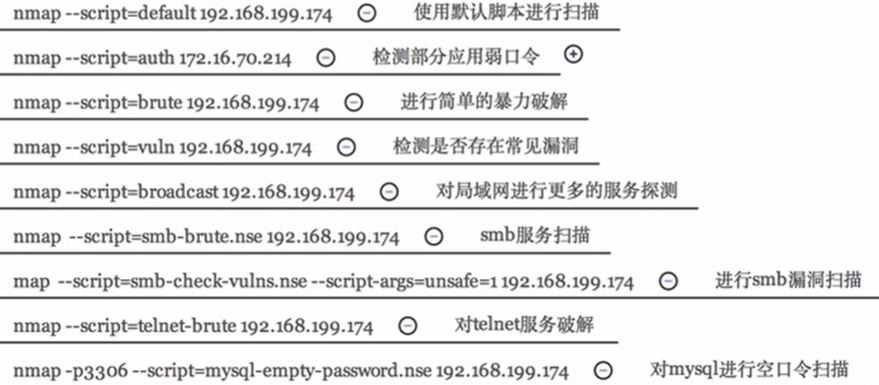
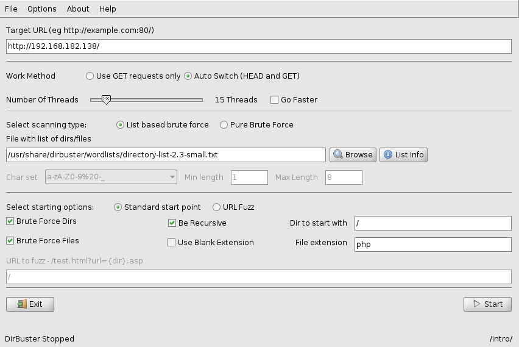
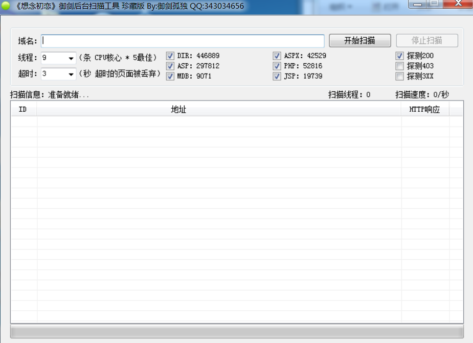
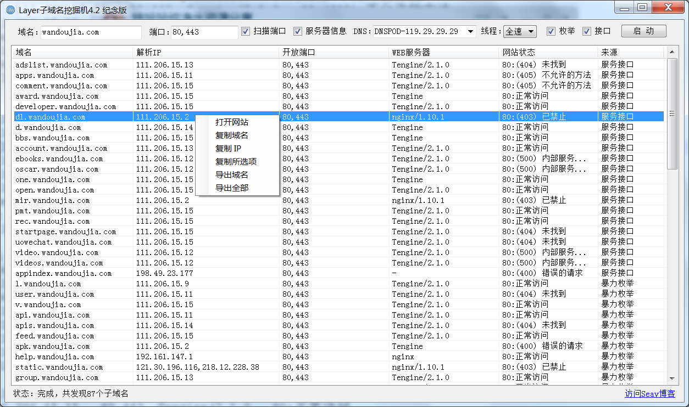
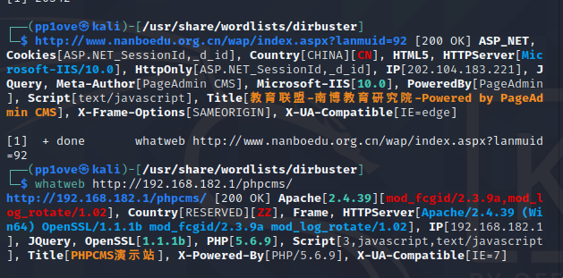

# 搜索引擎

## Google Hacking

### 符号（类似于正则匹配）

| -keyword    | 与关键词不相关                                            |
| :---------- | :-------------------------------------------------------- |
| \*KEYWORD\* | 与关键词相关                                              |
| "KEYWORD"   | 强制搜索相关关键词（若里里面有两个词,必须两个词同时存在） |

### site（搜索指定域名的网站）

举例

| site:zhihu.com            | 搜索跟知乎相关的网页              |
| ------------------------- | --------------------------------- |
| "web安全" site:zhihu.com  | 搜索知乎跟web安全相关的网页       |
| "sql注入" site:csdn.net   | 在csdn.net搜索跟sql注入相关的内容 |
| "教程" site:pan.baidu.com | 在百度网盘种搜索教程              |

### filetype(指定文件类型)

| nmap filetype:pdf      | 查找nmap相关的pdf文件 |
| ---------------------- | --------------------- |
| "web安全" filetype:PPT | 查找web安全相关PPT    |

### inurl(搜索url网址存在特定关键字的网页)

| inurl:php?id=          | 搜索网站URL中包含了php?id=          |
| ---------------------- | ----------------------------------- |
| inurl:/admin/login.php | 搜索网站URL中包含了/admin/login.php |
| inurl:login            | 搜索网站URL中包含了login            |

### intitle(搜索title存在特定关键字的网页)

| intitle:后台管理 filetype:php       | 搜索后台管理,php类型         |
| ----------------------------------- | ---------------------------- |
| intitle:index of "parent directory" | 搜索根目录相关的索引目录信息 |
| intitle:index of "password"         | 搜索密码相关的索引目录信息   |
| intitle:index of "admin"            | 搜索后台管理界面             |

### intext(搜索网页内容存在特定关键字的网页)

| intext:Powered by Discuz          | 搜索Discuz论坛相关的界面    |
| --------------------------------- | --------------------------- |
| intext:Powered by wordpress       | 搜索wordpress制作的博客网址 |
| intext:Powered by *CMS            | 搜索*CMS相关的界面          |
| intext:powered by xxx inurl:login | 搜索此类网址的后台登录界面  |

## 		Shodan	Hacking

除了可以搜索常见的web服务器,还能扫描防火墙、路由器、摄像头等一切联网的设备。放个简介,现在还用不上

## 		ZoomEye Hacking

ZoomEye(钟馗之眼),可以看做是"国产的Shodan",由知道创宇出品

官网:   https://www.zoomeye.org/

# 目标扫描

## Nmap

### 查用命令

| 命令  | 作用                                                         |
| ----- | ------------------------------------------------------------ |
| -help | 查看帮助                                                     |
| -sn   | 探测主机                                                     |
| -sS   | 探测服务                                                     |
| -O    | 判断系统                                                     |
| -sV   | 扫描具体服务的版本，比如80端口的apache版本                   |
| -A    | 综合扫描， 比如-O  跟-sV(如果你不想写-0跟-sV那就直按用-A即可) |

### 脚本加载

我们平时扫描默认使用的是 

> namp --script=default 192.168.182.0/24

然而namp还有很多脚本可以供我们使用,如:

​	详细脚本信息可以查看https://nmap.org/book/nse-usage.html

| -O                  | 判断是什么系统                                               |
| ------------------- | ------------------------------------------------------------ |
| -sV                 | 版本检测  比如扫出了SSH端口 然后得出他的版本号               |
| -A                  | 意思就是使用所有 比如-O  跟-sV(如果你不想写-0跟-sV那就直按用-A即可) |
| -P                  | 扫描指定的请口-P 1-65535或P 80,8080,1433                     |
| -v                  | 输出详细信息                                                 |
| -T4                 | 扫描速度(1-5) 蜗牛，鬼鬼来索，有礼貌的，正常的，侵略性的-T就是正常的 |
| -sS                 | 二次握手                                                     |
| --exclude           | 排除主机或网络。                                             |
| --excludefile       | 排除文件中的列表。                                           |
| --host-timeout 10   | 设置扫描主机10秒  在10秒后还没接收响应那就会认为没开端口     |
| -lt[list.txt]       | 如果你有大量的系统需要扫描 ,你可以将这些IP地址(或主机名)输入到一个文本文件中 |
| --script  afp-brute | 加载脚本                                                     |
| -PS                 | 选项来实施TCP SYN ping可绕防火墙                             |
| -PA                 | 这种类型的扫描将只会扫描ACK包。可绕防火墙                    |
| -PU                 | 扫描只会对目标进行udp ping扫描。这种类型的扫描会发送UDP包来获得一个响应。可绕防火墙 |
| -PP                 | 选项进行一个ICMP时问戳ping扫描  可绕防火墙                   |
| -PE                 | 参数进行一个ICMP(Internet控制报文协议) 在指定的系统上输出ping,可绕防火墙 |
| -Pn                 | 不采用ping方式进行扫描  可绕防火墙                           |
| -sA                 | 用于发现防火墙规则，比如扫到的端口是过滤的那么可以使用这个参数进行绕过。 |

## OpenVAS

下载后登录 https://127.0.0.1:9392/

sudo gvm-start  //启动

sudo gvm-stop //停止

使用说明: https://wizardforcel.gitbooks.io/daxueba-kali-linux-tutorial/content/28.html

# 域名遍历

## DirBuster

在kali中cd到/usr/share/wordlists/dirbuster，输入命令打开dirbuster

点击start开始扫描

详细介绍:https://blog.csdn.net/xiao1234oaix/article/details/108277427

​				 https://blog.csdn.net/weixin_42380348/article/details/100700889

## 御剑扫描

## Layer子域名挖掘机

# 指纹识别

## Whatweb

whatweb -h 查看参数  -v输出详细参数 -a调节探测速度

## httprint

## 御剑指纹识别

## 在线指纹识别

http://whatweb.bugscaner.com/look/

https://www.yunsee.cn/